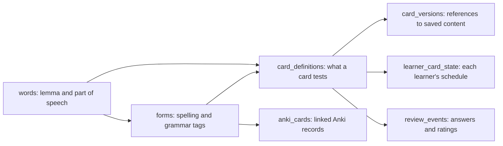

# Russian Arcade

Russian Arcade is a Russian learning application with vocabulary, flashcards, reading, writing, speaking and tutor lessons. It connects saved words to grammatical forms and examples, so the same material can support several kinds of practice.

Barsik (Барсик), a cat delivering a letter, guides the introductory lessons and journey activities. The application supports both younger learners and adults. Individual study is the default; household controls are optional.

**[Try the public demo](https://russian-arcade.fly.dev/)** · [Local setup](#local-setup) · [Architecture](#architecture-and-technology-stack) · [Documentation](#documentation)

<p align="center">
  
</p>

## Project purpose

The project began as an automated Anki card generator. In-app flashcards now provide the main review workflow. Anki generation remains available as an optional tool.

The aim is to practise Russian in context, including its case endings, conjugations and changes in meaning. Activities reuse saved vocabulary and introduce new words that learners can add to their collection. Tutor documents provide another source of examples and practice material.

Google Drive and SQLite have separate roles. Drive supports quick word capture, including on mobile. SQLite stores the structured vocabulary, content and learning history. Synchronisation connects them.

## Features

| Area | Current experience |
| --- | --- |
| **Flashcards** | Generate missing-word cards from vocabulary or selected lesson words, with pictures and audio. Review with **Again / Hard / Good / Easy**, response timing and spaced repetition. Filter cards by topic and grammar. |
| **Reading** | Generate or paste passages, answer comprehension questions and save new vocabulary. Revisit stories with English or Russian titles. |
| **Word Jumble** | Compose an original sentence using a supplied word set and receive feedback on meaning, grammar and use of the target words. |
| **Sentence practice** | Practise translation and review feedback on your attempt. |
| **Phrasebook** | Read Russian sentences beside their English translations and play each recording for shadowing. Search either language or filter by topic and level. |
| **Writing** | Respond to a prompt, save your writing and revisit assessed attempts. |
| **Speaking** | Talk freely in a scenario, or choose replies one exchange at a time in Step-through mode. Live conversations receive an audio review; Step-through offers optional hints and explanations. |
| **Tutor lessons** | Upload a PDF or image, save revisions, and practise with exercises based on the document. Select words on its pages for flashcards. |
| **My words** | Browse words, forms and grammatical details. See card counts and manage saved vocabulary. |
| **Guided A1 course** | Complete four [chapters](docs/word-post/course-chapters.md) covering all ten A1 topics. Help Barsik with new notes, separate listening updates and checkpoint replies, then open your letter. |
| **Barsik’s journey** | Learn your first words through the introduction, earn Lingocoins and choose optional games while following the guided course. |
| **Anki tools** | Use the existing automated card-generation workflow when you prefer to study in Anki. Native and Anki review schedules remain separate. |

The appearance icon switches between top navigation and a left sidebar, saving the choice in this browser. The top Activities menu lists the main activities. Sidebar mode places the profile, language, coins and library shortcuts at the bottom and removes the top banner.

### Practice games

The shop lets learners choose permanent game unlocks using Lingocoins: 25 for the first purchase and 50 for each later game. Core practice stays available from the start. First steps teaches the opening words without automatically unlocking games. Games use a wider vocabulary and remain open for standalone practice once owned. See [game access](docs/word-post/game-access.md) for pricing and migration rules.

| Game | What you practise |
| --- | --- |
| **Pack the Bag** | Match Russian messages to pictures and pack the appropriate items. |
| **Follow the Directions** | Follow Russian directions through a town assembled from neighbourhood blocks. Distinguish buildings and entrances, ask for missing details and respond to changed plans. Checked map instructions and AI dialogue are prepared with audio before play. |
| **Describe the scene** | Build Russian sentences from a simple scene. Practise prepositions, case endings, motion verbs, placement and agreement. |
| **Missing Stamp** | Restore the missing Russian form using its sentence and English translation. |
| **Post Office Radio** | Listen to a roughly one-minute Russian programme, then answer four comprehension questions. |
| **Mailbox Sort** | Match Russian messages to their contextual English meanings. |
| **A Letter Back** | Listen and reconstruct the recorded message from shuffled words or phrases. |
| **Lost Parcel Detective** | Combine a contextual picture clue and a route clue to find the matching delivery. |

Each game prepares the media it needs. Text activities do not require pictures. Radio generates a programme and recording. See [game design and integration](docs/word-post/journey-games.md).

## Curriculum

The [curriculum](docs/curriculum.md) defines **50 topics from A1 to C2**, with target vocabulary, grammar and practical learning objectives. Its 856 distinct target lemmas are organised into five course bands. C1 and C2 share topics but use different task demands.

Reading, Writing, Translation and Word Jumble draw from this shared material. A topic has a default course level; learners can choose another level when revisiting it. Word and form difficulty remain separate vocabulary filters.

The guided course adds four authored A1 chapters and independent checkpoints to the catalogue. Passing all four unlocks the A2 guided level; this release does not include authored A2 chapters or award a proficiency qualification. Higher-level free practice remains accessible. See [chapter content and progression](docs/word-post/course-chapters.md).

The [course catalogue](https://russian-arcade.fly.dev/curriculum) lists the topics and opens practice for each one. It does not add words automatically. Saving vocabulary still uses the existing lemma, form, topic and mnemonic pipeline.

## Vocabulary database

The database was designed for practising Russian forms in sentences. It links each dictionary entry to its forms, cards and review records.

### Lemmas and inflected forms

A **lemma** is the dictionary form used to look up a word. For example, **книга** is the lemma for “book”. In a sentence, that word changes according to what it is doing:

| Sentence | Form used | What the ending tells us |
| --- | --- | --- |
| Это **книга**. — This is a book. | книга | Nominative singular |
| Я читаю **книгу**. — I am reading a book. | книгу | Accusative singular: the book is what I am reading |
| У меня нет **книги**. — I do not have a book. | книги | Genitive singular, used here after нет |
| Я читаю **книги**. — I read books. | книги | Accusative plural |

The last two examples use the same spelling, **книги**, with different grammatical roles. The database can store these as separate form records.

Russian nouns change by case and number. Adjectives agree with nouns. Verbs change by person, number, tense, mood and, in some forms, gender. Participles combine features of verbs and adjectives. These distinctions matter when selecting forms for practice.

### Schema and relationships

The `words` table holds the lemma, part of speech, topics, mnemonic and estimated difficulty. Each entry has a numeric ID. The pair `(lemma, pos)` must be unique. This permits separate noun and verb entries for **печь**: an oven and “to bake”. Meanings within the same part of speech are not fully modelled.

Each `forms` row links to `words.id` through `word_id`. It stores a spelling, grammatical tags and difficulty. The combination `(word_id, form, tags)` must be unique. A spelling can therefore appear in several rows when its tags differ.



| Table or group | Why it exists |
| --- | --- |
| `words` | Keep shared information about the lemma in one place. |
| `forms` | Keep its inflected forms and their grammatical details linked to that lemma. |
| `card_definitions` | Identify the word/form and recall task a native card tests. One form can support several contextual cards. |
| `card_versions` + `learning_content_versions` | Keep card wording and examples separate from the card’s identity and review history. |
| `learner_card_state` + `review_events` | Store each learner’s schedule and the record of their reviews. |
| `anki_cards` | Link imported Anki card records to vocabulary words and forms, separately from native scheduling. |
| `lesson_word_picks` + `lesson_card_sources` | Remember the selected occurrence and the lesson revision/page from which a card came. |

For example, a card can test **книгу** while linking to **книга** for dictionary lookup. Its tags record the accusative singular. Another card can test a different use with its own review history.

### Form generation and filtering

The importer uses a Russian morphological dictionary to generate possible forms. Frequency data helps reduce uncommon forms before they enter the practice pool:

- **Nouns:** keep the six main cases in singular/plural, apply a frequency threshold, and limit the amount of generated material.
- **Participles:** apply a stricter frequency threshold to full and short participles to reduce uncommon forms.
- **Verbs, adjectives and comparatives:** reject forms with no recorded frequency in the lookup data.
- **Duplicates:** keep one copy of each spelling and retained tag combination.
- **Difficulty:** estimate lemma difficulty from frequency and length. Increase form difficulty for plurals and participles.

Frequency is a selection aid. A rare form may still be useful or correct. Lesson selections preserve the form found in the source text; they do not use these bulk-import filters.

The Anki generator filters words and forms by the requested topic, part of speech, case and difficulty. It randomly selects an eligible form, then generates a sentence, cloze, translation, picture and audio. A **cloze** is a sentence with a word or phrase removed for the learner to supply.

The native batch generator does not yet provide the same variety. It applies an optional case filter, then prefers a form matching the lemma. The importer also loses some adjective and participle tags. The [database guide](docs/vocabulary-data-model.md) explains these gaps and the exact filtering rules.

### Contextual translations

A lemma does not necessarily have one reliable English equivalent. Its meaning can depend on the sentence, and identical spellings may represent different words or meanings.

Cards store the English meaning for their example and a full sentence translation. This gives learners the context needed to answer. The vocabulary record does not require a single English equivalent or numbered translation fields.

## Implementation details

### Cloze cards and review scheduling

The front shows the missing-word sentence and English cue. Optional hints appear on request. The answer, Russian audio and dictionary link appear after reveal.

FSRS, the spaced-repetition scheduler, sets the next review date from the learner’s rating. Card content, schedules and review history are stored separately. Wording can be revised without deleting past reviews. Submission IDs and version checks prevent duplicate ratings. Undo records a reversal while retaining the original event.

See [native review](flask_vocab_app/services/native_review.py) and [card validation](flask_vocab_app/contracts/flashcards.py).

### Lesson word selection and source tracking

Optical character recognition (OCR) extracts text from lesson pages. Word selections retain the document revision, page, position, original reading and any correction. They wait in a pending tray until the learner chooses to generate cards.

Cards use the source sentence where possible. New examples are labelled when a fragment needs more context. Existing cards can be reused without resetting their schedules. See [lesson selection](flask_vocab_app/services/lesson_selection.py) and [OCR corrections](docs/word-post/lesson-ocr-corrections.md).

### Live conversation and assessment

WebRTC carries live audio between the browser and the conversation provider. Scenarios have variations, goals and instructions for their practice level. Those details are saved with each attempt. The agent can end the conversation when the task is complete.

The bundled Speaking catalogue has 30 situations across five settings at A1 and A2. Each task links to the curriculum and varies concrete details such as an order, a clothing size or a train connection. Both modes share repeat tracking, and saved conversations keep their original facts and objectives.

[Step-through mode](docs/word-post/step-through-speaking.md) uses the same scenarios to teach what to say next. Each paused exchange offers three Russian replies and an optional hint. The server checks the answer and saves the learner's place. Completion earns participation coins; choosing a written reply does not change speaking fluency scores.

A separate review assesses the learner’s recording for grammar, fluency and task completion. It does not use the live learner transcript as evidence: transcription can silently correct the endings being assessed. Audio review can still miss errors or mishear speech.

See [scenario design](docs/word-post/speaking-scenarios.md), [assessment](docs/word-post/speaking-assessment.md) and [speech-preservation experiments](docs/word-post/speech-preservation-results-20260911.md).

### Recoverable generation and reusable media

Native flashcard text, pictures and audio are prepared in separate, saved steps. A failed recording can be retried without regenerating the text. Each job is assigned to one request at a time to reduce duplicate work. File checksums verify saved media before reuse.

Audio jobs choose a voice from the configured list and keep it for retries. This provides voice variation across generated recordings. See [card generation](flask_vocab_app/services/card_generation.py) and [media jobs](flask_vocab_app/services/card_media.py).

### Rewards and progress tracking

- **Lingocoins** reward completed practice, subject to earning limits. Hints and mistakes do not automatically prevent rewards.
- **Game ownership** records permanent purchases from the shop.
- **Guided course progress** records topic preparation and independent chapter passes. Barsik’s header bar shows current-chapter preparation. Earlier journey receipts remain saved separately.
- **Skill estimates** retain separate assessed-practice histories; they do not control the course bar or chapter access.
- **Flashcard schedules** determine when each card returns.

A1–C2 describe curriculum task levels. They are not qualifications awarded by the app. The live Speaking catalogue currently has authored A1/A2 variations. The old Elo total remains in historical records; it does not determine current skill estimates. Coins buy optional games. The four-chapter course advances through independent checkpoints; coin earnings and spending do not change chapter access or skill estimates. Ordinary practice remains available. See [levels and progression](docs/word-post/levels-and-progression.md).

## Architecture and technology stack

One Flask application serves the backend and interface. Preact powers the homepage and interactive activities. Other activities use Flask/Jinja templates with shared styling and navigation. Vite builds the Preact assets; Flask serves them.

| Layer | Technology and purpose |
| --- | --- |
| Backend | Python 3.12, Flask, Jinja and Flask-Session |
| Interface | Preact, TypeScript and Vite; shared design settings, bundled fonts and light/dark themes |
| Data | SQLite with foreign keys, SQL migrations and migration backups |
| Flashcard scheduling | `fsrs` for review intervals; SQLite for card versions and review history |
| Russian language processing | `pymorphy3` for grammatical analysis; `wordfreq` for frequency estimates |
| Documents | `pdfplumber`, Poppler, Pillow and Tesseract for PDF/image processing and OCR |
| Audio processing | FFmpeg and `pydub` |
| AI integrations | OpenAI for text, images and live audio; OpenRouter for transcription; ElevenLabs for speech; Yandex for legacy translation |
| Optional integrations | Google Drive for capture and AnkiConnect for Anki |
| Hosting | Docker, Gunicorn and Fly.io |
| Verification | Python `unittest`, Vitest, Testing Library, TypeScript checks and GitHub Actions |

Model settings are listed in [config.py](flask_vocab_app/config.py) and [`.env.example`](.env.example). AI features require provider credentials and access to the configured models. Provider charges apply.

## Public demo and project status

The **[public demo](https://russian-arcade.fly.dev/)** offers introductory lessons, sample games, vocabulary and authored cloze cards without signing in. Each browser receives a separate temporary sample profile.

Sample mode uses synthetic data and makes no paid AI calls. Its cards demonstrate text review without generated pictures or speech. Sample progress resets on restart.

When the hosted AI trial is enabled, **GitHub sign-in** opens a separate, persistent workspace for that account. It supports the application's AI activities, including content generation, card media, lesson uploads and speaking, within provider and budget limits. Sign-in requests no repository access. A visitor cannot select another visitor's local learning profile.

Each account can use **US$1 per day and US$2 in total** of funded AI. All visitors share a **US$1 daily and US$10 total** budget. The existing US$20 monthly ceiling also remains in place. Usage is tied to a verified account, so signing out or clearing cookies does not reset it.

The server reserves costs before provider calls and limits each account to 30 calls per rolling minute and 120 per day. The standard flashcard generator allows at most five cards per hosted batch. Pictures, speech, transcription and assessment all count; one activity may need several calls. Saved practice remains available after the allowance runs out. Lingocoins do not buy AI credits.

Live calls close after one minute, but a server failure can prevent that close; a provider-side spending limit is also required. See [hosted trial operation](docs/operations-fly.md#funded-ai-trial) for the controls and their limits.

The application is under active development, with local individual and household use as its main deployment model. Current limits include:

- Local profiles do not provide hosted account authentication; the optional public trial uses its separate GitHub sign-in boundary.
- Background work uses threads within the application. Running multiple instances requires changes to storage and worker coordination.
- OCR, generated content and automated assessment can contain errors.
- Lesson selections feed cards and games. Broader lesson-based writing and speaking integration remains planned.
- The 50-topic curriculum and four guided A1 chapters, including the final-letter checkpoint, are implemented. Authored A2 chapters, additional later stories and more live Speaking scenarios remain future work.

The [product backlog](docs/word-post/product-backlog.md) and [migration strategy](docs/word-post/migration-strategy.md) record plans and earlier decisions. They are not inventories of completed features.

## Local setup

### Prerequisites

- Python **3.12** and Node **24**; `.python-version` and `.nvmrc` record the development versions.
- FFmpeg for audio processing, Poppler (`pdftoppm`) for lesson rendering, and Tesseract with `rus` and `eng` language data for OCR. These are system tools, not installed by `pip`.
- Provider credentials only for the integrations you want to use. Browsing and the small development seed do not require API keys.

From the repository root:

```sh
python3.12 -m venv .venv
source .venv/bin/activate
python -m pip install --require-hashes -r flask_vocab_app/requirements.lock

# If you use nvm, run `nvm use` first.
npm ci --prefix flask_vocab_app/ui
npm run build --prefix flask_vocab_app/ui

# Keep this development instance separate from existing learning data.
export VOCAB_DB_PATH="$PWD/instance/dev/vocab.db"
export VOCAB_SESSION_DIR="$PWD/instance/dev/sessions"
export VOCAB_UPLOAD_DIR="$PWD/instance/dev/uploads"
export APP_MEDIA_DIR="$PWD/instance/dev/media"
export WORD_POST_ASSET_DIR="$PWD/instance/dev/assets"
export ANKI_MEDIA_DIR="$PWD/instance/dev/anki-media"

python -m flask --app flask_vocab_app/app.py:create_app db-upgrade
python -m flask --app flask_vocab_app/app.py:create_app seed-demo
python -m flask --app flask_vocab_app/app.py:create_app run --port 5000
```

Open **[localhost:5000/](http://localhost:5000/)** and choose or create a local profile. The development `seed-demo` command adds three synthetic words; it is not the larger hosted-demo seed and does not generate cards. It refuses to seed a nonempty vocabulary, so skip it when using an existing database.

`db-upgrade` applies pending migrations and backs up an existing database first. Without a `VOCAB_DB_PATH` override, the historical default is `flask_vocab_app/vocab.db`; explicitly choose the database you intend to use.

For interface changes, run `npm run watch --prefix flask_vocab_app/ui` alongside Flask. Refresh the browser after each build. The command rebuilds files; it does not run a separate frontend server. Node is only required to build the interface.

### Integration configuration

If `.env` does not exist, copy [`.env.example`](.env.example) to `.env` and fill the relevant values. **Do not overwrite an existing secrets file.**

Settings are loaded in this order: shell variables, `flask_vocab_app/.env`, then the root `.env`. Existing values take priority. Explicit settings passed to the application factory override these defaults.

| Integration | Configuration |
| --- | --- |
| Session signing | Set a private `FLASK_SECRET_KEY` for a real installation. |
| AI activities and images | `OPENAI_API_KEY` and the workload-specific model settings |
| Configured transcription | `OPENROUTER_API_KEY` and transcription model settings |
| Russian speech | `ELEVENLABS_API_KEY`, model and voice IDs |
| Legacy translation | `YANDEX_API_KEY` where required by the selected workflow |
| Google Drive | OAuth credential/token paths and your capture file ID; interactive authorisation is opt-in |
| Anki | Anki with AnkiConnect running locally; its URL, deck and media directory |

Keys stay on the server. Keep `.env`, OAuth files, personal databases, uploads and generated media out of Git. A hosted server cannot reach Anki on your computer through its own `localhost`.

See [Security](SECURITY.md) for deployment boundaries, credential handling and public-demo limits. Local profiles are not authenticated internet accounts. Anonymous sample mode has no paid AI access; the optional signed-in trial has separate admission and spending controls.

### Tests and maintenance

```sh
npm run build --prefix flask_vocab_app/ui
npm test --prefix flask_vocab_app/ui
WORD_POST_REQUIRE_BUILD=1 python -m unittest discover -s flask_vocab_app/tests -t flask_vocab_app -v
python -m flask --app flask_vocab_app/app.py:create_app db-status
```

The isolated test helper creates temporary databases and replaces external services with test substitutes. It blocks network calls. Tests cover access controls, retries, scheduling, rewards, migrations, OCR selections and interface behaviour. GitHub Actions builds the interface and runs the Python and component tests.

Back up **both the database and media**. The `word-post backup` command includes native learning assets, lesson files and conversation recordings. Legacy story media, Anki and Drive need separate backups. See [operations and recovery](docs/operations.md) for commands and restore checks.

## Deployment

The [Dockerfile](Dockerfile), [fly.toml](fly.toml) and [hosted entry point](flask_vocab_app/hosted.py) configure Fly.io hosting. Anonymous samples use a temporary database; the optional signed-in trial requires persistent identity, budget and per-account storage. The image excludes credentials and personal runtime files.

A private deployment also needs authentication, persistent database and media storage, and backups. Separate SQLite files do not synchronise automatically. See the [Fly deployment runbook](docs/operations-fly.md).

## Repository structure

```text
flask_vocab_app/
  app.py                 Application factory and integration wiring
  blueprints/            HTTP routes and activity boundaries
  services/              Learning workflows, generation, assessment and scheduling
  repositories/          Database access and persistence rules
  contracts/             Structured input/content validation
  migrations/            Ordered SQL schema migrations
  data/                  Authored scenarios and introductory lesson content
  templates/             Server-rendered activity pages
  static/                Shared legacy CSS, JavaScript and static artwork
  ui/                    Preact/TypeScript interface and design tokens
  tests/                 Python workflow and regression tests
scripts/                 Release export, provider experiments and maintenance utilities
instance/                Ignored local databases, media, sessions and backups
docs/                    Architecture, product decisions and feature guides
.github/workflows/       Continuous integration
```

The homepage is `/`; optional Anki tools are at `/tools/anki/`. Existing `/post/` bookmarks redirect to the homepage and retain their activity destination. Some internal `word-post` names and asset paths remain from the earlier design.

Historical scripts may retain machine-specific assumptions; read them before running them against real data.

## Documentation

- [Architecture](docs/architecture.md), [development](docs/development.md) and [operations](docs/operations.md)
- [Curriculum: topics, vocabulary and grammar](docs/curriculum.md)
- [Vocabulary database and form-generation rules](docs/vocabulary-data-model.md)
- [Drive/SQLite synchronisation contract](docs/synchronization.md)
- [Native flashcards](docs/word-post/native-flashcards.md) and [vocabulary library](docs/word-post/vocabulary-library.md)
- [Tutor lessons](docs/word-post/lessons-companion.md) and [lesson-driven practice](docs/word-post/lesson-driven-practice.md)
- [Speaking scenarios](docs/word-post/speaking-scenarios.md) and [assessment](docs/word-post/speaking-assessment.md)
- [Describe the scene](docs/word-post/scene-builder.md), [Journey games](docs/word-post/journey-games.md) and [mixed vocabulary / Radio](docs/word-post/mixed-vocabulary-and-radio.md)
- [Guided A1 chapters](docs/word-post/course-chapters.md), [levels and rewards](docs/word-post/levels-and-progression.md), [skill progress](docs/word-post/skill-progress.md) and [Barsik’s story](docs/word-post/barsik-journey.md)
- [Design system](docs/word-post/design-system.md) and [hosting runbook](docs/operations-fly.md)
- [Public release procedure](docs/release-process.md) and [game shop](docs/word-post/game-access.md)

## Contributing and licensing

Describe the learning problem, proposed behaviour and checks performed. Use sample data in tests. Preserve learning history and distinguish generated examples from source material. Include regression tests for changes to storage or assessment.

Do not include credentials, private tutor documents or learner recordings in contributions.

No project-wide licence is currently included. Bundled fonts have their own OFL notices in [`ui/public/licenses`](flask_vocab_app/ui/public/licenses). Those notices cover the fonts only.
