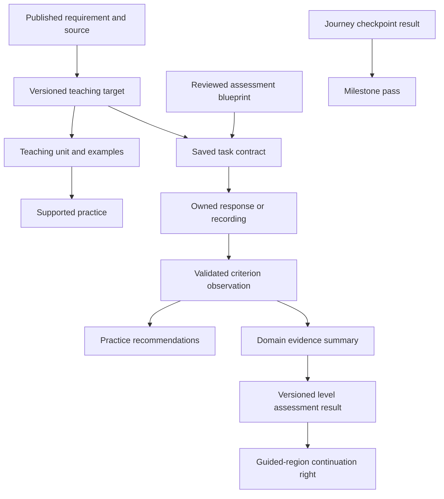

# Curriculum and assessment implementation plan

**Status:** proposed implementation plan, informed by the completed research and code audit.

**Baseline:** `cabad03`, reviewed 23 September 2026.

**Scope:** A1–B2 teaching coverage, activity integration, assessment, progression and migration.

The aim is to turn Russian Arcade's existing activities into a coherent course. Learners should understand what they are practising, receive useful feedback and see progress wherever they choose to study. A level assessment should test their Russian, rather than their willingness to follow a prescribed sequence of pages.

This document specifies the work still required. It does not describe that work as shipped. The [research review](curriculum-research.md) records the evidence behind the recommendations. The [239 requirement specifications](curriculum-requirements.md) provide the detailed reference. The [current milestone contract](word-post/course-milestones.md) remains authoritative for existing A1 attempts.

Read by purpose:

- [Decisions and delivery sequence](#1-decisions).
- [Current coverage](#3-baseline-and-gaps) and [A1–B2 teaching scope](#6-teaching-scope-by-level).
- [Activity contracts](#9-activity-evidence-contracts), [assessment](#10-assessment-and-feedback) and [progression gates](#11-progression-and-gates).
- [Data changes](#14-data-and-service-changes), [migration](#15-existing-learners-and-migration) and [build packages](#16-build-packages).
- [Verification](#17-verification-and-assessment-validation) and [completion criteria](#20-completion-criteria).

## 1. Decisions

| Decision | Consequence |
| --- | --- |
| Keep the 50-topic curriculum. | Topics organise teaching. They do not, by themselves, define proficiency. |
| Use A1–B2 requirements to specify language and communication. | Each exercise names what the learner must understand or produce. |
| Keep practice access open. | Learners can choose a level, revisit material or study outside Journey. |
| Count relevant practice from every entry point. | Starting from Activities, a lesson or Curriculum must not lose credit. |
| Separate preparation from assessment. | Preparation recommends a checkpoint. It is not a compulsory attendance record. |
| Let learners challenge an available checkpoint early. | Prior knowledge does not require repeating introductory work. |
| Use independent assessments for guided-course advancement. | Coins, Elo, vocabulary totals and page visits cannot award a level. |
| Require all five domains for a future full-level result. | Reading, listening, language use, writing and speaking retain separate outcomes. |
| Preserve earned access and published attempts. | New requirements apply through a new course release, not retroactive regrading. |
| Keep the existing vocabulary model. | Lemmas, grammatical forms and contextual meanings remain distinct. |
| Keep the interface compact. | Show the task and next action first. Put detailed evidence in optional disclosures. |

The current four milestones remain a small A1 journey course. They are not four equal measures of A1 proficiency. The future full-level result will mean **“Russian Arcade A1 assessment passed”**, with a stated assessment version. It will not be presented as TORFL certification.

## 2. Delivery sequence

The first internal build should connect a small, complete learning sequence to reliable evidence. Expanding every activity and all four levels at once would make errors difficult to isolate. Stages 1–2 are internal or diagnostic additions; they do not replace the current complete route.

| Stage | Result | Release condition |
| --- | --- | --- |
| 1. Coverage and contracts | A reviewed map from requirements to teaching and assessment; versioned task contracts. | Gaps and unsupported evidence are explicit. Existing progress is unchanged. |
| 2. A1 learning sequence | One complete sequence across teaching, Comprehension, controlled production, Writing and Speaking. | The same learner can practise independently and receive feedback grounded in their actual response. |
| 3. A1 coverage | Teaching and suitable assessment material for the reviewed A1 scope. | No requirement is called covered merely because it appeared in a prompt. |
| 4. A1 assessment pilot | Separate outcomes for all five domains, initially diagnostic. | Qualified human comparison and learner testing support the marking and pass policy. |
| 5. A1 progression release | An optional new enrolment with a validated course gate and migration preview. | Historical attempts, passes and access survive; failures have a useful recovery route. |
| 6. A2 course | Routine transactions, connected accounts and broader grammar in a new region. | A2 teaching, assessment and variation pass the same review process. |
| 7. B1 and B2 courses | Connected discourse, then inference, argument and register. | Each level is released separately after content and assessment validation. |

Stages 1–2 are the next engineering priority. Source and lexical research can continue alongside them. Later levels must not delay fixing the evidence boundary in activities that already exist.

## 3. Baseline and gaps

### 3.1 What exists

| Asset | Current scope | Limitation |
| --- | --- | --- |
| Topic catalogue | 50 topics; 856 distinct starter lemmas across the catalogue, including 148 at A1. | Starter vocabulary is not a complete lexical minimum. |
| TORFL reference | 239 original specifications across A1–B2, with source editions and locators. | This is a reference inventory, not a validated item bank or learner record. |
| Existing A1 target catalogue | 110 targets derived from the earlier topic objectives and grammar focuses. | Its IDs and scope do not map one-to-one onto the newer reference. |
| Focused A1 preparation | 32 required targets, eight per milestone. | A limited selection of comprehension and form-choice tasks. |
| Received letters | Four milestones, three variants each; 120 scored decisions across the variants. | They sample 36 unique existing targets and do not assess independent written or spoken production. |
| Ordinary activity evidence | Saved, owned task results can contribute topic preparation. | An overall score does not prove every grammatical feature mentioned in a task. |
| Speaking | Fluent conversations, recorded audio review and Step-through choices; authored A1/A2 situations. | Current reports need requirement-level contracts and validation before they support a full-level gate. |
| Flashcards | Contextual clozes, media, four ratings, FSRS and coverage-aware form selection. | Self-ratings measure recall practice, not objective proficiency. Some imported grammatical tags are incomplete. |
| Persistence | Versioned course enrolment, frozen attempts, drafts, observations, passes and continuation rights. | Several loaders and policies still assume the A1 course. |

The counts above describe different things. Do not add them, divide one by another or turn them into a learner's proficiency percentage.

### 3.2 Reference inventory

| Level | Language use | Reading | Listening | Writing | Speaking | Total |
| --- | ---: | ---: | ---: | ---: | ---: | ---: |
| A1 | 53 | 4 | 3 | 3 | 7 | 70 |
| A2 | 49 | 4 | 4 | 4 | 6 | 67 |
| B1 | 33 | 4 | 5 | 4 | 4 | 50 |
| B2 | 31 | 5 | 6 | 5 | 5 | 52 |
| **Total** | **166** | **17** | **18** | **16** | **22** | **239** |

These are the entries physically defined in each file. Later levels also develop earlier language through the catalogue's inheritance. A broad speaking requirement may need several tasks; a narrow case function may need a small contrast. Entry counts are not weights for a pass score.

### 3.3 What remains unproven

- The reference has not been reconciled against every later edition or the full published lexical minima.
- A complete set of original teaching material and assessment tasks does not yet exist for these requirements.
- Current checkpoints do not establish full A1 proficiency.
- Current Elo estimates have not been calibrated against human-assessed proficiency.
- Human learner pilots and qualified human comparison of the proposed level marking remain outstanding.

Each gap becomes a deliverable below. None should be hidden by a more confident label in the interface.

## 4. Source and coverage policy

Use the inspected [MSU A1–B2 references](https://test.irlc.msu.ru/podgotovka-k-testirovaniuu/) as the starting inventory. Preserve their actual edition dates. A recently uploaded PDF is not necessarily a recent standard.

Before declaring a level's content complete:

1. Reconcile the reference against the newest obtainable requirements from recognised testing institutions and publishers.
2. Inspect the relevant lexical minimum. Record its edition, lexical-unit convention and licence or permitted use.
3. Have a qualified Russian-as-a-foreign-language teacher review the scope, sequence and examples.
4. Record disagreements between sources. Do not silently overwrite a requirement to resolve them.
5. Publish a coverage report for the chosen reference edition and course release.

Do not copy textbook chapters or exam banks into the product. Use the sources to define scope, then author original tasks and recordings. External material needs a recorded right to use it.

Every requirement needs a coverage record with these separate fields:

| Field | Question it answers |
| --- | --- |
| Reference status | Has the source and interpretation been reviewed? |
| Teaching coverage | Where is this taught, with examples and supported practice? |
| Recognition coverage | Where must the learner distinguish its meaning or form? |
| Production coverage | Where must the learner produce it, if production is required? |
| Assessment coverage | Which reviewed blueprint samples it, and by which response mode? |
| Validation status | Have the item, marking and level claim been checked? |

Use explicit states such as `missing`, `draft`, `reviewed` and `released`. “Included in generator guidance” is a separate fact; it does not count as authored or assessed coverage.

The report must list unallocated requirements. No requirement may disappear because it lacks a convenient topic or current game.

## 5. Curriculum structure

### 5.1 Relationships

This is a relationship model, not a request for a new service for each box. Keep the implementation in the current Flask application and SQLite store.

### 5.2 Distinctions to preserve

| Concept | Example | Authority |
| --- | --- | --- |
| Topic | Food and Drinks | Existing canonical topic ID. |
| Teaching band | Food first appears in the A1 topic sequence. | Curriculum catalogue. |
| Task level | An A2 order with a substitution and clarification. | Saved task contract. |
| Language function | Ask for an item without an ingredient. | Versioned target linked to a requirement. |
| Grammatical form | Genitive singular after `без`. | The occurrence, syntax and morphological analysis. |
| Lexical difficulty | An uncommon noun or inflection. | Existing word/form estimates. |
| Recall state | A card is due tomorrow. | FSRS learner state. |
| Performance estimate | Provisional speaking-grammar rating. | Existing skill evidence policy. |
| Course result | A particular assessment was passed. | Frozen assessment and pass receipt. |

One topic can appear at several levels. One requirement can be taught in several topics. A task can assess a small number of named requirements. None of those relationships is automatically one-to-one.

### 5.3 Teaching targets and prerequisites

Use targets that name a distinction, rather than a whole case or a page title. For example: identify possession, express absence, state an age, distinguish location from destination, and contrast habitual movement with a current journey.

Some existing reference entries remain broad. Split them into teachable targets without changing their reference IDs. Each new target needs an observable outcome, permitted response modes, source links and prerequisite target IDs.

Prerequisites guide teaching recommendations. They must not become locks on free practice. Validate the prerequisite graph for missing references and cycles. Do not require a learner to visit an explanation if an independent response already demonstrates the prerequisite.

Keep recognition, controlled production and independent production separate. Recognising a participle in a text does not prove the ability to use it accurately in spontaneous speech.

### 5.4 Mapping the existing 110 targets

Create a reviewed crosswalk rather than replacing the old target catalogue. Each mapping states `equivalent`, `partial`, `related` or `unmapped`, with an explanation and allowed evidence mode.

A related topic is not evidence equivalence. A legacy selection task must not map to an independent-speaking requirement. Preserve the original observation and its target version. A compatible interpretation can be derived under a named mapping version without rewriting the saved response.

Only explicitly equivalent, compatible evidence may support a new preparation summary. A new level pass still follows its own assessment policy. All uncertain mappings remain visible to maintainers as gaps.

## 6. Teaching scope by level

The complete criterion inventory remains in [Curriculum requirements](curriculum-requirements.md). The following packages organise its implementation. They are proposed teaching units, not official divisions of an exam or equal units of proficiency.

### 6.1 A1: essential communication and core relationships

| Package | Language and communication | Representative reference IDs |
| --- | --- | --- |
| Script and sound | Decode Cyrillic, distinguish relevant sounds and stress, and produce intelligible familiar words. | `a1.reading.cyrillic-decoding`, `a1.listening.sound-contrasts`, `a1.speaking.intelligibility` |
| Introductions and reference | Greetings, names, formal/informal address, who a pronoun refers to, basic questions. | `a1.speaking.social-etiquette`, `a1.language.accusative-name-pattern`, `a1.language.pronoun-reference` |
| People and possessions | Identify people, family and objects; possession and absence; gender, number and animacy. | `a1.language.noun-gender-number-animacy`, `a1.language.genitive-possession`, `a1.language.genitive-absence` |
| Place and destination | Locate something, say where someone is going and distinguish travel to a person from travel to a place. | `a1.language.prepositional-location`, `a1.language.accusative-destination`, `a1.language.dative-person-destination` |
| Needs and transactions | Request an object, give something to someone, describe needs, quantities and simple prices. | `a1.language.accusative-object`, `a1.language.dative-recipient`, `a1.language.dative-need`, `a1.language.genitive-quantity` |
| Time and routine | Tell when something happens; distinguish a current action, routine and past event. | `a1.language.verb-conjugation`, `a1.language.verb-tense`, `a1.language.accusative-clock-weekday`, `a1.language.verb-aspect` |
| Movement and company | Directed/habitual movement, basic departure/arrival, transport and going with someone. | `a1.language.motion-basic-pairs`, `a1.language.motion-departure-arrival`, `a1.language.instrumental-company` |
| Connected information | Follow a short message, reference and sequence; connect a reason or time to an event. | `a1.reading.reference-and-sequence`, `a1.listening.short-message`, `a1.language.time-and-reason-clauses` |
| Independent responses | Write a purposeful personal message; ask and answer; request repetition or clarification. | `a1.writing.personal-message`, `a1.writing.connected-description`, `a1.speaking.ask-and-answer`, `a1.speaking.repair` |

A1 includes selected functions of all six cases. Do not postpone a whole case simply because one use appears difficult. Equally, do not claim that one correct ending establishes that case in every context.

Basic prefixed motion belongs in the reviewed A1 scope. Teach its meaning through the situation. Do not give beginners an unstructured list of every motion prefix.

The current four places can host these units. The coverage review determines how much teaching each place needs. Preserve existing letters; author expanded assessment in a new release.

### 6.2 A2: routine transactions and connected accounts

| Package | Added demand | Representative reference IDs |
| --- | --- | --- |
| Alternatives and clarification | Explain a need, ask a follow-up, choose an alternative and confirm the arrangement. | `a2.speaking.initiate-and-sustain`, `a2.speaking.clarify-and-repair`, `a2.listening.dialogue-intentions` |
| Time and experience | Dates, recurrence, time relations, past events and near-future arrangements. | `a2.language.genitive-event-date`, `a2.language.genitive-time-relations`, `a2.language.accusative-recurrence` |
| Description and ownership | Case agreement, comparison, reference and `свой` in an explicit context. | `a2.language.adjective-case-agreement`, `a2.language.adjective-comparison`, `a2.language.possessive-svoj` |
| States and interests | Say how someone feels, what interests them and what they need to do. | `a2.language.dative-experiencer`, `a2.language.instrumental-interest`, `a2.language.dative-necessity-named-person` |
| Routes and transport | Enter, leave, carry and convey; distinguish movement by person, object and means. | `a2.language.motion-enter-exit`, `a2.language.motion-carrying`, `a2.language.motion-conveying`, `a2.language.motion-aspect-context` |
| Reasons and intentions | Purpose, condition, indirect questions, cause and consequence. | `a2.language.purpose-clause`, `a2.language.conditional-clause`, `a2.language.indirect-questions-requests` |
| Connected production | Narrate familiar events, write correspondence and retell information with an appropriate response. | `a2.writing.connected-narrative`, `a2.writing.personal-correspondence`, `a2.speaking.retell-and-evaluate` |

Revisit A1 situations with a different communication demand. An A2 café task might require explaining that an item is unavailable and agreeing on an alternative. More menu words or longer dialogue alone do not make it A2.

### 6.3 B1: sustained communication and explanation

| Package | Added demand | Representative reference IDs |
| --- | --- | --- |
| Accounts and retelling | Follow and produce connected events, preserve important information and explain reasons. | `b1.reading.details-sequence`, `b1.writing.connected-account`, `b1.speaking.retell-experience` |
| Views and social interaction | Initiate and finish an exchange, clarify misunderstandings and support an opinion. | `b1.speaking.initiate-complete-exchange`, `b1.speaking.view-and-reasons`, `b1.writing.opinion-reasons` |
| Case and reference control | Broader government, quantity, roles, means, agreement and pronoun reference. | `b1.language.government-reflexivity`, `b1.language.numeral-phrases`, `b1.language.pronoun-reference` |
| Time, aspect and motion | Choose aspect across narration; explain a route and distinguish prefix meanings. | `b1.language.aspect-in-context`, `b1.language.motion-prefixes`, `b1.language.motion-direction-frequency` |
| Complex and compressed clauses | Relatives, reported speech, condition, concession, participles and adverbial participles. | `b1.language.relative-complement-clauses`, `b1.language.participles-active`, `b1.language.participles-passive`, `b1.language.adverbial-participles` |
| Meaning beyond isolated facts | Recognise attitude, reasons, main points and relevant detail in text and audio. | `b1.reading.attitude-reasons`, `b1.listening.reasons-response`, `b1.listening.dialogue-intention` |

Introduce participial constructions according to the reviewed requirement and response mode. An infrequent form can be excluded from ordinary random practice while still being available in an authored task that teaches it.

### 6.4 B2: interpretation, argument and register

| Package | Added demand | Representative reference IDs |
| --- | --- | --- |
| Viewpoint and implication | Infer intention, evaluation, relationships and conventional implication. | `b2.reading.author-evaluation`, `b2.listening.intent-and-motive`, `b2.listening.conventional-implication` |
| Purpose and register | Adapt correspondence and speech to recipient, situation and social intention. | `b2.writing.correspondence-register`, `b2.language.register-selection`, `b2.speaking.spoken-register-intonation` |
| Argument and negotiation | Develop and qualify a position, respond to objections and manage an inquiry. | `b2.writing.reasoned-evaluation`, `b2.speaking.reasoned-monologue`, `b2.speaking.manage-inquiry` |
| Reformulation | Preserve meaning when compressing a source or changing a grammatical construction. | `b2.writing.compress-source`, `b2.language.active-passive-transformation`, `b2.language.nominal-verbal-reformulation` |
| Precise grammar and lexis | Aspect, voice, focus, preposition meanings, collocation and developed motion contexts. | `b2.language.aspect-negation-mood`, `b2.language.preposition-polysemy`, `b2.language.lexical-collocation`, `b2.language.motion-developed-context` |
| Unprepared interaction | Respond coherently to information that was not supplied in a memorised script. | `b2.speaking.unprepared-conversation`, `b2.speaking.situation-tactics`, `b2.listening.dialogue-development` |

Increasing difficulty must change the demand on understanding and expression. It should not merely increase word count, shorten a timer or add obscure vocabulary.

## 7. Vocabulary and grammatical forms

### 7.1 Lexical coverage

The inspected sources describe cumulative lexical inventories much larger than the starter lists. The [research review](curriculum-research.md#communication-and-assessment-scale) records the figures and their limits. Do not make a “words saved” total into an entry requirement.

Build a lexical coverage manifest outside the learner's personal word list. It should record the source edition, lemma or expression, part of speech, relevant use, teaching targets and reviewed examples. It can describe what the course teaches without adding hundreds of words to someone's collection.

Ordinary generation should combine familiar words with useful new ones. Select the amount of new language according to the task and learner support, not a universal percentage. Important assessment instructions must use familiar or adequately explained language so incidental vocabulary does not obscure the skill being tested.

Newly saved words must use `SyncService.process_word` and `SyncService.enrich_words`, including topics and mnemonic. Keep lesson/page provenance separate from lexical topics. “First steps” and milestone titles are not word topics.

### 7.2 Preserve the relational model

Keep `words.id` and the existing lemma/part-of-speech identity. Keep `forms.word_id`, the exact spelling and grammatical analysis. Cards and examples retain their contextual meaning and translation.

Do not add `translation_1`, `translation_2` or a required English gloss to every lemma. A later sense inventory would need its own reviewed relationships; it is not a prerequisite for this course.

Homographs and ambiguous forms require the sentence. For example, the spelling `книги` alone does not identify a unique case or number. A task must record the intended reading and accept other readings only when its actual context allows them.

### 7.3 Repair specific pipeline gaps

The native selector already prefers less-used words, forms and grammatical combinations. It also filters by case and form difficulty. Reuse [form_selection.py](../flask_vocab_app/services/form_selection.py); do not build a second rotation system.

The remaining work is:

1. Preserve adjective and participle case information, relevant animacy, past-tense gender and consistent part-of-speech tags during import.
2. Canonicalise tag JSON and validate tag combinations before deduplication.
3. Let a task request an explicit grammatical function and compatible form, not just “any genitive”.
4. Retain frequency thresholds as defaults for bulk selection. Permit a reviewed, source-specific occurrence when an authored lesson needs it.
5. Distinguish coverage of an inflected spelling from coverage of its grammatical reading.
6. Report unresolved morphology instead of silently substituting a lemma or a different form.

Backfill on a copy first. Preserve existing form IDs and links. When a historical row merged several readings, add the missing analyses without guessing which one an old card intended. Relink only where its stored sentence and metadata establish the reading. Review history stays attached to the original card identity.

## 8. Teaching units and task design

A teaching unit should be small enough to explain one useful contrast. It needs a purpose, short labelled examples, supported practice and a route into independent use.

For **location and destination**, the unit could contain:

| Step | Learner sees or does | Evidence |
| --- | --- | --- |
| Notice | Two labelled examples: `Барсик в школе.` and `Барсик идёт в школу.` | Exposure only. |
| Distinguish | Select the sentence matching Barsik being inside the school or travelling towards it. | Recognition of location versus destination, under the saved support conditions. |
| Produce | Complete a new contextual sentence without supplied endings. | Controlled production of the named form. |
| Understand | Read or hear an arrangement and identify where someone is or is going. | Reading or listening, according to the source actually used. |
| Use | Write a short arrangement or give an original spoken reply. | Production evidence for the criteria genuinely elicited. |

The same example must not appear unchanged in teaching and an “independent” assessment immediately afterward. Change the people, objects or arrangement while retaining the grammatical demand.

Movement does not automatically imply a destination construction. A person can walk inside a place. Images and wording must establish the relevant relationship, not just whether the character is moving.

Reference material should use categories such as **Greetings → Formal / Informal**, with one useful example per distinction. Grammar explanations should be short and optional. A wall of mixed advice above a phrase list is not a teaching sequence.

## 9. Activity evidence contracts

### 9.1 Shared contract

Before an assessable task begins, save a versioned contract. The server owns it. The browser submits the learner's response, not the requirements it claims to have passed.

| Contract field | Required meaning |
| --- | --- |
| Identity | Task, item, content version/hash and activity family. |
| Context | Topic, task level, situation and relevant source material. |
| Intent | Requirement and target IDs, plus the particular distinction being elicited. |
| Response | Selection, controlled text, independent writing or original speech. |
| Marking | Rubric version, accepted alternatives, partial-credit rules and exclusions. |
| Support | Which hints, translations, transcripts, models or other aids can be offered. |
| Source evidence | Text span, question, audio segment or conversation goal that supports the judgement. |
| Eligibility | Whether this is practice, a diagnostic item or part of a released checkpoint. |

The current reference gives language-use entries a selection mode. Do not silently reinterpret those entries as proof of independent production. Author a compatible production target and mapping when that is the intended task.

### 9.2 Contribution by activity

| Activity | Appropriate contribution | Required uplift |
| --- | --- | --- |
| Comprehension: reading | Gist, detail, reference, sequence and interpretation of a written source. | Save question-level requirements and answers; prevent translation or visible answer text from counting as independent reading. |
| Comprehension: listening | Information understood from audio. | Provide audio-dependent questions; record transcript exposure separately from playback; preserve the actual recording. |
| Translation | Controlled production of a particular meaning or construction. | Accept valid alternatives; attribute only the assessed contrast, not broad writing proficiency. |
| Word Jumble | Use supplied vocabulary in a meaningful sentence or linked ideas. | Assess the saved task, preserve morphological alternatives and distinguish lexical support from independent composition. |
| Writing | Purpose, relevant information, organisation and language control in original text. | Add criterion-level evidence to the existing report; separate communicative success from specific grammatical errors. |
| Fluent Speaking | Spoken goals, interaction, intelligibility and appropriate grammar/fluency evidence. | Bind the saved scenario and original audio to reviewed criteria; represent uncertain or insufficient evidence. |
| Step-through Speaking | Understand a turn and choose a suitable reply. | Record receptive/contextual selection evidence. A selected line is not spoken production. |
| Native flashcards | Spaced recall and practice of contextual forms. | Link suitable cards to targets for recommendations; self-rated recall must not award assessed requirements. |
| Tutor lessons | Context for examples, selected vocabulary and original follow-up tasks. | Freeze source revisions and OCR corrections; assess the resulting learner response, not upload or page completion. |
| Phrasebook | Listening, shadowing and reference practice. | Keep its simple row/audio interface. Playback alone is not an assessment. |
| Games | Specific contrasts or comprehension decisions defined by each game's contract. | Validate semantics, alternatives and chance effects before accepting requirement evidence. Completion alone is insufficient. |

A lesson can feed all these activities through existing content, vocabulary and media services. It must not create separate card schedules, reward balances or copies of the learner's word store.

### 9.3 Game-specific boundaries

- **Describe the scene:** use the depicted relationship, direction or aspect contrast. Increase scenario demand and choice quality by level. A distractor must be plausible enough to require the target distinction.
- **Follow the directions:** assess understanding of landmarks, route relations and clarifications. Accept routes that satisfy the instruction. Do not penalise a valid destination because an internal coordinate was ambiguous.
- **Radio:** assess meaning from a coherent recording, including details and later inference. Pictures are unnecessary unless a question genuinely depends on them.
- **Missing-word and matching games:** separate word recognition from form selection. A photograph that gives away the answer does not assess an ending.
- **Other games:** add a named task contract before using them for requirement evidence. Keep participation rewards independent.

Do not impose a fixed image count or response pattern on every activity.

## 10. Assessment and feedback

### 10.1 Formative practice

Practice should allow retries, hints and corrections. Start feedback with what the learner communicated. Then identify one or two useful improvements, with a corrected example and a brief explanation in the interface language.

Record the first response, later corrections and support separately. A corrected response is useful learning evidence; it must not masquerade as an independent first answer.

Punctuation, spelling, grammatical control and task completion are different observations. Do not turn a missing full stop into a long grammar lecture. Do not describe an accusative object as nominative because the visible forms happen to coincide.

### 10.2 Written production

Use a level-specific rubric with separate dimensions:

| Dimension | Evidence to inspect |
| --- | --- |
| Communicative purpose | Did the response accomplish the request and address the recipient? |
| Relevant content | Did it include the information the task actually required? |
| Organisation | Are the relationships between ideas understandable at this level? |
| Language range and control | Are vocabulary and constructions sufficient, and how do errors affect meaning? |
| Register | Is the address and tone suitable when this is part of the task? |

Do not enforce an essay rubric on a short message. A short correct response can be sufficient when the task only asks for a short response. Conversely, a broad assessment needs a task that elicits enough language; it cannot infer missing evidence from a short answer.

Every reported error must quote a real span and give a correction that preserves the learner's intended meaning. Accept legitimate alternatives in word order, aspect and formulation when the context allows them. Do not require the model's preferred sentence.

### 10.3 Spoken production

Keep the existing separation between conversation and later review. The character responds naturally to imperfect Russian; the assessor evaluates the saved audio against the saved task.

- Preserve the original recording. ASR text and live captions are fallible aids.
- Check relevant audio before claiming an ending was correct or incorrect. A transcription system may repair a learner's case or conjugation.
- Separate communication goals, grammatical control, intelligibility and fluency.
- Do not judge accent against a native-speaker ideal. Assess whether the intended message can be understood.
- Allow a brief reply to complete a goal without inventing a global fluency score.
- Mark missing, unclear or interrupted evidence as unresolved. Recording and provider failures are not learner errors.
- Attach feedback to an audible segment where possible. Do not invent quotations or exact timing.

The controlled validation set must include incorrect Russian such as `Я хочу чай без сахар` and `Она работают в школе`, alongside correct contrasts and contextually valid variants. A Russian teacher must approve the intended interpretations. Test whether the system preserves, detects and explains the error without changing the source transcript to hide it. Test tense and aspect separately with sufficient context; a narrative-present shift is not automatically an error.

One fixed sentence is not a sufficient ASR evaluation. Include different speakers, rates, microphones, accents, pauses, self-corrections and short answers. Keep development examples separate from the held-out validation set.

### 10.4 Marking workflow

1. Validate the task and response ownership.
2. Load the frozen contract, content and support record.
3. Use deterministic marking where the answer space is closed and unambiguous.
4. For open responses, request a bounded rubric report with cited evidence.
5. Validate the report, response spans, score ranges and allowed requirements.
6. Save the judgement with assessor and policy versions.
7. Derive observations only for criteria that the response actually supports.
8. Show feedback and an appropriate next action.

Malformed output, unsupported claims or an unavailable model leave review pending or failed with retry. They do not become a zero. Model confidence alone does not establish reliability.

## 11. Progression and gates

### 11.1 What can block what

| Action | Permitted gate | Never a gate |
| --- | --- | --- |
| Choose a practice topic or level | Content must exist; normal account and service availability apply. | Journey position, coins, Elo or vocabulary-count minimum. |
| Use an optional game | Permanent shop ownership under the existing policy. | A new proficiency requirement added by this plan. |
| See the next guided milestone's content | Previous milestone passed, or an explicit placement or retained-access rule in that release permits entry. | Coin spending or an Elo drop. |
| Attempt the current checkpoint | An eligible owned attempt; early challenge remains available. | Completing every preparation page. |
| Pass a checkpoint | Its frozen rubric, required components and independence conditions. | Merely completing it or filling the preparation bar. |
| Earn a future full-level result | A released five-domain blueprint and reviewed pass policy. | An average that conceals an unmeasured or failed domain. |
| Continue to a new guided region | An accepted course continuation right, or a validated challenge result under the new release. | Retroactive removal of an existing right. |

For new regions, a level challenge can establish the required entry capability without replaying earlier lessons. It must not fabricate story completions, coins or old milestone badges. Earlier story content can remain available to play.

For a new comprehensive course, the published five-domain level assessment is required to advance normally into the next guided region. A validated placement challenge can establish the same entry right. Retained historical rights remain valid. This rule applies only after the new assessment is usable and validated; it never restricts higher-level free practice.

Here, a **region** means the guided course for a level. A **milestone** is a stop within that course. Entry requires the preceding level's approved result, not the destination level's exit test:

| Destination | Accepted entry evidence when the region is published |
| --- | --- |
| A1 | New-course entry; no prior language assessment. |
| A2 | A preserved A2 continuation right, including one earned by finishing an old A1 release after rollout; or the new approved A1 assessment/challenge. |
| B1 | The approved A2 assessment/challenge, or an explicit compatible continuation right. |
| B2 | The approved B1 assessment/challenge, or an explicit compatible continuation right. |

Course-specific placement rules may open a later milestone without fabricating earlier story passes. Their scope must be recorded in the release, not inferred from an Elo score.

Do not publish a full-level gate until all its required assessments can be completed. An unavailable microphone path, missing content or broken provider integration must not become an accidental permanent lock.

### 11.2 Current policy remains intact

The existing `activity-or-target-practice-v1` preparation policy uses the greater of ordinary activity preparation and focused-target preparation. The ordinary route needs two distinct successful tasks per topic, at least 70%, across two activity families. These are application preparation rules, not official proficiency thresholds.

In `a1-journey-v2`, the first three letters require 7/8 and their essential decisions. The final requires 13/16, its component floors and essential decisions. Legacy `a1-v1` has eight questions per chapter and its own frozen 80% rubric. Each release retains its support, listening and marking rules. This plan changes neither set of marks.

### 11.3 Future readiness

New releases should recommend preparation by missing or weak target groups, rather than repeatedly sending a learner through completed material. Eligible evidence can come from any activity with a compatible contract.

Unit checks contribute preparation and diagnostic evidence. They do not create another mandatory unlock ladder or a unit-mastery ledger. A reviewed milestone assessment advances the story; a reviewed band-ending assessment grants onward region entry under section 11.1. If a future release requires a particular unit check, its prerequisite must be justified by the next task and included in that release's challenge route.

Each release must declare and freeze its preparation rule and bar calculation. Header, Journey and Profile consume the same course projection. Target recommendations must not introduce an undisclosed second progress score beside the existing topic preparation.

Use states such as **Not tried**, **Practised with help**, **Demonstrated in this task** and **Needs another example**. Do not label a target permanently mastered after one choice. A success in another context can strengthen the recommendation, but required evidence breadth belongs to the reviewed target or assessment policy.

Ageing evidence can affect suggestions. It must not remove an earned course pass or relock a purchased game.

### 11.4 Future full-level assessment

Author a blueprint before choosing a cut score. For each domain, state the functions sampled, task formats, range of contexts, independent response requirements, support conditions and marking rules.

The blueprint must justify the sample across the reviewed curriculum. It need not administer one question for every reference entry to every learner. It must prevent a narrow set of easy items from substituting for broad coverage.

Use five component outcomes. Any component floor and overall decision rule must be set through the validation process in section 17. Do not copy a percentage from a historical TORFL paper onto an eight-question app checkpoint.

Keep results such as **Passed**, **More evidence needed**, **Practise and retry** and **Review unavailable** distinct. A missing speaking assessment is unmeasured, not failed and not passed.

Retakes should target unmet components, using equivalent unseen material where available. The policy must define when prior component results remain usable; do not invent an expiry interval before piloting. Stored attempts remain immutable even when the retake policy later changes.

### 11.5 Accessibility and support

Readable text, keyboard operation, clear audio controls and normal audio replay need explicit treatment in the task contract. An answer-revealing translation or transcript changes the evidence condition; a visual focus aid does not automatically do so.

Offer supported practice when independent assessment cannot be completed. Where an alternative assessment preserves the same skill, author and validate it. Where it does not, report the domain as unmeasured and keep practice available. Any exceptional continuation decision must be explicit and separate from a proficiency result.

## 12. Journey and interface

### 12.1 Narrative progression

Keep the established A1 route: home, post office, market, then beyond town. Barsik receives a letter at each assessment stop. Each sender has a reason to write, and understanding the message changes what happens next.

Proposed later settings expand the demands of the course:

| Level | Setting direction | Communication opportunity |
| --- | --- | --- |
| A2 | A neighbouring village and regional transport. | Make arrangements, explain needs, clarify a change and recount an event. |
| B1 | A longer route through towns and varied landscapes. | Handle an unexpected situation, explain decisions and maintain relationships. |
| B2 | Travel across regions and countries. | Interpret viewpoints, negotiate, make a case and adapt register. |

These are narrative directions, not authored releases. Do not require four equal sections at every level. Allocate requirements first, then choose a manageable number of meaningful stops.

The original letter remains sealed until the larger campaign's ending is designed. Avoid spending that narrative payoff in another introductory assessment.

### 12.2 Responsibilities of each page

| Page | What belongs there |
| --- | --- |
| Curriculum | Complete topic and requirements overview, short classified examples and links into practice. Expanded requirements stay in closed disclosures. |
| Journey | Current story, milestone cards, continuation action and received-letter assessments. |
| Activity | The task, its immediate controls and optional help. |
| Profile | Compact course results, domain summaries and provisional skill estimates, with detail on request. |
| Shop | Optional games and the coin balance needed to buy them. |

Curriculum must not become a second Journey page. Do not add Leaving home, a duplicate current-milestone chip, personal progress, locked topics or assessment actions to the overview.

### 12.3 Presentation contract

- Preserve the current hero wording unless a separate copy change is requested.
- Keep the active task near the top of the usable viewport. Combine title, position and secondary navigation into a compact header.
- Future Journey cards retain blurred placeholder content and a readable number. Do not send their future narrative or answers merely to blur them with CSS.
- Available cards are fully clickable, with one clear link target. The active card contains the button-styled **Continue milestone** action.
- Keep language help, evidence detail and technical marking explanations optional.
- Show a concise useful result, then the next action. Do not insert a save-confirmation page between routine answers.
- Show generation and review progress immediately, with recoverable error states. Saved work must survive navigation and refresh.

The header's Barsik line continues to mean **preparation for the current checkpoint**. Completing the line does not mean a quarter of A1 has been certified. A passed milestone has a separate permanent result.

### 12.4 Representative learner flow

1. The learner practises a Comprehension task from Activities.
2. The saved questions show that they understood location but confused destination.
3. Their topic preparation updates regardless of how they opened the task.
4. A short follow-up offers the relevant contrast. They can ignore it and choose another activity.
5. Journey recommends the current letter when preparation is sufficient; early challenge is also available.
6. The result identifies what was understood and any unmet requirement. A retry offers a different valid situation.
7. At the end of a future validated level assessment, Profile records the five domain outcomes and the course result.

## 13. Content authoring and variation

### 13.1 Separate teaching generation from assessment publication

AI can draft examples, passages, dialogues, distractors and feedback. It cannot publish a new progression gate simply by returning valid JSON.

Use this publication sequence:

`specification → draft → automated validation → linguistic review → pilot → approved release`

For ordinary practice, bounded generation can continue at runtime. A task may supply useful feedback without being eligible for a level decision. For a gate, use a reviewed bank or a validated parameterised template with constrained facts and tested marking.

### 13.2 Comparable variants

Each blueprint defines what may vary and what must remain equivalent:

| Variable | Example |
| --- | --- |
| Surface detail | Person, object, meeting time or location. |
| Communicative condition | An item is unavailable; a meeting point changes. |
| Linguistic demand | The same case function, aspect contrast or inference. |
| Support and response | Same assistance policy and comparable original response demand. |
| Marking | Same rubric and comparable evidence requirements. |

Changing a name does not create an independently useful test form. Equally, replacing a simple request with a negotiation does not preserve difficulty.

Track seen variants and content hashes per learner. Prefer unseen valid variants. When the bank is exhausted, allow useful practice but do not present a memorised repetition as fresh independent evidence. The assessment policy must specify how repetition affects eligibility and provide a recovery route: another approved form, a reviewed replacement or a validated alternative assessment. Do not introduce a hard retry limit or improvise an unreviewed gate with AI. If no eligible assessment is available, show that availability state and retain the learner's work and access. A release without a supported retry path is not ready to become a gate.

Do not expose the twist in an English title. A label such as “The closed bridge” can reveal the inference the Russian directions were meant to test.

### 13.3 Validation rules

- Every question depends on its stated source or scenario.
- Every distractor is wrong for a documented reason in that context.
- Accepted alternatives include legitimate grammatical and communicative variations.
- Images show the relevant spatial or motion relationship and do not contradict the sentence.
- Audio matches the intended source; subtitles, filenames and alt text do not leak hidden answers.
- Listening tasks cannot be solved entirely from a displayed transcript or an identical earlier example.
- Source text and user uploads are task data, never instructions to the assessor.
- Factual and procedural scenarios remain consistent with their generated world or facts.
- Hints teach or guide; their use is recorded without punishing participation.

## 14. Data and service changes

### 14.1 Extend current responsibilities

| Existing component | Planned change |
| --- | --- |
| [torfl_requirements.py](../flask_vocab_app/services/torfl_requirements.py) | Keep source validation and inheritance; expose reviewed mappings and coverage without writing learner state. |
| [curriculum_targets.py](../flask_vocab_app/services/curriculum_targets.py) | Load targets by catalogue/version; add reviewed requirements mappings and prerequisite validation. |
| [course_targets.py](../flask_vocab_app/services/course_targets.py) | Preserve current observations; support named response contracts and compatible evidence summaries across releases. |
| [course_evidence.py](../flask_vocab_app/services/course_evidence.py) | Keep aggregate topic preparation separate; accept detailed observations only through verified activity adapters. |
| [course_progression.py](../flask_vocab_app/services/course_progression.py) | Select versioned preparation and assessment policies; remove A1 assumptions through explicit release metadata. |
| [course_releases.py](../flask_vocab_app/services/course_releases.py) | Register new course/assessment releases without mutating published files. |
| [course_authoring.py](../flask_vocab_app/services/course_authoring.py) | Validate cross-domain blueprints, original-response tasks, media and publication completeness. |
| [course_followups.py](../flask_vocab_app/services/course_followups.py) | Reuse completed content for targeted practice, contextual cards and original follow-up responses. |
| [skill_progress.py](../flask_vocab_app/services/skill_progress.py) | Retain provisional skill ratings; do not convert them into course passes. |
| [progression.py](../flask_vocab_app/services/progression.py) | Retain the existing event and reward authority; no second coin ledger. |

Migration 045 already widened course evidence and course-level storage to A1–C2. Do not add a redundant migration based only on the older A1 constraint in migration 044. Audit the effective schema, including all subsequent migrations.

The remaining A1 assumptions are concrete. The course snapshot selects the default release's band; preparation start accepts the current A1 release; the schema-2 authoring validator expects its four sections and choice-based rubric; Writing follow-ups use A1. Add version dispatch and explicit course selection. Keep existing URLs and validators working for their frozen releases.

### 14.2 Static catalogues

Add versioned data for requirement-to-target mappings, teaching units and assessment blueprints. Exact filenames can follow the existing catalogue conventions. Each must have a schema version, stable identifiers, source references and validation.

Keep published payload hashes stable. A correction that changes accepted answers or task demand requires a new assessment version. A presentation-only reference-note change must not rewrite a saved grade.

Avoid manually maintaining three copies of coverage. Generate the maintainers' coverage report from the catalogues and task contracts, as the requirements document is already generated.

### 14.3 Activity integration points

| Task store | Integration work |
| --- | --- |
| Saved stories | Add a nullable versioned task contract. Freeze the checked passage, questions, answers and marking snapshot before the mutable story row can change. |
| Writing and Translation | Add nullable contracts to existing task records; attach criterion results to the existing saved attempts. Legacy tasks without a contract remain usable and unmapped. |
| Word Jumble | Extend the existing `task_json` snapshot; keep old NULL tasks on their original marking path. |
| Fluent and Step-through Speaking | Extend the saved scenario/dialogue contracts. Changing the catalogue must not change a resumed conversation. |
| Course preparation | Resolve target metadata by the saved catalogue and release, not today's default file. |

Implementation starts in `services/comprehension_service.py`, `services/writing_service.py`, `services/sentence_service.py` and `services/word_jumble_service.py`, with their existing repositories. Speaking uses `repositories/speaking_repository.py`, `services/step_conversation.py`, `services/speaking_review.py` and `services/speaking_assessment.py`.

Ordinary practice can still be saved if no precise target contract is valid. It may retain topic preparation and useful feedback without an invented requirement claim. Existing Fluent diagnostic observations whose independence is unverified must retain that limitation.

### 14.4 Learner evidence

Reuse `course_target_observations` where its semantics fit. Its existing `demonstrated` flag requires a perfect item score. Do not weaken that constraint in place to squeeze a multidimensional Writing or Speaking rubric into a binary result.

Introduce additive criterion-judgement storage for open responses where needed. It must reference the existing owned attempt and include:

- The exact requirement/target version, task contract and rubric version.
- Criterion outcome and score, with `insufficient_evidence` distinct from incorrect.
- Evidence spans or recording references and the support used.
- Assessor configuration, validation status and review time.
- An idempotency identity and any superseding judgement reference.

This is an extension of assessment records, not a second learner-progress authority. Existing immutable attempt records remain the source where available. For Reading, save the exact checked passage, questions, response, support and contract hash in immutable event evidence or an owned assessment snapshot. A link to the current mutable `saved_stories` row is insufficient. New summaries derive from eligible judgements rather than accepting a provider's “mastery” field.

Keep single attempts, component outcomes, level results and continuation rights distinct. Extend existing checkpoint storage only where its frozen-content and ownership contract fits. Separate level-assessment records may be needed for a multi-component attempt; their purpose is to group evidence, not duplicate it.

Prefer a component-submission table attached to the existing owned checkpoint envelope, with a reference to a saved Writing attempt or Speaking recording/session. Dispatch marking by the frozen assessment format. The old choice submission and draft endpoints must retain their existing contract. Do not send production scores through an endpoint that expects choice IDs.

### 14.5 Transaction and identity rules

The authenticated server resolves profile ownership. Task identifiers and judgement requirements must be checked against the saved contract. Two simultaneous submissions must not create duplicate observations, passes, coins or entitlements.

Target-practice identity must include the relevant release/catalogue when the same section can exist in several versions. Preserve old active attempts and their original content. Do not resume a new catalogue's questions into an old attempt by matching only a section name.

Save the activity response, evidence eligibility and associated progression event atomically where the current architecture permits. Durable review jobs may finish later; their results attach to the original attempt and use its saved policy and study date.

Perform provider calls outside the database write lock. At commit, revalidate the saved owner and task revision, then save the review result and eligible event/observations atomically. A delayed review must never use whichever profile is currently selected. Shared legacy household work must not be credited automatically to the selected child. Enforce owned-attempt relationships on new component and judgement links; handle archived owners using the existing report/reward policy.

Retain the existing observation uniqueness rule unless an explicit regrading design requires more. Adding a catalogue version to an identity key must not allow the same answer to earn duplicate credit. Derive eligibility before the existing daily coin-cap exit, so exhausted rewards do not suppress learning evidence.

### 14.6 API boundaries

Retain the existing progression and activity endpoints for current clients. Add versioned response fields before changing consumers. New endpoints are justified for multi-component assessment lifecycle, not for each grammatical category.

Required operations are: inspect available assessment, start/resume, save draft, submit component, retrieve review status, read result and request eligible retry. Mutations need CSRF protection, ownership checks and idempotency. Draft revisions need conflict handling.

Do not return answer keys, private marking notes or future story content before they are needed. Store them server-side. A client can report a playback event; it cannot assert that a requirement has been demonstrated.

Course selection must identify a published band and release. Keep `GET /api/v1/course` backward compatible and add explicit selection for later courses. A catalogue entry, active enrolment, completed result and continuation right are different states. Do not silently change enrolment on a read request or route two levels with the same section name to one attempt.

Scope new chapter and preparation URLs, component identities, request keys and client caches by release. Update `ui/src/App.tsx`, `ui/src/CourseJourney.tsx` and `ui/src/CoursePreparation.tsx` together. Existing attempt-ID links must resolve their saved release. Test old bookmarks, identical section names in two releases and a delayed response arriving after a course switch.

## 15. Existing learners and migration

### 15.1 Preservation contract

Preserve word/form IDs, personal annotations, cards, FSRS schedules, media, recordings, activity attempts, coin balances, game ownership, milestone passes and earned continuation rights. Preserve configuration and credentials; this work does not require rewriting `.env`.

The current `a1-journey-v2` release and `a1-v1` remain available for their saved enrolments. Existing users do not acquire a new assessment requirement because they refreshed the page.

| Learner state | Migration behaviour |
| --- | --- |
| New learner | Use the new release only after it passes publication checks. |
| In an existing lesson or checkpoint | Resume the exact frozen task, audio, rubric and support state. |
| Partway through a released course | Continue it; offer a clear optional switch preview. |
| Completed the current A1 journey | Keep that course result and A2 continuation right. Offer broader assessment without erasing the result. |
| Has ordinary historical practice | Retain it as topic preparation where eligible; do not invent detailed observations. |
| Has old target evidence | Apply only reviewed, compatible mappings in new summaries; preserve the original records. |
| Has existing higher-level ability | Offer an available validated challenge; do not require replaying the tutorial. |

### 15.2 Rollout procedure

1. Inventory the actual database schema and content versions. Extend [audit_course_migration.py](../scripts/audit_course_migration.py) for new release IDs and evidence tables. Its preservation checks must also include existing target observations, preparation attempts/requests/receipts, enrolments, release switches and follow-ups.
2. Back up database and media. Rehearse migrations on a copy.
3. Compare preserved rows, relationships, content hashes and entitlement totals. Run integrity and foreign-key checks.
4. Deploy additive storage and contract support with new assessment gates disabled.
5. Run new marking in diagnostic mode for opted-in pilot attempts. Do not reprocess private historical recordings automatically.
6. Review the pilot and publish a new release only when its gate criteria pass.
7. Offer enrolment switching with a preview of retained work and genuinely new requirements.
8. Monitor failed saves, invalid assessments, stuck attempts and unintended denials of access.

Update account import and backup/restore alongside new tables. The existing `services/account_import.py` conflict checks must cover new contracts and component references. Unsupported account merges should fail explicitly; they must not use permissive row overlays or string replacement inside frozen payloads. Test local-to-hosted identity collisions and old release URLs as well as fresh accounts.

Abort a migration without changes when it finds unknown preparation versions, orphaned ownership or ambiguous release/section identities. If a table rebuild is necessary, use the migration runner's explicit rebuild policy and verify foreign keys. Old request fingerprints must still replay after new identity fields are added.

Rollback should disable new discovery, default enrolment and new starts, while preserving newly saved work. Keep registry entries, media and marking handlers needed to read and resume existing attempts. Do not restore an old database over subsequent learning as a routine rollback. A disaster restore requires a separate recovery procedure and an explicit account of lost writes.

## 16. Build packages

These packages are implementation-sized groups with observable completion criteria. Estimates should follow the coverage and schema audit; no calendar promise is implied.

| ID | Package | Depends on | Done when |
| --- | --- | --- | --- |
| CU-01 | Requirement crosswalk and coverage report | Research reference | All 239 entries appear in the report; mappings distinguish equivalence from related content; missing work is visible. |
| CU-02 | Task and judgement contracts | CU-01 | Validators reject incompatible modes, unknown requirements, missing sources and client-supplied mastery. |
| CU-03 | Release-scoped practice, routing and import identity | CU-02 | Old and new releases can coexist without mixing attempts, links, caches or evidence; account imports preserve owned references. |
| CU-04 | Morphology preservation and targeted selection | Vocabulary audit | Missing tags are preserved for new imports; reviewed backfill retains IDs and history; task selection honours the intended distinction. |
| CU-05 | First complete A1 teaching sequence | CU-01, CU-02 | Short teaching, varied supported practice and independent use share the same targets and vocabulary pipeline. |
| CU-06 | Comprehension evidence | CU-02, CU-05 | Item-level reading and audio-dependent listening evidence remain separate, including support and leakage checks. |
| CU-07 | Controlled-production evidence | CU-02, CU-04 | Translation and Word Jumble accept valid variants and report only elicited language-use criteria. |
| CU-08 | Writing criterion review | CU-02, CU-05 | Reports cite real response spans, preserve communicative success and represent insufficient evidence. |
| CU-09 | Speaking criterion review | CU-02, CU-05 | Original-audio judgements survive the grammatical-error test set; choices and captions cannot establish spoken proficiency. |
| CU-10 | A1 teaching and lexical coverage | CU-01, CU-04, CU-05 | All required A1 teaching coverage and the reviewed lexical plan have suitable original material. Unresolved required gaps block completion of this package. |
| CU-11 | A1 five-domain diagnostic | CU-06–10 | All components can be completed, resumed, marked and retried under a frozen blueprint, without new access restrictions. |
| CU-12 | Assessment validation and pass policy | CU-11 | Human comparison, learner pilot and documented standard-setting support the intended decisions. |
| CU-13 | Compact progress and migration UI | CU-03, CU-11 | Curriculum stays separate; Profile explains results; switch preview and recovery routes work on desktop and mobile. |
| CU-14 | New A1 progression release | CU-12, CU-13 | Migration rehearsal and access tests pass; the reviewed gate is enabled only for its new release. |
| CU-15 | A2 teaching, region and assessment | Shared contracts; A1 pilot findings | A2 content and all five components pass their own review; scenes differ in language demand from A1. |
| CU-16 | B1 teaching, region and assessment | A2 system and content workflow | Connected production, participial scope and interpretation are represented and validated. |
| CU-17 | B2 teaching, region and assessment | B1 system and content workflow | Register, implication, argument and reformulation are represented and validated. |

Content authors and engineers can work in parallel once CU-01–02 establish the contract. Qualified linguistic review is a separate responsibility from model self-review. The same authoring model is not an independent validator.

CU-14–17 each require a complete, reviewed course for the scope advertised, with working media, all five assessment components and an eligible retry path. An internal pilot may use incomplete material if its limited scope is explicit. A first-section prototype must not replace a learner's complete existing route.

### Next implementation pass

Start with CU-01–03 and the A1 location/destination sequence from section 8. Include one written and one spoken diagnostic task. This exposes the difficult evidence boundaries early without making an unvalidated production score a gate.

Deliver a generated gap report, versioned contracts, one working sequence and migration regression tests. Keep the full source inventory in scope through the report; do not confuse a successful slice with completion of the course.

Then expand activity adapters and A1 content. A2–B2 source review and lexical work can proceed alongside this, but their released gates depend on their own validated material.

## 17. Verification and assessment validation

### 17.1 Automated checks

| Area | Required checks |
| --- | --- |
| Catalogue | Stable IDs, source locators, valid topics, acyclic prerequisites, reviewed mappings and explicit missing coverage. |
| Grammar | Ambiguous readings, case functions, animacy, aspect, motion, participles, short forms, past gender and `ё`/`е` handling. |
| Task generation | Validated facts and forms, plausible alternatives, no answer leakage and preserved selected requirements. |
| Evidence | Correct mode, owned source, first/corrected response, support, invalid report rejection and no aggregate-to-target inference. |
| Listening | Recording unavailable, transcript exposed, replay, byte ranges, interrupted playback and failed receipt save. |
| Speaking | Preserved grammatical errors, unclear audio, brief correct replies, code-switching, missing segments and delayed review. |
| Persistence | Duplicate requests, concurrent submission, draft conflict, profile switch, archived profile and release switch. |
| Migration | Frozen payloads and grades unchanged; old passes, access, vocabulary and schedules preserved; completing an old active attempt still earns its original continuation right. |
| Progression | Free practice works at every available level; caps do not suppress learning evidence; unsupported components cannot pass. |
| Interface | Task visible early, full-card links, keyboard access, narrow screens, readable feedback and clear loading/retry states. |

Existing tests are in `flask_vocab_app/tests/` and `flask_vocab_app/ui/src/`. Extend the relevant suites rather than building a separate testing application. Generated-document checks must continue to match their source catalogues.

Add explicit regressions for editing a story after its assessment, shared household work, delayed review after a profile switch, release-scoped bookmarks, unchanged old request replay and resuming new-release work after rollout is disabled.

### 17.2 Human review

Qualified reviewers must check linguistic correctness, level suitability, naturalness, distractor ambiguity and acceptable alternatives. Learners must test whether instructions and results make sense without an explanation from the developer.

For open responses, construct a consented evaluation set with correct, partly successful, incorrect and insufficient responses. Include boundary cases, different topics and the expected variety of speech. Keep a held-out set that prompt authors do not use for tuning.

Compare model judgements with independently marked human judgements. Adjudicate disagreements before treating human labels as final. Report results by domain and error type, not only an overall agreement number.

### 17.3 Setting a pass policy

Before enabling a gate, document:

1. The capability the pass is intended to establish.
2. The blueprint's coverage and the rationale for task sampling.
3. The marking rubric and examples around the proposed pass boundary.
4. Human standard-setting decisions and any component floors.
5. False-pass and false-fail findings on held-out responses, with uncertainty and sample sizes.
6. Retry rules, support rules and equivalent-form evidence.
7. The conditions that require suspending or revising the gate.

Set numerical acceptance limits before reviewing the held-out results. Their values need qualified assessment input; this plan does not invent an official threshold or claim that a small pilot proves exam equivalence. If the evidence is insufficient, retain diagnostic results and open practice while improving the assessment.

### 17.4 Operational measurements

Measure invalid or unsupported judgements, review latency, save failures, generation failure rates, repeated ambiguous questions and cost per completed activity. For learning, examine performance on changed contexts and later attempts, not only immediate repetition.

Collect only the data needed for this work. Do not send personal lesson text or recordings to public analytics. Participation in a human review dataset needs an explicit data-use basis and retention policy.

## 18. Cost, reliability and privacy

Reuse the current provider adapters, durable jobs, account controls and trial budget services. Keep credentials on the server. The public demo remains subject to its agreed **US$1 daily and US$20 monthly limits** and provider-side spending controls.

Cache and reuse reviewed public course content and media. Do not generate a new image for every question or rerun an assessor when someone reopens a result. An idempotent retry must refer to its existing job or saved outcome.

Before paid work, apply the existing reservation and concurrency policy. Expensive multi-component assessments may need resumable components or prepared sample content within the trial budget. Budget exhaustion means the service is unavailable for that paid action; it is not a failed assessment or loss of progress.

Private recordings and lesson-derived content retain their existing ownership. Publishing a course item must not publish a learner's source file, answer, voice or vocabulary collection. This plan adds no mandatory child/adult split, PIN or content-approval workflow for personal study.

## 19. Principal risks

| Risk | Mitigation | Verification |
| --- | --- | --- |
| The reference is mistaken for a complete course. | Separate reference, teaching, assessment and validated coverage states. | Generated report lists gaps; public labels match release status. |
| Topic labels substitute for language requirements. | Require explicit functions and evidence modes in task contracts. | A topic-only task cannot produce requirement observations. |
| Missing morphology creates incorrect exercises. | Repair import tags; preserve ambiguity; validate the selected occurrence. | Contrast tests and reviewed examples before backfill. |
| ASR repairs the learner's Russian. | Retain and assess original audio; represent uncertainty. | Held-out recordings with deliberate case/conjugation errors. |
| AI marking overclaims or invents evidence. | Validate quotations and criteria; compare with human marking. | Unsupported reports are rejected, not saved as failures. |
| Repetition makes a gate trivial. | Track exposure and use equivalent variants. | Memorised content cannot silently count as unseen evidence. |
| A rigid course blocks capable learners. | Keep free practice open and allow validated challenges. | Entry-point and prior-knowledge regression tests. |
| New releases erase earned progress. | Pin enrolments and preserve pass/continuation records. | Migration digest checks and old-attempt playback. |
| New UI becomes another dashboard of system data. | Keep task and next action first; use optional detail. | Viewport and learner usability checks. |
| Content production outruns review capacity. | Release levels separately; publish only approved scope. | No incomplete region advertised as playable. |
| AI costs exceed the demo budget. | Reuse content; reserve bounded spend; make jobs resumable. | Concurrent-budget and duplicate-job tests. |

## 20. Completion criteria

The uplift is complete for a level only when:

- Its source scope and lexical plan have been reviewed, including explicit limitations.
- Its requirements map to original teaching and suitable assessment tasks.
- Ordinary activities produce only evidence supported by their saved contracts and responses.
- All five domains have usable, reviewed assessment paths.
- The marking and pass policy have passed the agreed human and automated validation.
- The learner can understand the result and continue with focused practice or an eligible retry.
- Existing data, passes, access and schedules survive migration.
- Documentation, interface claims and released functionality agree.

Engineering completion alone is insufficient for a proficiency gate. A content catalogue alone is insufficient for teaching. Both must be complete enough for the specific release being offered.

The comprehensive uplift is complete only when A1, A2, B1 and B2 each satisfy these conditions. C1/C2 retain their existing scope and are not described as part of this uplift.

## 21. Decisions still requiring evidence

The architecture and first implementation packages do not need further product clarification. The following choices should be resolved through the defined review work:

| Decision | When to resolve it | Evidence needed |
| --- | --- | --- |
| Final source editions and lexical resources | CU-01 and CU-10 | Availability, provenance, rights and linguistic review. |
| Production rubric boundaries and pass policy | CU-12 | Human standard-setting and held-out marking results. |
| Number of later-region milestones | CU-15–17 content planning | Requirement allocation and manageable learner workload. |
| Component-result validity for retakes | Assessment pilot | Learning and equivalence evidence; clear recovery needs. |
| Unsupported assessment accommodations | Before enabling a full-level gate | Accessible task design and evidence that the same skill is measured. |

Coins, Elo, independent practice, personal-use access and preservation of earned progress are already settled. Do not reopen them as hidden requirements in implementation.

## References

- [Research review and source editions](curriculum-research.md).
- [Generated A1–B2 requirement specifications](curriculum-requirements.md).
- [Topic curriculum](curriculum.md) and [vocabulary data model](vocabulary-data-model.md).
- [Current A1 milestone contract](word-post/course-milestones.md) and [earlier A1 implementation plan](word-post/journey-milestones-build-plan.md).
- [Levels and rewards](word-post/levels-and-progression.md), [skill evidence](word-post/skill-progress.md) and [Speaking assessment](word-post/speaking-assessment.md).
- [Course release operations](release-process.md) and [Fly operations](operations-fly.md).
- [Council of Europe: relating examinations to the CEFR](https://www.coe.int/en/web/common-european-framework-reference-languages/relating-examinations-to-the-cefr) and [ALTE assessment materials](https://www.alte.org/Materials), as reviewed in the research document.
