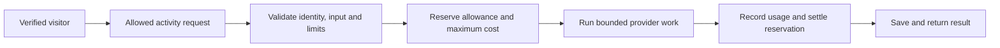

# Public release and AI demo review

Initial audit: 16 September 2026, commit `e1f6f814`. Implementation update: 17 September 2026.

The original development repository must remain private. The owner selected a new, independent `russian-arcade` repository with reviewed source and no inherited history. Anonymous samples have no AI provider access. The optional funded trial uses verified identities, dedicated credentials and persistent spending controls. See the [release procedure](release-process.md) and [current trial runbook](operations-fly.md#funded-ai-trial).

## Approved decisions

- Publish a clean source snapshot in a new repository; retain the original private archive.
- Limit future AI trial spending to **US$1 per UTC day and US$20 per calendar month** across all users.
- Keep paid AI disabled until dedicated credentials and the admission controls are ready. Budget approval alone does not enable provider calls.

The findings below describe the initial audit. The implementation status at the end records subsequent work.

## Findings

| Area | Evidence | Conclusion |
| --- | --- | --- |
| Current tracked source | Gitleaks found one synthetic session secret in a test fixture. No operational secret was detected in the exported source. | Suitable for a separate publication review. This scan does not establish that all content is safe to publish. |
| Git history | Gitleaks reported 22 findings across reachable history, including OpenAI keys. Exact values in historical files match currently configured OpenAI, ElevenLabs and Yandex credentials. | Do not make the existing history public. Credential validity was not tested. |
| Historical personal files | Earlier commits include vocabulary databases, backups, OAuth files, tutor PDFs and generated media. | Removing files from the latest commit does not remove them from history. |
| Hosted credentials | Fly lists only `FLASK_SECRET_KEY`. Public-demo startup also overrides four AI provider keys with empty values. | The current demo has no configured AI provider key. |
| Hosted access controls | Nine existing hosted/demo tests passed. Seven actual generation, media, speaking and lesson endpoints returned 403 in an isolated demo probe. | The checked paid routes are blocked. This is a scoped verification, not a complete penetration test. |
| Browser controls | The live page has CSP, frame protection and Secure, HttpOnly, SameSite=Lax session cookies. Checked credential paths returned 404. HSTS was absent from the response. | Several useful controls are present; HTTPS policy still needs review. |
| Abuse controls | The demo allows 60 writes per minute per browser session. A capped session returned 429; a fresh browser session could enter again. | This cannot enforce a visitor’s paid allowance. |
| Cost accounting | No shared reservation ledger or enforced per-account/global AI budget was found. | Do not enable anonymous paid generation with the present controls. |
| Dependencies | `pip-audit` flagged cryptography, Flask, pdfminer-six, Pillow and python-dotenv in the locked Python dependencies. `npm audit` reported no known issues in the UI lockfile. | Update and test the affected Python packages. Individual advisory reachability has not been established. |
| Test baseline | The merge check ran 671 Python tests with 14 failures and one error. Build and 323 interface tests passed. | Resolve the Python failures before treating an AI-enabled public deployment as ready. |

Local credentials, personal databases, Git history and deployment settings were not changed during this review. No paid provider calls were made. The scan reports redact secret values.

## Public repository options

The recommended route is a new `russian-arcade` repository containing a reviewed snapshot of the current source and a new Git history. Keep the existing repository private as the development archive. Create an independent repository, not a fork that retains the old history.

Before publishing the snapshot:

1. Review historical credentials for rotation. Create replacements, update the local installation, verify it, then revoke the old credentials. Review Google OAuth material separately. Do not delete or overwrite the local `.env` as a cleanup step.
2. Exclude personal data and review historical documentation, local paths, examples and artwork for publication.
3. Run a secret scan on the final snapshot. Add secret scanning and dependency checks to CI. Enable GitHub push protection where available.
4. Resolve the affected dependencies and failing tests. Choose the project licence and confirm which assets it covers.
5. Create the public repository from that reviewed snapshot. Future changes should pass the same checks.

The alternative is to clean the existing repository’s full history. That requires a separate clone, a backup, a coordinated rewrite of affected branches and tags, and a review of other GitHub records. It changes commit IDs and requires force-pushing. It should not be performed implicitly as part of changing visibility.

GitHub also exposes Actions history and logs when a private repository becomes public. Its [visibility guidance](https://docs.github.com/en/repositories/managing-your-repositorys-settings-and-features/managing-repository-settings/setting-repository-visibility) describes those effects. Its [sensitive-data removal guide](https://docs.github.com/en/authentication/keeping-your-account-and-data-secure/removing-sensitive-data-from-a-repository) explains credential rotation and history-cleanup limits.

## AI trial experience

Keep the existing sample activities available without signing in. Require a verified identity only when a visitor requests paid AI work. GitHub sign-in would suit visitors arriving from the repository; an email-based option could be added later.

Give each visitor a separate trial account and learning profile. Do not publish a shared username/password or expose the local profile picker. Local profiles deliberately have no passwords; they are not internet account authentication.

Start with a small text feature, such as feedback on a sentence. Reuse prepared pictures and audio. Add generated media and Speaking after their complete costs can be limited. Trial allowances must remain separate from Lingocoins; earning practice rewards must not create an unlimited AI allowance.

An initial policy could be:

| Control | Proposed starting point |
| --- | --- |
| Per verified account | Three short text assessments per day |
| Concurrent work | One paid job per account; two globally |
| Feature access | Selected activities and models defined by the server |
| Input/output | Fixed maximum input length and provider output-token limits |
| Images and speech | Prepared media initially; no anonymous generation |
| Later Speaking trial | One short call with a server-enforced duration and reserved budget for its assessment |
| Spending | An owner-approved daily application budget and monthly provider-project hard limit |
| Limit reached | Keep saved/sample practice available and show when the trial allowance resets |

The owner approved the US$1 daily and US$20 monthly ceilings. The table above records the initial proposal. The later implementation supports the application's provider-backed activities under shared spending limits; it is not limited to sentence feedback. Deployment activation is a separate step described in the runbook.

## Request and spending controls

All paid calls should pass through one server-side admission service. Keeping keys hidden does not prevent an attacker from repeatedly calling an expensive application endpoint.

Use persistent records for:

- **Trial accounts:** verified identity, linked learner profile and access status.
- **AI requests:** account, activity, request ID, input hash, state, reserved cost and actual usage.
- **Budget periods:** account and global spending, reservations and action counts for each period.
- **Provider attempts:** provider request ID, model, usage, outcome and retry history.

Reserve the maximum permitted cost before contacting a provider. Check the account allowance, global allowance and concurrency limit in the same database transaction. Concurrent requests must not all see the same unspent balance.

Count the complete activity: generation, retries, images, speech, transcription, delegated model calls and final assessment. Set limits on each stage. A single button click can cause several billable requests.

After completion, settle the reservation against recorded usage. A timeout does not prove that a provider did no work. Keep uncertain charges reserved until reconciled, and bound every retry. Repeated submissions of the same request should return its existing state or result.

The ledger must survive restarts and deployments. The current demo’s temporary database is unsuitable for this purpose. One Fly instance can use a separate persistent SQLite ledger with transactions. Multiple instances need a shared transactional store.

Block new paid work when the ledger, pricing rules or quota checks are unavailable. Keep a global AI-off switch. Monitor usage and errors without logging keys, full recordings or unnecessary personal content.

## Provider isolation

Create a dedicated OpenAI project and restricted service credential for the demo. Keep personal development keys out of that deployment. Store the demo credential in Fly secrets and restrict it to the required permissions and models. Use separate restricted credentials for other providers when their account controls support this.

OpenAI currently documents both spend alerts and enforceable monthly hard limits. Alerts alone do not stop requests. Hard limits stop affected traffic once tracked spend reaches the threshold, but enforcement can lag slightly. Enable a hard limit on the demo project and leave room for in-flight work. The application ledger still needs to enforce daily and per-user allowances. See [OpenAI spend limits](https://developers.openai.com/api/docs/guides/spend-limits).

Provider rate limits apply at organisation/project level rather than to each visitor. Apply account and trusted-edge IP limits in the application as additional controls. Neither IP limits nor sign-in prevent all account farming. The global budget is the final spending boundary. See [OpenAI rate limits](https://developers.openai.com/api/docs/guides/rate-limits) and [production guidance](https://developers.openai.com/api/docs/guides/production-best-practices).

## Additional release checks

- Validate authentication callbacks and bind each verified identity to its own data.
- Keep CSRF and ownership checks on all state-changing endpoints, including retries and media operations.
- Use exact endpoint allowlists. Do not make an entire legacy blueprint public to enable one feature.
- Reject client-supplied provider URLs, credentials, unrestricted model choices and arbitrary tool definitions.
- Use a bot challenge before paid trial access where appropriate. Verify it on the server.
- Treat prompts and model output as untrusted content. Prompt instructions are not access or spending controls.
- Keep PDF/image uploads disabled until dependency updates and resource-limited processing are tested.
- For live audio, verify that server settings and call termination remain enforced if the browser is modified, disconnects or the worker restarts. A timer in the interface is insufficient.
- Define recording retention and deletion before offering public Speaking trials.
- Test quota races, fresh cookies, multiple accounts, retries, worker crashes and missing usage events. Confirm each case has a bounded cost.

Public source and public AI access are separate releases. A reviewed source snapshot can be published while paid demo features remain disabled.

## Implementation status

The security branch updates the affected Python dependencies and the hash lock.
Gunicorn is included in that lock. CI now installs the media/OCR prerequisites,
scans source and incoming commits for secrets, and audits both dependency locks.
Tests use current migration expectations and authenticated, CSRF-protected flows.

The public demo uses exact endpoint allowlists and shared transactional request
limits. Profile creation has an atomic cap. Hosted HTTPS responses include HSTS.
These controls do not enable paid providers.

`services/ai_trial_budget.py` provides the separate spending ledger. It defaults
to disabled and uses integer microdollars. Shared admission budgets are US$1 daily,
US$20 monthly and US$10 total. Each account has US$1 daily and US$2 total.
Reservations are atomic and idempotent. The current allowance is 30 provider
operations per rolling minute and 120 per account per day, with one ordinary operation per
account and two in total. A voice reservation permits that account's metered
delegation call alongside it. One activity can require several operations. Pending charges remain
reserved across date changes and process restarts.
Missing storage blocks admission. An underestimated charge is recorded and
halts further admissions for review.
The standard flashcard generator limits hosted batches to five cards, including
their pictures and recordings. Local installations retain the existing batch size. The runbook
documents current limits; earlier tables in this review record the initial proposal.

The hosted trial adds GitHub OAuth with state and PKCE, an independent workspace
for each verified identity, and provider adapters that reserve spend before
calls. The public sample application remains separate. Browser-supplied identity,
prices and usage are never authoritative. Hosted activation still requires a
configured OAuth app, dedicated demo credentials, a persistent ledger and live
verification. Source publication does not establish that paid access is enabled.

Live speaking closes after one minute and uses at most two metered delegation
calls. The provider has no configurable duration limit for its primary voice
session. If the application server dies, an existing call can continue billing.
The ledger blocks further work but cannot stop that call. A verified provider
hard monthly limit is required; the application does not guarantee a US$1 daily
invoice under this failure. See the current runbook before enabling live trials.

Credential rotation remains an account-owner task. No environment file or
existing provider credential was changed by this remediation. Create and verify
replacements before revoking old credentials. The future public trial should use
its own restricted provider project and key.
