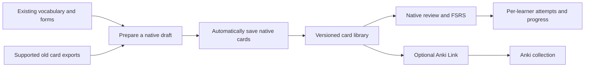

# From Anki card tools to native flashcards

**10 September update:** the [Anki parity plan](flashcard-parity-plan.md) now owns the next implementation sequence and supersedes the two-rating/text-only MVP target. This document retains the earlier audit and migration findings.

Status: migration plan and read-only audit, 9 September 2026, against `79c7a62b` and the local schema-8 database. No native scheduler, card import or Anki export was implemented during that audit. Subsequent implementation is recorded in the [MVP guide](native-flashcards-mvp.md): F1 plus automatic generation and basic library controls are now available; bulk/provider import and Anki Link remain later work.

**Owner decision, 9 September:** start a separate native schedule and keep Anki untouched. Existing Anki intervals, history and rewards will not seed native learning state. Native flashcards are the primary experience; the existing Anki generator remains available as an accessory during migration.

This document owns the implementation sequence and findings for the flashcard migration. [Native flashcard requirements](native-flashcards.md) owns FC-01–12; [the product backlog](product-backlog.md) owns priority across the whole application. Local individual use is the default; household publication controls are optional and Fly.io hosting remains later work.

**Owner correction after the first MVP:** automatic generation is the primary workflow. The individual can edit/delete cards without approval or PIN; household restrictions are opt-in. Older implementation gates below record the original proposal, not mandatory steps for individual use. Migration 010 and the corrected workflow are documented in the [MVP guide](native-flashcards-mvp.md).

## 1. Product direction

Build a **Flashcards** section where a learner can start a short practice, return to due cards, browse their vocabulary and see understandable progress. Card preparation belongs in the grown-up workspace. Anki Link exports content when requested; neither Anki nor an AI provider is required to study prepared cards.

Keep Flask, SQLite, the existing learning services and the bundled Preact/TypeScript UI. The difficult work is reliable content identity, scheduling and recovery. Replacing the framework would not solve those problems. Reuse the generator's useful preparation steps through adapters, rather than copying the script into a second application.

Drive remains an easy vocabulary capture route. SQLite remains the structured library and learning store. Adding a word through Drive does not by itself create an approved card or imply that the learner knows it.

## 2. What actually exists

### Local inventory

These are different populations and must not be presented as interchangeable totals:

| Read-only observation | Value | Meaning |
|---|---:|---|
| Vocabulary records | 1,233 | Lemma/POS identities in `words` |
| Inflected forms | 16,049 | Available forms, not a curriculum or card queue |
| Sum of `words.count` | 117 | Legacy generation counter, currently used as a card statistic |
| Words with a positive generation counter | 112 | Recorded generation coverage, not recall success |
| Sum of `forms.count` | 88 | Another generation counter, with a different population |
| Local `anki_cards` rows | 192 | Stored Anki metadata; 153 linked words and 169 linked forms |
| Old `anki_flashcards.txt` export | 533 rows | Candidate term/meaning material, including one repeated term |
| Native profiles, content versions, sessions, attempts and assets | 0 in each table | Foundation schema exists, but this local dataset has no native learning history |

The vocabulary table deliberately has **no universal English meaning field**, as clarified by the owner after this audit. Its fields are lemma, POS, counts, difficulty, topic, mnemonic and date. This is not a missing column to backfill: translations can be wrong and words can lack exact English equivalents. Native cards instead own reviewed senses, Russian contexts, answers and explanations. The MVP adds reporting, correction and retirement for unsuitable cards.

A read-only pass over the old tab-separated export extracted nonempty term/meaning text from all 533 rows. Using HTML text extraction, NFC normalization and case folding, 433 rows matched one current lemma, covering 432 distinct word IDs; 100 rows did not match. No multiple-lemma matches were found by that particular comparison. This establishes candidate coverage only: translations, senses, duplicates, form-only matches and media still need review. The private export stays outside version control.

No AnkiConnect listener was found on local port 8765 during this audit. No live collection was inspected or modified. The local metadata table is not evidence of the current remote collection size.

### What to preserve from the Python tools

| Source | Useful capability | Migration treatment |
|---|---|---|
| [Active flashcard service](../../flask_vocab_app/services/flashcard_service.py) | Selects vocabulary/forms; creates Russian cloze context, meaning, sentence translation, mnemonic, audio and illustration | Extract typed preparation stages; persist drafts before export; reuse provider adapters after validation |
| [Basic card script](../../scripts/vocab_to_anki-card.py) | Russian term, English meaning, image and pronunciation in tab-separated fields | Supported content-import source and model for basic cards; strip presentation HTML into structured fields |
| [Sentence script](../../scripts/vocab_to_anki-card-sentence.py) and [database variant](../../scripts/vocab_to_anki-card-setence-grok.py) | Cloze sentences, translations, grammatical metadata and generation limits | Reference material for one shared cloze preparer; retire duplicate execution paths only after parity checks |
| [Video pipeline](../../scripts/mp4_to_anki-card.py) | Video-to-vocabulary followed by card preparation | Keep as optional capture tooling; no dependency in the reviewer |
| [Anki sync](../../flask_vocab_app/sync_anki_cards.py) | Reads card metadata and attempts vocabulary linkage | Preserve provenance; do not reuse its inferred mappings as authoritative native identity |

Several scripts execute work at module level. Do not import them into the running app. Extract pure functions and explicit adapters without triggering network calls.

### Defects to address at the relevant boundary

| Finding | Consequence | Required correction |
|---|---|---|
| Root **Review Cards** calls the [legacy reward collector](../../flask_vocab_app/services/user_service.py), not a card player | The label promises practice but processes stored Anki metadata | Native **Start practice** opens a real session. Relabel the old action accurately in the Anki tools and keep it out of child navigation |
| Case filters search serialized JSON using `LIKE '%"case":"nomn"%'` | Zero matching forms versus 1,048 with `json_extract`; whitespace changes behaviour | One tested selector using JSON values/normalized tags. Use `EXISTS` or distinct lexical IDs for form joins, with deterministic ordering |
| Case joins can duplicate selected words; selection is capped before random form choice | Batch limits and coverage are misleading | Separate word selection from exact form selection; preview distinct words and resulting cards before preparing |
| Cloze matching can choose a different form from the requested form; the original form counter is still incremented | Card content and form identity can disagree | Validate the exact target span/form. Reject or return the mismatch for review; never silently reassign it |
| [Cloze formatting](../../flask_vocab_app/utils/formatters.py) can include punctuation in the blank and embeds HTML/uniqueness comments | Awkward prompts and presentation-dependent identities | Store plain structured text and one target span; retain punctuation outside the answer. Stable IDs replace artificial HTML uniqueness |
| Media names depend only on word/form IDs | Different contexts can overwrite each other's audio/image | Use immutable content-addressed assets with explicit prompt/answer/hint roles |
| Both media failures reject a text card; `Extra` markup is malformed for some image/audio combinations | Provider outages block useful cards; exports render inconsistently | Text-only cards are valid. Build native components and separately tested export templates |
| Anki note creation precedes local persistence; returned note IDs are discarded | Remote success plus local failure can duplicate notes on retry | Save native content first; use an export outbox, stable native keys and reconciliation. Store note IDs separately from card IDs |
| Export assumes a `Cloze` note type with custom fields; requests lack sufficient bounds | Different Anki setups fail unpredictably | Inspect destination fields, use a versioned app-owned note type, and set bounded requests and retries |
| Sync skips known card IDs and infers links from cloze/translation/hint text | Repetition totals become stale and guessed mappings can be wrong | Treat as legacy snapshots. Any later content importer must report unmatched/ambiguous records explicitly |

The 117 generation count, 192 metadata rows and 533 export rows are not a reconciliation failure by themselves. They represent different workflows. Do not rewrite them until their provenance has been established, and do not call any of them “words learned.”

## 3. The learner experience

### Entry and navigation

Add **Flashcards** to the existing activity choices. Use the current hash-router deliberately: proposed routes are `/post/#flashcards` for the overview and `/post/#review/{session_id}` for the player. They are now implemented by the MVP. Retain `/post/#words` for the lexical library, with a link from a word to its prepared cards.

The overview has one primary action, **Start practice** or **Continue practice**, with a short factual description such as “8 cards ready · up to 2 new.” Put **Browse cards** underneath. Use the durable personal profile by default. Show a profile picker only when optional household mode is enabled; keep old Anki and legacy activity histories independent.

Keep advanced options behind **Choose cards**: deck/topic, practice type and a short session size. Grown-up controls handle preparation, limits and Anki. Do not put provider selection, batch parameters, raw grammatical codes or a wall of charts above the learner's next action.

### Card and session flow

1. Show one clear prompt. **Show answer** is the primary control. Pronunciation is available when it is part of the prompt; optional answer-bearing support is labelled as help.
2. Reveal the answer, a brief relevant explanation and prepared answer media. Use **Practise again** and **I remembered**, mapping to Again and Good. An ordinary reveal is not a failed review; requesting answer-bearing help is recorded as assisted.
3. Save the accepted rating before advancing. A network error keeps the current state and offers retry. Refresh or restart resumes the same issued occurrence.
4. Offer **Undo last answer** and **Finish for now**. A short session may end while reviews remain. Say what was practised and what remains; do not imply the backlog was cleared.

Example recognition card: `яблоко` → “apple.” A separate production card asks “apple” → `яблоко`. Example cloze: `Я ем [[blank]].` with a reviewed meaning cue “I am eating an apple,” answer `яблоко`, and the period outside the blank. This is a distinct retrieval objective, not automatically the reverse of a recognition card. These examples illustrate the contract; they are not published curriculum.

Use the current palette, typography, generous space and Barsik illustration sparingly. Literal instructions remain visible without requiring a story explanation. Keyboard reveal/grading must avoid accidental double submission, focus must follow the card state, audio needs an accessible alternative, and animation must respect reduced motion. Interface language is independent of tested language: English navigation must not translate away a Russian prompt. Card-set titles and labels support English/Русский using the existing language preference.

Advanced four-button grading, typed answers, listening-only cards and multiple cloze targets follow the first release. A typed answer is not safely graded by exact string equality alone: Russian stress, spelling variants, senses and inflections need an explicit answer policy.

## 4. Card identity, scheduling, ranking and counts

### Identity and content

A vocabulary word, a card and a review are different entities. One word can have several reviewed senses or contexts; each recognition, production or cloze objective has its own stable card ID. Anki similarly distinguishes notes from the cards made from them. [Anki concepts](https://docs.ankiweb.net/getting-started.html).

Store the lexical ID, optional exact form ID, stable sense/context key, retrieval mode and related-card group. Do not generate a card for every one of the 16,049 forms. Introduce selected useful forms through reviewed content. Group siblings by sense/context and, where appropriate, lemma so related answers do not immediately give each other away.

Decks are collections or saved selections. A card in two decks has **one state per learner**, not two schedules. The canonical approved content remains an immutable `learning_content_versions` payload. New `card_versions` reference its exact item and provide indexed identity metadata; they do not own a second editable answer. Searchable meanings are projections of approved content. A later dictionary/sense editor must use that same publication boundary.

A changed illustration or corrected cosmetic text can keep card identity, while history retains the old version. A new sense, answer or retrieval objective normally creates a new card. Replacing a published version never silently rewrites what a learner previously answered.

### FSRS and queue policy

Use a maintained FSRS library through an application-owned scheduler interface. The current candidate is **`fsrs==6.3.2`**, released 9 August 2026, MIT-licensed and requiring Python 3.10 or later. Confirm compatibility, pin its dependency closure and prove serialization/time transitions before adopting it; it is not installed in this app. [PyPI release](https://pypi.org/project/fsrs/).

Use the library's documented default parameters and 0.90 desired retention as the initial versioned policy. Record library version, parameters, rating, effective review time and before/after state. The library supplies memory calculations; the app owns eligibility, queue order, daily limits and sibling handling. This does not promise identical scheduling to every Anki configuration. [py-fsrs documentation](https://github.com/open-spaced-repetition/py-fsrs).

Proposed starter policy:

- Offer up to **5 new cards per study day**, with a short session goal of **10 distinct cards**. These are tunable pilot defaults, not fixed curriculum requirements.
- Serve due learning/relearning cards first, then due review cards, then allowed new cards. Break ties deterministically and persist the issued queue. A card waiting for its next learning step is not “due now.”
- Defer siblings until a later study day initially. Do not alter their FSRS due dates to implement spacing. Record the application-level deferral separately.
- Again schedules another learning opportunity; it does not remove coins or demand that the child keep playing. If no card is ready yet, show the next availability and allow finishing.
- Pause by saving state; never move unreviewed due dates just to empty the screen. Persist issued/revealed status and all scheduler random outcomes.
- Store UTC instants, plus the profile's study timezone and versioned study-day policy. Persist daily new-card claims across sessions/tabs. Timezone changes must not reopen a spent allowance.

Record `introduced_at` when a card's first prompt is issued to the learner, not when an entire queue is selected. Claim that introduction allowance atomically at the same point; a resume does not consume it twice. Introduction is exposure, not a successful review. Undo restores scheduling but retains the exposure and its introduction claim, so repeatedly undoing cannot bypass the daily new-card limit. Introduced cards awaiting a first rating can resume even when the new allowance is exhausted.

Start with Again/Good. Hard means difficult successful recall, not partial forgetting, and can be introduced in an advanced reviewer later. [Anki grading](https://docs.ankiweb.net/studying.html). Limits and sibling policy require their own tests alongside the scheduler. [Anki deck options](https://docs.ankiweb.net/deck-options.html).

**Ranking has three meanings:** queue priority follows due state; library sorting can use alphabetical order, date added, due date or reviewed difficulty; later skill adaptation uses qualified task evidence. Legacy Elo, generation counters and coins do not change FSRS intervals. Show “new,” “learning” and “reviewing” rather than a premature mastery rank. Frequent lapses can flag a card for grown-up inspection before suggesting suspension; do not punish the learner for a poor prompt.

**Study due cards** changes scheduling. A separately labelled **Free practice** mode can later preview selected cards without memory, reward or Elo changes. Do not silently reschedule all matches when a learner browses a topic. Filtered practice and scheduling are separate choices in established tools too. [Anki filtered decks](https://docs.ankiweb.net/filtered-decks.html).

### A single counting contract

The server returns counts and the eligibility policy used to produce them. All filters use validated IDs, parameterized queries and the same selector as session creation; the browser never computes due counts from a partially loaded list.

| Label | Definition |
|---|---|
| Words with cards | Distinct linked word IDs with eligible published cards in the selected scope |
| Cards | Distinct stable card IDs; direction/context variants count separately and multiple deck memberships do not |
| New available | Eligible cards never yet issued to this learner (`introduced_at` absent); separate from the remaining daily introduction allowance |
| Learning / reviewing | Disjoint introduced-card groups: Learning/Relearning versus Review. Learning includes an introduced card still awaiting its first rating; neither label means mastered |
| Ready now | Introduced, eligible cards whose due instant has arrived, excluding suspended/buried cards; split learning/review if detail is requested |
| Ready for this session | A bounded selection from ready cards plus allowed new introductions; display the two components separately |
| Practised today | Distinct cards with an accepted, non-reversed native rating in that study day |
| Answers today | Accepted, non-reversed rating events, including repeats; never label this “words” |
| Next up | Introduced cards due later; useful when no review is ready, not mixed into “ready now” |

Availability (draft/withdrawn, suspended, buried, unassigned) is separate from learning state. Grown-up library views may include those cards with explicit status; the child queue may not. Aggregate percentages use the same filtered population and say whether they count cards or words.

During a session, show progress through the fixed set of distinct selected cards and separately identify repetitions. Do not change “3 of 10 cards” to “3 of 11” after Again. Finishing the selected cards once does not imply their learning steps are complete. Counts are a snapshot and are refreshed after accepted actions; session creation rechecks eligibility atomically.

## 5. Integrate with the existing foundation

The [schema-004 foundation](../../flask_vocab_app/migrations/004_learning_foundation.sql) already provides profiles, publication, assets, sessions, idempotent commands, attempts, evidence and an append-only reward ledger. Native review must extend it, not introduce a second account or activity-history system.

There are two concrete contract gaps:

1. [Content schema v1](../../flask_vocab_app/contracts/learning.py) has basic/cloze items, but only `ru-en`/`en-ru` directions, local item IDs and role-free assets. Add a backwards-compatible **v2** with global card identity, sense/context, optional form linkage, a `ru-cloze` retrieval mode, bilingual presentation metadata and prompt/answer/hint asset roles. Preserve v1 activity imports. Validate exact form ownership and cloze target at preparation/publication; ordinary learner responses never supply authoritative answers.
2. Current `learning_sessions.version_id` is required and its service assumes a fixed, single-pack choice activity. Reviews can repeat cards and span content versions. Add a review session subtype: retain the shared session ID/profile/command ledger, make its pack reference nullable **only for review sessions**, and require pinned per-occurrence card versions in `review_session_items`. Existing activity sessions retain a required pack version and their present behaviour. Do not use an unrelated pack as an artificial session anchor.

The second change requires a carefully tested SQLite table migration, including referencing attempts/commands. Use the next migration number available at implementation time; rehearse on a copied schema-8 database, preserve existing IDs, verify foreign keys and prove that existing activities still resume. No destructive downgrade against a database containing new reviews.

| Proposed addition | Role |
|---|---|
| `card_definitions`, `card_versions` | Stable retrieval identity; immutable reference to a published source item and validated indexing metadata |
| Deck membership / learner eligibility | Grouping without duplicated card state; begin with a small explicit collection before saved dynamic selections |
| `learner_card_state` | Unique profile/card; serialized FSRS state, indexed due time, policy, counters and monotonic revision; suspension/bury status |
| `review_sessions`, `review_session_items` | Extension of the shared session; scope/limits and issued occurrences, each pinning a version, reveal/help state and queue position |
| `review_events`, reversals | Scheduling extension of one canonical `activity_attempts` event, prior/next state, effective rating and undo provenance |
| Daily introduction claims | Enforce new-card allowances across sessions and tabs, including undo/review handling |
| Export jobs/mappings | Later durable optional Anki operations, native/remote identity and reconciliation state |

Place the scheduler wrapper, selector and review coordinator in the existing `services/` and transaction-aware SQL in `repositories/`. Add a dedicated review blueprint under `/api/v1`, using the existing profile authorization, CSRF and command conventions. The [proposed review API](native-flashcards.md#proposed-server-contract) remains the endpoint contract. Preact owns the reviewer DOM; Jinja/HTMX can continue owning grown-up forms and legacy pages.

Each issued **occurrence** has an ID distinct from its card ID: the same card may return after Again. Validate that occurrence, reveal/help state, content eligibility and expected revisions before accepting a rating. Before reveal, do not include answers or answer-bearing media in the response or hidden DOM. Recheck ownership/publication before replaying a cached result. Withdrawn content stops future presentation and acceptance without erasing existing history; missing optional media has a text fallback, while missing required prompt media makes that item unavailable.

In one short transaction, append the canonical attempt, its review extension, the schedule transition, session/queue revisions and qualified word evidence. No provider calls occur inside that transaction. A repeated key with the same payload returns the original result; a changed payload conflicts. Concurrent sessions cannot each overwrite the same card state. Ending a session retains unfinished learning steps and the next due state.

**Undo ships with the first daily-use reviewer.** It appends a reversal, restores the prior schedule/queue/support state and reverses derived evidence once, while advancing revisions monotonically. Permit it only for the latest unconflicted review in that session; later changes to the card or dependent work prevent restoration. The UI must explain that conflict. The original attempt remains auditable and is excluded from current effective totals through its reversal relationship.

## 6. Rewards, assets and Anki boundaries

### Lingocoins and skill evidence

Native review rewards follow WP-18 after the core review/undo transaction works. The proposed policy remains one coin per distinct card/day, capped at ten review coins/day, with equal credit for Again and Good. Do not display promised review earnings before that policy is implemented. Games may reuse card content while producing different evidence; matching an exposed answer does not silently update its recall schedule. See [progression](progression.md).

The current reward ledger is append-only and unique by profile/eligibility key. A naive negative entry using the original key would conflict; deleting the award is also forbidden. Introduce a separate review reward-claim record keyed by profile/card/study day, with ledger operation keys for the grant and each compensation. Track effective net eligibility and daily cap use transactionally. Undo releases only that review's effective entitlement; re-review can produce at most one net award. Existing activity reward keys and totals remain intact. Cover this before enabling review coins, not after children have accumulated balances.

FSRS answers provide self-reported memory evidence. They are not objective writing/listening scores or a global Elo ranking. Keep later skill adaptation and narrative advancement on their own explicit event policies.

### Prepared assets

Reuse the existing content-addressed local `learning_assets` store. It currently validates images and short PCM WAV audio; Anki material commonly uses MP3. Audit media first, then add a bounded, validated MP3 ingestion path or explicitly convert supported audio to WAV. Renaming an extension is not conversion. Do not assume absolute desktop paths in TSV HTML will work in a browser or on Fly.io.

Preserve the original export and media before conversion. Produce an import report with missing, unsupported and recovered assets; do not delete source files or fetch arbitrary embedded URLs automatically. Rendering uses owned components and plain fields, not arbitrary Anki HTML/JavaScript. Runtime review never generates audio or images on demand.

Local SQLite holds schedules and attempts. Files hold assets. Later, SQLite can move to a persistent Fly Volume and media/backups to private object storage under the [hosting plan](storage-and-hosting.md). A mutable database blob is not the live review store. Hosting remains a separate gate after local backup/restore and household access work.

### Anki as an accessory

Keep existing Anki progress independent by the owner's explicit choice. Native schedules start only when a learner begins a prepared native card. Exporting, importing content or observing a legacy repetition count does not create native review history or rewards.

During the pilot, the old generator remains available under a clearly labelled grown-up Anki entry. Once native preparation and export pass their gates, move it behind **Anki tools** and preserve old URL/form compatibility deliberately. Changing the root page is a navigation cutover, not a reason to break existing POST destinations immediately.

New Anki Link exports an exact approved native version through a durable job. Validate the destination deck/note type, transfer supported media, retain separate note/card IDs and use stable native identity for deduplication. An ambiguous timeout requires readback/reconciliation before retry. Do not overwrite existing notes or schedules merely because their text resembles a native card. Keep all card-type mappings explicit, including the one-note/multiple-card relationship.

Start with optional local AnkiConnect export. Downloadable Anki packages are a later portability path; Anki supports text and package exports with different content/history capabilities. A TSV is not a review-history backup. [Anki export documentation](https://docs.ankiweb.net/exporting.html). Hosted Anki Link will need a file workflow or a deliberately designed local bridge, because server `localhost` is not the learner's desktop. Two-way scheduling sync is outside this migration.

## 7. Delivery sequence and gates

Sizes are relative and depend on the existing foundation; they are not delivery promises. F0–F3 refine WP-17 and its preparation dependencies. WP-18 rewards and WP-12 Anki Link retain their positions in the programme backlog; this sequence does not move them ahead of all game work.

| Slice | Priority / effort | Concrete output | Gate before moving on |
|---|---|---|---|
| **F0: content and contracts** | P0 / small–medium | Copied-data reconciliation, supported legacy-text importer/dry run, v2 schema and identity mapping, accurate selector, 10 draft pilot cards covering basic and cloze | Every item has a reviewed meaning/context and exact lexical/form linkage; unsupported rows reported; repeated import is harmless; no live Anki writes. This document completes the audit portion only |
| **F1: one reliable native reviewer** | P0 / large | Profile setup handoff; native card projections; shared session migration; FSRS wrapper; start/reveal/help/Again/Good/finish/resume/undo; minimal card inspection and suspend/resume | Approved 5–10-card deck works with Anki/AI/Drive unavailable; two profiles and tabs remain isolated; retries/restart/withdrawal/undo work; counts agree with SQL; restore rehearsal passes |
| **F2: library and queue control** | P1 / medium | Search, topic/deck/type/direction/status filters, due sorting, grown-up limits and history, additional deck memberships, sibling controls and honest counts | Same card in two decks has one schedule; all filters and counts share the queue selector; no silent rescheduling; no leaking another learner's progress |
| **F3: native card preparation** | P1 / medium–large | Select words/forms → preview scope → prepare persisted draft → inspect/edit → publish; bounded durable provider jobs; asset import and recoverable partial results | Text-only preparation works; failed provider leaves recoverable drafts; retries do not duplicate content; exact cloze/form checks pass; child never receives unpublished output |
| **WP-18: review participation rewards** | After F1 / small–medium | Shared review reward policy, claim/reversal accounting and truthful UI | Concurrent caps, Again/Good equality, undo/re-review and duplicate requests yield at most the intended net reward |
| **F4 / WP-12: Anki Link cutover** | Programme order 6 / medium plus job prerequisites | Export approved native cards; optional destination controls; legacy Anki tools retained as accessory; mapping and recovery report | Repeated/ambiguous exports reconcile; media/note types work; Anki being closed cannot damage native cards or schedules |

**F1's first usable scope is deliberately small, but complete.** A validated local import/preview/publish workflow can precede a polished bulk editor. Manual reviewed cloze content can precede live sentence generation. No synchronous AI call, huge form batch or collection-history migration is required to prove daily practice. Broader type/grammar filters and charts follow verified core counts, not the reverse.

## 8. Migration risks and release checks

| Risk | Mitigation and evidence |
|---|---|
| Wrong meanings, cloze targets or guessed old identities | Dry-run report; stable source checksum/row mapping; preserve originals; review ambiguous/unmatched rows; publish a small real deck first |
| Cross-profile history or old rewards leaking into native progress | Explicit profile setup and ownership tests; no default import of adult balances, Anki reps or generation counts |
| Session schema changes breaking existing games | Copy-backed migration rehearsal with real legacy records and synthetic active learning sessions; FK/integrity checks; existing start/resume/attempt regression checks |
| Repeat taps, refresh or two sessions corrupting due state | Idempotency and expected revisions; one transaction; fixed-clock queue tests; independent browser sessions and restart recovery |
| Undo producing invented history, wrong counts or extra coins | Append-only reversals; monotonic revisions; effective-event queries; later-change conflict checks; review reward claims tested before enabling coins |
| Media replacing answers or revealing them too soon | Explicit media roles and front/reveal projections; missing-required-media policy; Cyrillic, stress and punctuation fixtures; audio format validation |
| A scheduler update changing every due date unexpectedly | Pinned dependency/parameters; saved before/after state; serialized fixture round trips; no implicit bulk reschedule on upgrade |
| Native rollout harming Anki or lexical capture | Native feature gate; retain legacy routes; zero writes to Anki in content migration; preserve lexical IDs and existing Drive semantics |

Backend acceptance covers fixed-time new/Good/Again/assisted transitions; learning waits; day/DST boundaries; daily limits and siblings; duplicate and changed-payload keys; stale revisions; ownership and withdrawal; safe undo and immutable evidence; copied-data migration and restore. UI acceptance covers clear empty/setup states, reveal/help, save failure/retry, resume, finishing early, English/Русский labels, keyboard/touch and narrow viewports. Assert behaviour rather than mirroring implementation internals.

Before enabling native review for real household use, take a consistent SQLite-and-assets backup, verify the migration on a copy and demonstrate an actual restore. Use a proposed native-review feature flag alongside the existing household boundary. A UI rollback disables the new entry while preserving its records. Never restore an old database over newer learning merely to roll back a stylesheet or application build; retain a compatible build or correct the migration forward.

The initial implementation task was **F0 plus the smallest F1 slice**: prepare ten reviewable cards from existing vocabulary, establish stable identity and the scheduler contract, then connect a real learner to the durable review loop. Present that concrete deck for grown-up approval before publishing it. Age/reading level can be refined at that content review; it does not block the storage and scheduler work. Historical Anki carryover is resolved: the native schedule is separate and Anki stays unchanged.

## MVP checkpoint, 9 September

The [MVP operating guide](native-flashcards-mvp.md) records schema 9, contextual manual authoring, ten unapproved drafts from copied vocabulary, the FSRS reviewer, basic search/filters/history and verification. F1 is implemented for a local pilot. F0 legacy import/selector work, F2 configurable limits/full facets, F3 provider jobs and F4 Anki Link are still open. Review rewards remain a separate WP-18 task. No household curriculum was auto-approved and no Anki schedule was changed.
