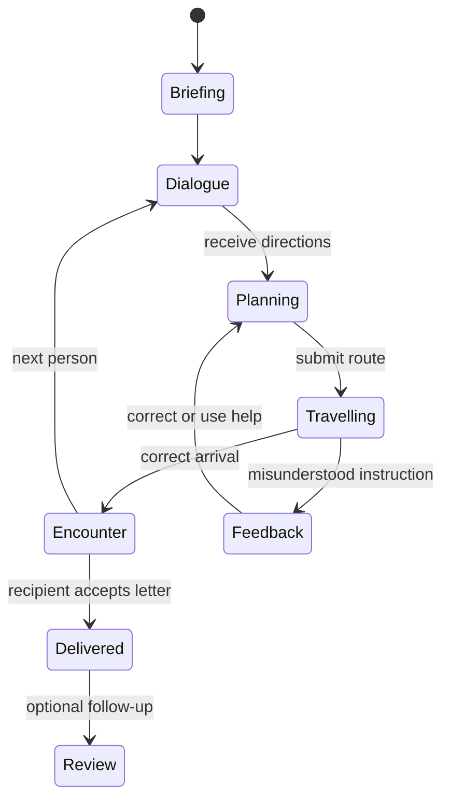

# Follow the directions: game redesign

**Status:** product and implementation specification. Five connected deliveries across two neighbourhoods, listening-first play and section replay are now implemented on `codex/directions-delivery`. See the [implementation record](directions-delivery-implementation.md) for current behaviour, validation and remaining work. The full specification below is broader than the current build.

**Date:** 16 September 2026.

**Scope:** replace the standalone Directions drill with a connected delivery activity. Retain the current application, profiles, vocabulary model, media services and participation rewards.

Related documents: [corrected game audit](game-audit-2026-09-16.md), [game quality plan](game-quality-pass.md), [current journey games](journey-games.md), [skill progress](skill-progress.md) and [vocabulary data model](../vocabulary-data-model.md).

## 1. Product direction

Barsik has a delivery to make in a neighbourhood he does not know. The learner helps him understand directions, recognise places, ask for clarification and find the recipient. People encountered along the route provide the next part of the journey.

One session is one connected delivery. The map, Barsik's position and the people already met persist throughout it. Arriving somewhere changes the situation: a shopkeeper gives directions, a gardener explains which house to find, or the recipient accepts the letter.

The Russian must explain something the learner needs to do. A landmark must help identify a place, a turn, a relationship or a destination. A character must contribute information or a useful interaction. These are the foundations of the activity.

Keep **Follow the directions** as the activity name during development. Give individual deliveries short titles, such as **A letter for Anna**. A new name is not needed to fix the experience.

These are local deliveries along Barsik's wider journey. Finishing one does not deliver the application's final letter to the learner or replace that planned ending.

### First release decisions

| Area | Proposed decision |
| --- | --- |
| Session | One delivery with two or three connected route stages |
| World | A small, illustrated neighbourhood with real paths, crossings, entrances and landmarks |
| Characters | Authored Russian dialogue at meaningful points on the route |
| Main interaction | Read or listen, plan a route, then send Barsik along it |
| Default presentation | Russian text with Russian audio available; a listening-first setting can hide the text |
| Assistance | Replay, clarification, contextual word help and a guided route when needed |
| Vocabulary | Useful familiar words plus a few new words appropriate to the place and task |
| Initial content | Reviewed, authored missions with prepared recordings; no live AI dependency |
| Completion | A visible delivery, useful feedback and the existing participation reward |
| Evaluation | Play and review a complete mission before producing a larger catalogue |

The default should work for an individual learner. It does not introduce an adult approval step, a PIN, a separate children's account requirement or a new currency.

## 2. What needs replacing

The inspected implementation builds random sequences of left, right and straight. Route length cycles through one, two and three moves. Each round starts again from the centre of a grid. The post office and market are illustrations; the instructions and answer checker do not use them.

The five-round session inspected during review contained only these sequences: left; straight then right; left then right then right; straight; straight then straight. Its saved options named a vocabulary source, but the route builder did not use that source.

The current checker compares command positions with an expected array. It can say that a turn differs, but it cannot establish whether Barsik reached the recipient, crossed a bridge too early or took another valid route.

The recent quality pass improved reliability, corrections and presentation. Those improvements remain useful. They did not provide the missing delivery objective or richer language.

| Existing behaviour | Replacement |
| --- | --- |
| Five disconnected rounds | One delivery with a continuing position and purpose |
| Arbitrary sequence of arrows | Directions grounded in the actual neighbourhood |
| Decorative landmarks | Places and spatial relationships used by instructions and validation |
| Repeated generic prompt | A current objective and a particular person giving directions |
| Exact command-array comparison | Route and destination checks against the meaning of the instruction |
| Automatic reset to the map centre | Continue from the person or place just reached |
| More rounds as difficulty | More demanding language and decisions, introduced deliberately |
| Generic success message | The recipient receives the letter; the learner sees what they understood |

A one-command exercise may remain as an optional controls demonstration. It must not be presented as the full game.

## 3. Learning objectives

The activity should develop practical comprehension of Russian directions. It should also make Russian forms meaningful through use.

The learner should practise:

1. Recognising places and people in a short instruction.
2. Following a sequence while retaining the current destination.
3. Distinguishing relationships such as before, after, opposite and next to.
4. Understanding movement towards a place and location at a place.
5. Asking for repetition or clarification when the instruction is unclear.
6. Transferring a familiar expression to a different route or neighbourhood.

Navigation alone does not demonstrate accurate spoken Russian. Selecting a phrase does not establish that the learner could produce it independently. A long route does not establish an advanced language level.

### Language progression

These are proposed content bands, not claims of formal TORFL alignment. Review the scripts before attaching A1 or A2 labels in the catalogue.

| Content band | Language focus | Example | What changes in play |
| --- | --- | --- | --- |
| Introduction | A destination and a short direction | «Иди прямо до фонтана». | Find one visible place and stop there |
| Short delivery | Two instructions and a landmark | «У аптеки поверни направо». | Recognise the pharmacy and turn at it |
| Landmark relationships | Before, after, next to, opposite | «Перед мостом поверни налево». | Distinguish the turn before a crossing from the turn beyond it |
| Destination detail | Ordinals and relative positions | «Дом Анны — второй справа». | Count houses from the stated approach direction |
| Clarification | Ask which place or repeat a detail | «До моста или после моста?» | Resolve a genuine uncertainty before choosing a route |
| Later variation | Restrictions and a revised route | «Мост закрыт. Иди через парк». | Update a plan using new information |

Within a band, change both the route and what has to be understood. Repeating the same sentence over a longer path is not sufficient progression.

## 4. A complete example: A letter for Anna

This example defines the first playable mission. It is a design fixture, not a promise that these draft lines are already reviewed teaching material.

### The neighbourhood

The post office opens onto a street leading to a fountain. A road from the fountain approaches a bridge. Before the bridge, a side street leads west past a bakery towards a park. Two houses stand on the right of that street when walking towards the park.

```text
                                                        North bank
                                                             |
       House 2          House 1                            Bridge
          |                |                                 |
Park — House 2 junction — House 1 junction — Bakery — Bridge approach
                                                             |
    Post office — Corner — Street junction ————————————— Fountain
```

The diagram shows connections, not final artwork. The authored map has fixed coordinates and entrances. North stays at the top. In particular, the houses must be north of the residential street so they are on Barsik's right when he walks west towards the park.

The bakery and houses must have distinct entrances. A park illustration in the background must not be confused with its walkable entrance. The river can only be crossed using the bridge.

The following coordinates make the example testable. They are logical positions, not pixel measurements. East increases `x`; south increases `y`. Only the connections in the diagram are walkable, even where two nodes happen to be close together.

| Node | Position | Purpose |
| --- | --- | --- |
| Post office | (1, 3) | Starting place; Barsik faces east |
| Corner | (2, 3) | First node along the starting street |
| Street junction | (3, 3) | Next node on the same street |
| Fountain | (4, 3) | Sasha's encounter |
| Bridge approach | (4, 2) | Junction where the left turn happens |
| Bridge entrance | (4, 1) | Start of the crossing |
| North bank | (4, 0) | Far end of the bridge |
| Bakery | (3, 2) | Olya's encounter, west of the bridge approach |
| House 1 junction | (2, 2) | First residential entrance when walking west |
| House 2 junction | (1, 2) | Second residential entrance when walking west |
| Park entrance | (0, 2) | Landmark establishing the westward direction |
| House 1 entrance | (2, 1) | First house on the right from that approach |
| House 2 entrance | (1, 1) | Anna's entrance; this identity remains server-side until arrival |

### Opening at the post office

The screen shows the neighbourhood, Barsik outside the post office and a small envelope marked **Анне**. A postal worker explains:

> «Это письмо для Анны. Саша у фонтана поможет тебе её найти. Иди прямо до фонтана».

The learner's immediate objective is **Ask Sasha for directions**. The Russian explains where to find him. An English task label must not translate away the place or relationship being practised. The recipient and purpose are clear before movement begins.

The learner can replay the line, read it, select an unfamiliar word or ask for a shorter explanation. A new learner can first try a brief controls demonstration, then return to this same scene.

### Stage 1: reach Sasha

Barsik begins facing along the street towards the fountain. The learner plans the path and presses **Go**. Barsik follows it. No route is drawn automatically from the Russian instruction.

On reaching the fountain, Sasha waves. **Talk to Sasha** opens a short exchange. The next stage begins from the fountain, with the rest of the map unchanged.

The learner can select:

> «Где живёт Анна?»

Sasha explains why Olya can help:

> «Оля из пекарни знает её адрес».

Then he gives the route:

> «Иди к мосту. Перед мостом поверни налево. Там пекарня».

Sasha knows the way to the bakery; Olya knows Anna's address. Each encounter therefore adds information for a reason. Characters must not withhold an address they already know simply to force another stage.

### Stage 2: find Olya at the bakery

The learner must approach the bridge, turn left before entering it and reach the bakery. The bridge approach is a real junction in the map. The route towards it changes Barsik's heading, so the left turn is relative to his movement at that junction.

Useful dialogue options include:

| Learner choice | Sasha's response | Purpose |
| --- | --- | --- |
| «Повтори, пожалуйста». | Repeat the original direction | Replay without inventing a new task |
| «До моста или после моста?» | «До моста. Не переходи мост». | Clarify the spatial relationship |
| «Что такое пекарня?» | «Место, где пекут и продают хлеб». | Explain a word in a useful context |
| «Спасибо!» | «Пожалуйста!» | Close the exchange and continue |

An English explanation remains available through the application's help controls. The conversation itself stays in Russian.

If the learner crosses the bridge, the feedback refers to that action: **“The turn was before the bridge. Your route crossed it.”** If the learner merely steps onto the approach, the game must not falsely say they crossed the river.

The learner can return to the last junction or revisit Sasha's instruction. Their first submitted route remains recorded. Correction does not require restarting the mission.

Olya is outside the bakery. Reaching her produces a useful encounter, not an “Answer saved” page.

### Stage 3: find Anna's house

Olya says:

> «От пекарни иди к парку. Дом Анны — второй справа. Позвони в дверь».

The learner walks west from the bakery towards the park. The first house on the right is a plausible wrong destination. The second is Anna's. House labels show ordinary addresses or numbers; they do not label the answer **Anna's house** before it is found.

The learner chooses an entrance and presses **Deliver the letter**. Merely passing a building does not submit a guess.

At the wrong house, a resident offers a brief, natural response:

> «Анна живёт в соседнем доме».

That response is help, and the game records it as such. It must match the actual map. There is no scolding, lost currency or forced restart.

At the correct house, Anna receives the letter:

> «Спасибо за письмо, Барсик!»

The animation and exchange finish the delivery. The map remains behind the completion panel so the outcome belongs to the place the learner reached.

### Completion

Show **Letter delivered**, the participation coins actually credited and a short account of the language practised. For example:

> You found the fountain, turned before the bridge and reached the second house on the right.

If the learner needed help, describe it without disguising it as an independent success:

> You found the bakery after checking where to turn.

Offer three useful continuations: another delivery, a short practice of the missed relationship, or selected words for flashcards. Do not require all three. A completed delivery should feel complete.

## 5. Movement and interaction

### Plan, then travel

Use a visible route plan as the default control. Selecting an adjacent street node adds it to the plan. **Undo** removes the last step; **Clear route** returns the plan to the current checkpoint. The learner chooses a stopping place, such as a landmark, person or entrance, then presses **Go** to submit the intended arrival and animate Barsik's travel.

This separates experimenting with the controls from submitting an answer. The first submitted route counts as the first attempt. Quietly editing a draft is not a failed attempt.

Do not require a fixed number of turns. A valid plan can be short or long. Selecting an intermediate junction extends the draft; it does not submit a half-finished answer. **Go** becomes available when the learner has selected a stopping place. Explain an incomplete plan as a control requirement, not a Russian comprehension error. A bounded maximum path length prevents accidental loops and abusive requests; it is not the solution length.

Later, direct movement can be offered as a setting. It needs a clear submission boundary before it can be used for assessment. It should not be mixed into the first implementation as a second partially working control scheme.

### Route rules

- Streets form a connected graph. Adjacent nodes, crossings and entrances define legal movement.
- Walking does not pass through buildings or cross water without a bridge.
- Left and right are relative to Barsik's heading at the relevant turn. The map does not rotate during a task.
- Tapping a landmark identifies it; it does not automatically compute or reveal the correct route.
- The map shows only the learner's proposed path before checking. Solution paths appear as explicit help or feedback.
- Reaching a character creates a conversation opportunity. Completing that exchange establishes the next objective.
- Returning to a previous character allows repetition without resetting the delivery or awarding anything again.

### Exploration, early arrivals and detours

The streets should not become inexplicably locked to force the intended story. The first authored map can arrange encounters naturally along the route, which keeps the implementation manageable.

If a learner reaches a later character early, a short authored help branch can supply the missing direction. Mark bypassed instruction checks as supported or skipped. Do not pretend they were answered correctly. The learner may still finish the delivery with help.

The mission is a guided language activity, not a promise of unrestricted conversation with every resident. Background characters can greet Barsik without starting another task. Clearly distinguish people who can help from decorative figures.

Accept a detour when the instruction leaves the route open and the learner still satisfies its constraints. If the instruction explicitly says to turn before the bridge, arriving at the destination by crossing the bridge first does not satisfy that instruction. The feedback should explain the difference.

## 6. Characters and dialogue

Characters need a reason to be where they are. A baker knows the nearby street; a gardener knows the park entrances; a postal worker knows an address. These roles make short dialogue understandable without long biographies.

For each encounter, author:

- An opening line linked to the current delivery.
- One instruction containing the information needed for the next stage.
- Two or three useful clarification responses.
- A brief acknowledgement or farewell.
- A response for returning or arriving unexpectedly.

Store dialogue as a small directed graph with stable node IDs and explicit transitions. A choice such as **Repeat** replays the current node. A clarification reveals a related node and records assistance. Acknowledging the instruction moves to route planning.

Dialogue choices should serve a purpose. Do not make the learner select **Спасибо** merely to unlock a button after every line. Greetings can enrich an encounter without becoming artificial examination questions.

In the first release, selected Russian phrases are enough to ask questions. Microphone input is a later integration with Speaking. It must retain the existing distinction between what the learner said, what transcription inferred and what an assessor can support.

### Audio and voice identity

Every core instruction and meaningful character response should have prepared Russian audio. A character keeps the same voice through a delivery. Different characters and future missions can use different voices; variety remains deliberate.

Do not assign a fresh random voice to every line from the same character. Save the chosen voice with the content version, and include it in audio cache identity. A text-only cache hit must not silently replace Olya's voice with Sasha's.

Allow replay and a slower playback setting. Never require the learner to wait through an already-heard recording to act. Show recording failures clearly and preserve the mission. Reading mode remains usable; listening mode needs a working recording or an explicit switch to reading.

Characters should speak as people giving directions. Avoid a synthetic announcer narrating every interface action.

## 7. Map and screen design

The neighbourhood is the main play area. The previous design gave too much space to headings and instructions above a small board. This redesign should use the available viewport for the place the learner is exploring.

### Desktop

Use a wide activity layout under the existing header. A compact top row contains the delivery title, current objective and exit link. The map occupies roughly two-thirds of the play area; an adjacent panel contains the active character, dialogue and route controls.

The panel changes with the task. It should not simultaneously display the whole conversation history, all hints, every word and the completion statistics. A small notebook can retain directions already received.

### Mobile

Place the map above a compact dialogue and controls panel. Keep the current direction and primary action visible without covering a house entrance or the route being planned. Allow the panel to collapse while the learner examines the map.

Pinch and drag may help with a larger neighbourhood, but provide explicit zoom and recenter buttons as well. Default zoom must make the first task usable without those controls.

### Visual language

Use the existing Barsik artwork, palette and illustrated style. Start with a small set of reusable buildings, trees, bridges, signs and character portraits. Compose them into maps rather than generating a new picture for every instruction.

The important distinctions must be legible: bakery versus pharmacy, bridge entrance versus far bank, first house versus second. Decorative texture must not conceal junctions. Distinguish a landmark's illustration from its entrance and walking surface.

Show Barsik's facing direction clearly. Animate travel along the submitted path and stop at the actual arrival point. Respect reduced-motion settings. A letter handover should communicate success without requiring a long cutscene.

### Interface copy

| Current or unsuitable wording | Preferred use |
| --- | --- |
| Round 2 of 5 | Find Olya |
| Follow the Russian directions to guide Barsik | The character's actual Russian instruction |
| Check route | Go |
| Answer saved | Continue within the same scene |
| Incorrect | A specific description of the misunderstood direction |
| Mission statistics dashboard | A short delivery result with optional detail |

Use the selected interface language for controls and explanations. Character speech, street signs and learning examples remain Russian. English meanings are available as help where appropriate.

### Accessibility

Provide keyboard route planning with visible focus and clear selected-path feedback. Inputs must work without dragging or precise clicking. Announce arrival, a new speaker and route feedback without repeatedly reading the whole page.

Offer a text representation of the map's topology: current location, heading, adjacent streets, visible landmarks and entrances. It must provide equivalent navigational facts, without naming the correct destination in an accessibility label.

Do not hide all useful descriptions to prevent answer leakage. Review the accessible task as a playable activity in its own right. Do not infer listening skill when the learner uses a textual alternative.

## 8. Russian vocabulary and grammar

The existing lemma and form relationships are an asset. The game should use them rather than reduce all language to labels such as left, right and bridge.

| Contextual phrase | Useful relationship | Database treatment |
| --- | --- | --- |
| «к мосту» | Movement towards a place; dative form | Link «мосту» to its form record and the lemma «мост» |
| «перед мостом» | Position before a landmark; instrumental form | Keep the actual phrase and the «мостом» reading |
| «после моста» | Location after passing a landmark; genitive form | Preserve the sentence that establishes the meaning |
| «у пекарни» | Location by a place | Link «пекарни» to the relevant contextual reading |
| «через парк» | Movement through a place | Store the contextual analysis even when spelling overlaps another case |
| «в парк» / «в парке» | Destination versus location | Treat these as different uses, not interchangeable translations |
| «второй справа» | Position in an ordered set from a stated viewpoint | Retain the referent, approach direction and full example |

These examples describe language opportunities. The game does not prove case knowledge merely because a learner navigates successfully.

### Selecting familiar and new language

Use vocabulary and lesson history to choose suitable content packs or validated variants. A stored word indicates familiarity, not mastery. A learner who has saved «мост» may still need «к мосту» explained.

As an initial design target, a short delivery might introduce two to four new content words and one new spatial construction. Adjust this after observing learners. Do not turn it into a rigid quota that forces inappropriate words into a scene.

A hospital-related lesson can support a delivery involving a pharmacy or clinic. An abstract word such as «структура» should not be inserted into a street name merely to satisfy a vocabulary filter. When there is no natural connection, use another suitable mission and label its source honestly.

Word selection must not be limited to the learner's list. Encountering an unfamiliar place or expression is part of the activity. The learner can select it, see its contextual meaning and explicitly add it to their vocabulary.

Routine character names should not fill the suggested new-vocabulary batch. Keep them in their actual dialogue context, and let a learner select them deliberately if useful.

### Context and ambiguity

Keep exact surface spans, lemma and form references where resolved, grammatical interpretation, dialogue node, mission version and contextual translation. Generated paraphrases retain their own provenance. Do not attach a universal English meaning to a lemma.

Some visible forms have several possible analyses. Interpret them within the reviewed line. If an exact form link cannot be resolved reliably, keep the contextual occurrence without inventing a foreign-key match; resolve it before creating a grammar-targeted card.

The current game lookup checks occurrences in completed content. Mid-mission lookup needs an extension that only exposes dialogue the learner has already received. It must not reveal the next character's instructions, the final address or hidden feedback.

### Follow-up flashcards

At completion, let the learner select useful words and phrases. Preserve the automatic native-card workflow and its required media.

For example, «Перед мостом поверни налево» can support a card for «мостом» with the full contextual English sentence, an optional mnemonic and sentence audio after reveal. A card for the expression «перед мостом» needs an explicit phrase selection, not a misleading single-word lemma entry.

Check the illustration for answer leakage. A picture that prints the missing word or draws the exact target relationship may make the cloze trivial. Use a suitable scene image rather than automatically reusing the entire route solution. Keep the existing reveal and Again, Hard, Good, Easy behaviour.

## 9. Content construction and validation

### First release: authored missions

Build the first mission by hand. Review its map, Russian, translations, instructions and feedback together. Then produce a small number of variants that change a real decision.

An initial public sample must be entirely playable with bundled content and recordings. Starting or replaying it must not call a paid provider.

### Later: constrained variation

Build a valid mission before asking a model to phrase it. The application selects a map, reachable locations, encounters and instruction constraints. It then chooses reviewed lines or requests wording that expresses those constraints.

The model does not decide where buildings exist. It does not grade the route. It cannot introduce an unavailable bridge, a third house where there are only two, or a person absent from the scene.

Use this order:

1. Choose a reviewed map and mission pattern.
2. Select compatible landmarks, recipient, route stages and language targets.
3. Compute at least one route satisfying every stage.
4. Resolve Russian phrases and their contextual form references.
5. Validate any generated wording against the intended constraints.
6. Prepare or reuse the required recordings and artwork.
7. Freeze the complete mission before play.

If a generated variant cannot be validated, offer an authored mission. Preserve preparation work and explain a retry when needed. Do not spend repeated hidden model calls trying to repair an impossible route.

### Mission validation

| Check | Failure it prevents |
| --- | --- |
| Every referenced entity exists | A character mentions a missing pharmacy |
| Every stage is reachable | A destination lies across an uncrossable river |
| Dialogue order has a completion path | A person requires information that can only be obtained from them |
| Relative directions have an approach heading | “On the right” changes meaning without explanation |
| Ordinals have a defined starting point and set | Two different buildings can both be the second house |
| Instructions match route constraints | “Before” is spoken while the stored route turns after the bridge |
| Valid alternatives are recognised | A reasonable detour is marked wrong without cause |
| Visuals do not disclose the answer | The intended house carries an “Anna lives here” marker |
| Grammar and translation agree | An English cue changes the relationship expressed in Russian |
| Required audio matches its line and speaker | Stale recordings or inconsistent character voices |
| Assistance has a recorded effect | A revealed solution is counted as independent comprehension |
| The mission has a useful ending | Arrival produces another disconnected quiz screen |

Seeded variation should change the combination of language and task. Recolouring a house or shuffling internal IDs is not a new assessment item.

## 10. Route checking and feedback

Replace positional command matching for new missions with a route validator operating on the authored graph.

Each stage contains a start state, a destination or encounter, and explicit constraints. Examples include reaching the fountain, turning left at the bridge approach before entering the bridge, or selecting the second entrance on the right while heading towards the park.

The submitted route is a list of adjacent node IDs plus any explicit arrival action. The server validates the whole path. A client cannot submit a target coordinate and claim to have walked there.

For the example mission:

| Stage | Required result | Important constraint |
| --- | --- | --- |
| Post office to Sasha | Reach the fountain and speak to Sasha | Follow the instructed street rather than teleporting to the marker |
| Fountain to Olya | Reach the bakery encounter | Approach the bridge and turn left before entering it |
| Bakery to Anna | Deliver at the second right-hand house | Count from the bakery while moving towards the park |

“Correct” does not mean shortest. If the instruction does not forbid a detour, accept an equivalent route that satisfies its meaning. A reference route is useful for testing and hints; it is not necessarily the only accepted answer.

### Diagnose the first meaningful misunderstanding

Feedback should identify the relevant action and relationship, then make correction possible.

| Submitted behaviour | Useful feedback |
| --- | --- |
| Crosses the bridge before turning | The turn was before the bridge. Your route crossed it. |
| Turns right at the bridge approach | Turn left at this junction. Barsik was facing the bridge. |
| Stops at the first house on the right | This is the first house. Anna's is the second. |
| Reaches the right house by another allowed street | Accept the delivery. Do not invent an error. |
| Encounters a closed edge or impossible move | Explain the physical obstruction; do not label it a Russian grammar error. |

Reveal only as much as needed. First identify the relevant phrase and junction. Offer a fuller explanation or an illustrated route on request. Showing the whole route immediately can remove the purpose of a correction attempt.

Keep first submissions immutable. Later attempts and assistance remain visible in the learner's history. Continuing with a guided route is a legitimate way to finish; it is not independent evidence of comprehension.

## 11. Rewards, progress and replay

One completed delivery uses the existing activity reward: up to **3 Lingocoins**, within the **12-coin daily activity allowance**. Do not award three coins for every character, turn or stage. Replays follow the existing daily deduplication rules.

Completion with mistakes or help can still earn participation coins. Interrupted sessions resume. Opening the map, repeatedly greeting a character and replaying audio do not create additional rewards.

Delivery progress and the header skill bar are different. The mission can show **Find Sasha → Find Olya → Deliver the letter** without claiming a rating increase at every checkpoint.

### Skill evidence

The current route chance assumption is tied to three arrow choices. It must not be reused for a neighbourhood with different branching paths and semantic constraints.

Before enabling rating evidence for the new mission format:

- Define the assessed instruction units and their supported alternatives.
- Count a first unassisted interpretation once, not every movement animation.
- Exclude already-revealed instructions, guided routes and skipped stages.
- Evaluate guessing against the actual branch and destination choices, including equivalent paths.
- Keep text-supported comprehension separate from listening-only evidence.
- Version the policy and retain historical receipts under their original rules.

Until those checks exist, the new missions should award participation coins without inventing a new Elo observation. The profile and existing header remain available; the game should not promise that this pilot raises the skill rating.

Later, report what the evidence actually supports: understanding a particular route instruction. Do not infer speaking fluency, general grammatical competence or a TORFL level from arrival alone.

### Reasons to replay

Replay should offer another small delivery with a different recipient, route relationship or source of information. Useful variations include a different approach to the bridge, a recipient across from the pharmacy, or an encounter where the learner must clarify which park entrance to use.

Do not add a countdown to make the existing content seem more engaging. Speed can be an optional later challenge after the language and navigation are familiar. It should not determine the normal reward.

## 12. Technical architecture

Keep Flask, SQLite and Preact. The current stack is suitable for an illustrated map, short audio clips, authored dialogue and transactional progress. This activity does not require WebSockets or a separate game server.

A browser can animate a route locally. Requests save plans, check a submitted path and advance encounters. Streaming conversation remains a separate Speaking capability unless a later mission specifically needs it.

### Content and runtime state

Separate an immutable mission definition from the learner's current state.

| Record | Contents |
| --- | --- |
| Map definition | Nodes, legal edges, entrances, coordinates, landmark IDs and artwork |
| Mission definition | Recipient, stage order, encounter references, semantic constraints and content version |
| Dialogue definitions | Russian lines, contextual English support, choices, speaker IDs, audio and transitions |
| Contextual occurrences | Exact spans, lemma/form links, grammatical interpretation and provenance |
| Session state | Current position, heading, phase, active stage, received dialogue and draft route |
| Attempt records | First submissions, corrections, assistance, feedback and request identity |

Start with authored mission packs in source control. Freeze the selected pack into the existing `journey_game_sessions.content_json` when a session starts. That preserves a played mission even after an author edits the pack. A content-management interface is unnecessary for the first release.

Do not put the entire new runtime into `support_json` or pretend every conversation is another multiple-choice round. Add a small, explicit route-state model.

### Proposed persistence changes

Use an additive migration with the next available schema number. This document does not reserve or apply one.

- **`journey_route_state`**, one row per existing game session: current stage, node, heading, phase, state version, draft path and received dialogue IDs. The parent session retains ownership, content, completion and reward linkage.
- **`journey_route_actions`**, an append-only record of accepted commands: session, request ID, payload hash, operation, stage, attempt kind, submitted data, assistance and result. A uniqueness rule permits only one first check per session and stage. Corrections remain separate rows.

This is a current-state table and a bounded action history, not a new event-processing framework. The action receipt supplies duplicate-request protection and evidence of the first answer. Do not duplicate those first answers into several competing stores.

Existing `journey_game_corrections` continues to serve legacy game sessions. The new route adapter exposes an equivalent correction/review experience without requiring new structured navigation data to fit its legacy answer-array format.

### State transitions



The server saves the semantic result before animation finishes. Refreshing during travel restores the accepted arrival or feedback state, without repeating an attempt or a reward. The interface can replay the animation or offer **Skip animation**; it cannot submit the answer again just because the page reloaded.

### Commands and concurrency

Retain the existing session URL and ownership checks. A version-specific route handler can accept commands such as `save_plan`, `check_route`, `talk`, `choose_reply`, `request_help` and `deliver` through a dedicated route-command endpoint.

Every mutation carries a request ID and expected state version. A duplicate request with the same payload returns the saved result or current state. Reusing its ID with a different payload is rejected. An outdated browser tab receives a recoverable state conflict rather than overwriting the newer position.

Persist planned routes at sensible boundaries, such as after a brief debounce or when opening dialogue. Do not submit a request for every animation frame. Keep submissions small and bounded; cap route length, dialogue loops and saved command volume under existing visitor limits.

The server verifies legal movement, current dialogue choices, assistance state, ownership and completion. Hidden constraints, accepted destinations and full future dialogue stay out of the initial client payload. Visible map facts remain available for play and accessibility.

### Proposed code boundaries

These are responsibilities to implement, not files that already exist.

| Area | Proposed responsibility | Existing integration |
| --- | --- | --- |
| Route content service | Load, version and validate mission packs | `journey_vocabulary_games.py` start selection |
| Route geometry and assessment | Legal paths, semantic constraints, equivalent routes and feedback | Versioned dispatch from `journey_games.py` |
| Route session service | Runtime state, commands, attempts and resume | Existing ownership and transaction helpers |
| Route player | Map, planning, travel, arrival and dialogue | `JourneyGames.tsx` version-specific renderer |
| Dialogue panel | Speaker, lines, clarification and audio | Existing language and media controls |
| Content validator | Geometry, dialogue graph, phrases, assets and completion checks | Tests and authored-pack build checks |
| Progression adapter | Delivery completion and reviewed skill evidence | `progression.py` and `skill_progress.py` |

Extract these responsibilities rather than continuing to enlarge the shared eight-game component. Other activities should not inherit route-specific phases and controls.

## 13. Media, performance and public demo

Use bundled illustrated buildings and a limited number of character portraits. A new map arrangement should reuse them. No routine image generation is needed when the learner presses **Start**.

Prepare authored dialogue audio once per content and voice version. Cache it with the mission assets. Preload the current encounter and, when useful, the next short clip; do not download an entire future campaign before showing the map.

The first playable content should open without an AI wait. For later personalised missions, display durable preparation progress before play and retain completed stages on retry. Never place a required provider request in the middle of the final route.

For the public demo:

- Bundle one complete, reviewed delivery with its audio and illustrations.
- Reuse visitor isolation, CSRF protection and request limits.
- Allow only the route commands needed by that fixed sample.
- Keep paid generation and arbitrary dialogue requests unavailable.
- Test complete play with outbound network calls blocked.
- Apply the existing temporary-progress policy and explain it consistently.

Verify restrictive production Content Security Policy settings, asset URLs and audio MIME types in the actual hosted build. A successful local screen is not sufficient deployment evidence.

## 14. Migration and compatibility

Keep `directions` as the game ID so discovery links and unlocked access survive. Give the new content a distinct format, such as `journey-delivery-v2`. Dispatch reading, commands and rendering by the frozen content version.

Old sessions remain readable and finishable through the legacy adapter. Do not reinterpret a saved array of turns as a new delivery, reset first answers or rewrite old reward evidence.

Offer **Start a delivery** beside an old unfinished session. Starting the new format supersedes the old active session under existing rules while retaining its history. Make the choice explicit rather than silently replacing the session open in another tab.

Use a feature setting for the new catalogue entry during development. The rollback path changes new-session selection; it does not drop new tables or delete in-progress missions. Retain a compatible reader while any new-format sessions exist.

Back up and rehearse migrations against a copy of the configured preview database. Verify the runtime settings before selecting a database. The port-5052 preview uses `instance/native-flashcards-mvp/`; the default application database is a separate store. Compare original rows and foreign keys after migration.

Publish to the clean public repository only after local review. Keep its history separate from the original private repository. Deploy the prepared sample after its hosted smoke checks pass.

## 15. Implementation sequence

### Stage A: prove one delivery

Build the exact Anna mission with the post office, fountain, bridge approach, bakery and houses. Include Sasha and Olya, prepared dialogue, real destinations and a visible letter handover.

Implement route planning, legal movement, one wrong-turn explanation, correction and refresh recovery. Retain the existing controls demonstration only as an optional introduction.

**Review gate:** someone unfamiliar with the plan can explain who the letter is for, why they are visiting each person and what they must understand to arrive. The game must remain understandable without a developer narrating it.

Do not build procedural neighbourhood generation before this gate passes.

### Stage B: make the interaction complete

Add clarification branches, the direction notebook, contextual lookup, keyboard controls, a useful text map and mobile layout. Check early arrivals, equivalent routes, interrupted audio and stale tabs.

**Review gate:** a wrong turn produces an understandable opportunity to learn. The learner can recover, finish and leave without an unexplained lock or reset.

### Stage C: add genuine variety and integration

Add a small set of reviewed missions that require different decisions: before versus after a landmark, opposite versus beside a building, and an ordinal destination from a different approach. Connect selected contextual words to the native flashcard generator.

Integrate the existing completion reward. Enable new skill evidence only after its assessment and guessing model are tested.

**Review gate:** replay requires understanding a changed instruction, not remembering the same coloured house. Missions work for learners whose vocabulary is limited and for those who want richer language.

### Stage D: release and evaluate

Prepare the public sample, migration rehearsal, legacy-session checks and hosted asset verification. Play complete missions on desktop and mobile before release.

Collect a small amount of useful feedback from real use. Improve the weakest encounter or instruction before expanding the map library. Add constrained AI variation only after authored content is consistently understandable and enjoyable.

## 16. Tests and acceptance criteria

### Automated checks

| Area | Required examples |
| --- | --- |
| Geometry | Reachable destinations; bridge crossing; building collision; valid and invalid edges |
| Direction semantics | Left/right from every approach; before/after crossing; ordinal counting from the stated origin |
| Alternatives | Two valid routes accepted; a route violating an explicit constraint rejected |
| Dialogue | Every mission can finish; clarification returns to play; revisits do not duplicate rewards |
| Persistence | Refresh before and after checking; during animation; at an encounter; after delivery |
| Idempotency | Repeated route, reply and delivery commands; same request ID with changed payload |
| Profile boundaries | Another learner cannot read a mission, advance it or request its private media |
| Answer exposure | Future dialogue and hidden destinations absent from client state and accessibility labels |
| Vocabulary | Correct lemma/form links; ambiguous readings preserved; no universal translation field |
| Rewards | One delivery completion; daily caps; no rewards for repeated greetings or corrections |
| Rating | No reuse of the old three-arrow chance assumption; supported and exposed instructions excluded |
| Demo | A whole delivery completed with network calls blocked; arbitrary generation still rejected |

Use reviewed map fixtures with known constraints. A test that merely confirms the generator returns its own expected array would repeat the weakness of the old implementation.

### Human review

Review the Russian, map and audio together. Check that instructions are natural and that the map makes their meaning determinate. Ask a Russian speaker or tutor to examine ambiguous phrases and case choices before presenting the pack as reviewed material.

Then observe a few learners without coaching them through the interface. Ask:

- Can they explain the delivery objective before moving?
- Do they understand why the next character is relevant?
- Is a wrong turn caused by the language or by an unclear map/control?
- Does the feedback help them repair that misunderstanding?
- Can they use the same expression on a changed route?
- Do they want another delivery, and what makes it feel repetitive?

Automated checks establish defined behaviour and data integrity. They cannot supply enjoyment scores. Record observed problems and the circumstances, rather than assigning a confident numerical learning score from code inspection.

### Release criteria

The first release is ready when a complete delivery satisfies all of the following:

1. Every required person, place and route exists on the map.
2. At least two connected encounters contribute necessary information.
3. The learner uses landmark relationships and a destination detail, beyond recognising isolated left/right commands.
4. Barsik retains position and progress between encounters.
5. Wrong turns produce accurate feedback and optional correction.
6. Equivalent permitted routes are accepted.
7. Required dialogue has working Russian audio and an accessible text path.
8. New and familiar vocabulary can be understood and selected in context.
9. Refreshes, retries and concurrent tabs preserve first attempts and completion.
10. The final delivery is visible and rewards follow the existing rules.
11. Legacy sessions and the public sample both pass their own complete playthroughs.
12. A human review finds the objective, directions and interactions coherent.

## 17. Main risks and mitigation

| Risk | Mitigation |
| --- | --- |
| A larger map hides the same shallow task | Require landmark relationships, connected encounters and an actual recipient in the first prototype |
| The map makes an instruction ambiguous | Author approach headings, entrances and constraints together; test alternative interpretations |
| Visual clues let the learner bypass the Russian | Keep mission answers out of labels and highlights; separate a guided experience from independent evidence |
| Characters become repetitive quiz dispensers | Give them a local role, short dialogue and information that changes the next action |
| Too much text overwhelms a beginner | Short encounter lines, replay and clarification; introduce one new construction at a time |
| New vocabulary overwhelms the task | Select missions using familiarity signals and explain a few useful new words in context |
| AI produces natural-sounding but impossible directions | Build and validate the mission first; constrain wording; fall back to authored content |
| Audio changes speaker or mispronounces a name | Stable speaker/voice mapping, contextual pronunciation review and versioned recordings |
| A wrong click is treated as a language error | Editable plans before submission, generous controls and separate physical validation |
| Progress rewards encourage farming | Existing completion identity and daily caps; no coin award per movement or dialogue action |
| Rating overstates comprehension | Versioned evidence, explicit support records and no automatic route-score-to-Elo conversion |
| The redesign damages other games | A dedicated route adapter and player, plus regression checks for the shared services |
| Implementation expands into a full RPG | One small neighbourhood and one complete delivery first; no inventory economy or unrelated quests |

## 18. Later extensions

The same structure can support richer missions after the first delivery works:

- **Ask a local:** formulate a question through Speaking, then return to the map with a saved instruction.
- **A changed route:** a character explains that a gate is closed and gives a valid alternative.
- **Address details:** distinguish a street, building, entrance and floor, with an appropriate building view.
- **Remember the message:** retain a short instruction between encounters, with optional replay and support recorded.
- **Give directions:** guide another character through a known neighbourhood using selected phrases, writing or speech.
- **Tutor lesson missions:** use appropriate places and constructions from confirmed lesson selections.
- **Two deliveries:** plan an order and ask for clarification, once one connected delivery is enjoyable.

These are extensions to a working activity. None is a reason to postpone a coherent first mission or to disguise another arrow drill as a larger game.

## 19. Source references

The observations about the current application were checked against these files on 16 September 2026:

- [Route construction](../../flask_vocab_app/services/journey_vocabulary_games.py): `build_routes`, the one-to-three-move cycle and static landmarks.
- [Shared game service](../../flask_vocab_app/services/journey_games.py): `movement_path`, `normalise_answer`, `assess_answer`, session commands and ownership.
- [Current player](../../flask_vocab_app/ui/src/JourneyGames.tsx): `MapBoard`, planned paths and per-round controls.
- [Client contracts](../../flask_vocab_app/ui/src/journey-games-api.ts): existing board, round, state and command shapes.
- [Game routes](../../flask_vocab_app/blueprints/journey_games.py): start/read/prepare/command boundaries and request validation.
- [Game audio](../../flask_vocab_app/services/journey_game_media.py): authorised content resolution, prepared media and cache identity.
- [Original game migration](../../flask_vocab_app/migrations/030_journey_games.sql) and [correction history](../../flask_vocab_app/migrations/034_game_corrections.sql): current persistence boundaries.
- [Native follow-up cards](../../flask_vocab_app/services/first_steps_practice.py): contextual selection and reuse.
- [Participation rewards](../../flask_vocab_app/services/progression.py) and [skill evidence](../../flask_vocab_app/services/skill_progress.py): separate completion and assessment policies.
- [Public samples](../../flask_vocab_app/services/demo_games.py): current provider-free Directions entry point.

All new behaviour in this document is proposed. Writing this specification does not migrate data, change the running game or establish that its learning outcomes have been validated.
