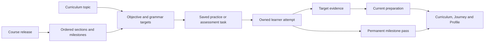

# Journey and curriculum milestones: build plan

Status: **implementation plan, 22 September 2026**. The narrative direction comes from the product discussion. Technical designs, assessment counts and rollout choices below are proposed implementation defaults. They are not changes already running in the application.

Baseline reviewed: public repository commit `8c98e12`, schema 044. The [chapter specification](course-chapters.md) describes that shipped version. This document governs the next journey revision where the two differ. The [curriculum](../curriculum.md) remains the authority for topics, language targets and activity levels.

Key sections: [A1 sequence](#4-revised-a1-sequence) · [Assessment](#6-received-letter-assessments) · [Interface](#7-learner-facing-structure) · [Technical design](#9-data-and-service-design) · [Migration](#11-migration-of-existing-learners) · [Build phases](#12-implementation-sequence).

## 1. Product direction

Barsik starts at home with a letter for the learner. He prepares his bag, visits the post office and leaves familiar surroundings. His route grows from a neighbourhood to nearby villages, other regions and eventually distant places.

At the end of each section, Barsik **receives a separate letter** from someone connected to the story. The learner reads it, listens to any separate spoken update and responds to its practical requests. Passing that assessment earns a permanent milestone and opens the next section.

The fourth A1 letter is a cumulative assessment. Passing it completes the A1 course and opens the next guided level. It does **not** deliver or open the original letter Barsik carries for the learner.

Milestones connect the course, its activities and the story. They must explain what the learner has demonstrated and what to practise next. They must not become another currency or a second set of unrelated lessons.

### Agreed direction

- Start at home, then visit the post office, the market and the route out of town.
- Expand the geographical reach as the learner can handle more independent communication.
- End each section with a received letter that has a sender, a purpose and a consequence.
- Show progress as **A1 · 1 of 4 milestones complete**. Reserve **A1 course complete** for the cumulative ending.
- Keep the original letter sealed beyond A1. Its eventual delivery belongs to the larger journey.
- Make existing activities the main source of practice. Keep them available independently.
- Keep Lingocoins, game purchases, skill estimates and flashcard schedules separate.
- Preserve individual use. This plan adds no household setup or approval requirement.

Four milestones divide this application's A1 course. They are not equal measurements of proficiency, and completing this course does not constitute a TORFL qualification or an assessment of every A1 skill.

### What this build includes

The complete A1 revision includes four connected sections, preparation linked to curriculum objectives, received-letter assessments, a cumulative A1 ending, a milestone view in Curriculum, a corresponding Journey view, a compact profile summary and migration of existing learners. It also provides the data structure needed for later levels.

Later regions are specified here so A1 leads somewhere coherent. Writing all A2–C2 lessons, generating a world atlas and delivering the original letter are subsequent content releases. They must not be advertised as playable before they exist.

## 2. Current implementation and required changes

| Area | Shipped behaviour | Required revision |
| --- | --- | --- |
| Route | Post office → home → market → delivery | Home → post office → market → leaving town |
| Original letter | Opened in the fourth A1 chapter | Remains in Barsik’s bag; A1 ends with an onward letter addressed to him |
| Assessment | Three variants per chapter, each with eight questions and a separate recording | Rewrite the content and give the final milestone its own cumulative blueprint |
| Curriculum connection | Chapters and questions refer to topics | Add stable objective and grammar targets, with evidence of what was actually assessed |
| Preparation | Two distinct successful tasks per topic, at least 70%, across two activity families | Retain this initial baseline while adding target coverage and focused practice recommendations |
| Progress display | Journey shows chapters; the header bar shows current preparation | Show permanent milestone passes separately from preparation for the next one |
| Curriculum page | Public topic catalogue with activity links | Group A1 topics under milestones and add the selected learner’s progress when available |
| Persistence | Profile-owned evidence, frozen attempts and chapter passes | Version course enrolment, requirements and continuation rights before changing the route |
| Later levels | Higher-level free practice; authored guided chapters only at A1 | Generalise course loading and level handling without pretending later chapters are complete |

The current final checkpoint is not a complete cumulative A1 assessment. Its question targets omit Family and Home across all three variants. Displaying those topics in a course list does not establish that the final assessment covers them.

The current system also derives topic preparation from aggregate activity scores. It does not establish every objective or grammatical pattern in that topic. For example, a successful food exercise may never ask the learner to make a request.

## 3. Narrative structure

### The delivery and the received letters

The hero promise remains: **“Barsik has a letter for you. Help him deliver it, one word at a time.”** Keep the existing headline, **“A small letter. A big adventure.”** This plan does not authorise unrelated hero-copy changes.

The carried letter and received letters have distinct roles:

| Letter | Role | Presentation |
| --- | --- | --- |
| Original letter | The larger delivery Barsik is trying to complete | Kept visibly sealed in his bag during A1 |
| Section letter | Gives Barsik information needed for his next step | Shows its sender and message before asking questions |
| Final A1 letter | Combines familiar language to arrange the journey beyond town | Resolves the A1 route and establishes the next destination |

Do not explain this distinction repeatedly in interface paragraphs. Establish it in the opening scene, then use a clear sender, an envelope and consistent story events. The learner should be able to explain who wrote the current letter and why Barsik needs it.

A letter must not exist only to administer a test. It might identify the person meeting Barsik, request supplies, explain a changed departure time or describe a meeting place. Correct interpretation produces a visible outcome: the right item goes into the bag, the meeting is confirmed or the next route opens.

English titles should identify the place or purpose without revealing the solution. Do not name an assessment after its hidden twist or display the answer in an illustration, link, audio label or summary.

### The expanding world

| Course stage | Geographical scope | Communication grows through |
| --- | --- | --- |
| A1 | Home, post office, neighbourhood market and the edge of town | Familiar people, simple requests, descriptions, times and short directions |
| A2 | Nearby towns and villages, local transport, forests and lakes | Everyday transactions, routines, simple reasons and changes of plan |
| B1 | Regional cities, valleys, mountain routes and longer visits | Connected accounts, explanations, practical problems and different points of view |
| B2 | Harbours, distant cities, desert routes and other countries | Comparing options, negotiating needs and justifying decisions |
| C1–C2 | A connected journey through communities, institutions and cultural settings | Implication, register, precise expression and synthesis of several accounts |

These are proposed story settings, not geographical definitions of language difficulty. A desert can support a simple weather exchange. A familiar kitchen can support a complex discussion. The selected curriculum objectives determine the language demands.

Later places should reuse people and consequences from earlier sections. A character introduced at the post office might have a relative in another village. An earlier reply can explain why someone is expecting Barsik. Keep a small cast with recorded relationships rather than inventing a disconnected helper in every activity.

The exact endpoint of the original delivery is an editorial decision before later-region production. Do not silently equate it with completing C2 or promise an ending that has no authored route. The A1 release ends honestly with a completed local journey and a clear onward invitation.

## 4. Revised A1 sequence

The canonical curriculum topic order stays unchanged. The journey groups those topics for teaching; it does not rename topics or change their bands. The proposed primary allocation is **3 / 2 / 3 / 2 topics**. Each topic has one primary section, while earlier language returns throughout the route.

| Milestone | Primary topic IDs | Preparation and story action | Received letter and consequence |
| --- | --- | --- | --- |
| 1. Leaving home | `greetings`, `family`, `home` | Meet Barsik, identify people and familiar objects, and help him get ready | A family member or friend identifies a helper and an object in a room. Understanding the message lets Barsik leave prepared. |
| 2. The post office | `numbers`, `daily_activities` | Meet the clerk, understand a short daily routine and arrange a departure | The clerk confirms who is doing what and when. A separate spoken update changes one arrangement. The learner confirms the correct plan. |
| 3. The market | `food`, `colors`, `clothing` | Ask for supplies and distinguish similar items by colour, size or description | A stallholder’s letter specifies what to collect. The learner selects the requested supplies and an appropriate reply. |
| 4. Leaving town | `places`, `weather`, plus earlier targets | Follow a short route and prepare for the stated weather | Someone in the next village sends the onward invitation. The learner combines the route, meeting arrangement, people and supplies. Passing completes A1. |

These are working section names. Character names and exact letters must be fixed during content authoring, before dialogue or artwork production.

Moving Barsik around an early scene does not require independently assessed directions before that language has been taught. Early navigation can be guided or visual. Clothing is introduced at the market and revisited in the weather decision. Time and daily activities belong naturally to the post office’s routine and departure arrangement.

### Opening and existing First steps

The welcome remains short and useful. Introduce Lingocoins when the learner reaches their explanation, then introduce the progress line. Teach the first words before asking for recall.

Integrate the relevant existing First steps material into the opening and first two sections. Do not make a new learner finish a five-lesson introductory route and then repeat the same material in a second course route. Create an explicit map from each existing introductory task to its teaching role and any reusable evidence.

Keep old First steps URLs, attempts and rewards readable. Returning learners may continue or revisit them. The one-time welcome reward remains one-time. Completing the introduction does not purchase games, pass a milestone or certify an entire topic.

## 5. Curriculum objectives and language evidence

### Definitions

| Term | Meaning |
| --- | --- |
| Topic | The curriculum subject, such as Family or Weather |
| Objective | Something observable the learner should be able to understand or do |
| Grammar target | A form or pattern needed for that objective in context |
| Section | The place and sequence of practice leading to an assessment |
| Checkpoint | The received-letter assessment attempt |
| Milestone | The permanent achievement earned by passing that checkpoint |

Learner-facing pages should mainly use **milestone**, **practice** and **letter**. The other terms belong in the curriculum detail or technical documentation where they help explain the work.

### Stable targets

Give the existing curriculum objectives and grammar focuses stable IDs without replacing their readable descriptions. Distinguish receptive and productive evidence. An illustrative ID is `a1.home.locate-object.read`; its related production target might be `a1.home.describe-location.write`.

Store the target’s curriculum version, topic, task level, expected response and marking guidance. A wording correction should not change its identity. A materially different requirement needs a new target or version.

Content must record the targets it introduces, practises and assesses. A word merely appearing in a passage is not proof that its meaning, ending or grammatical role was assessed.

| Topic | Observable task | Relevant language to assess in context |
| --- | --- | --- |
| Greetings | Identify a speaker or give an appropriate introduction | Personal pronouns, `Меня зовут…`, familiar `ты/вы` choices |
| Family | Identify a relationship or describe a family member | `мой/моя/мои`, `Это…`, `У меня есть…` |
| Home | Find an object or say where it is | Taught `в/на` locations, familiar plurals and adjective agreement |
| Numbers | Confirm a quantity or event time | `час/часа/часов`, morning/evening, time versus duration |
| Daily activities | Explain who does something or what is happening now | Taught present forms, including `ем`, `сплю`, `иду` |
| Food | Identify an order or make a request | `хочу`, `можно`, familiar accusative objects |
| Colours | Distinguish similar objects or describe one | Gender and plural agreement; `этот/эта/это` |
| Clothing | Select or request the described item | Clothing agreement, familiar accusatives, plural-only `штаны`, indeclinable `пальто` |
| Places | Locate a destination or follow a short instruction | `где/куда`, taught direction commands and place expressions |
| Weather | Understand the forecast and choose the stated plan | Impersonal weather expressions and familiar noun/adjective/state distinctions |

The milestone specification must say which of these targets its assessment establishes. Selecting `На кухне` can demonstrate understanding of a location. It does not establish the ability to formulate that description independently.

### Evidence from normal practice

Keep existing activities as the main preparation routes. Their saved task contracts should include curriculum targets. Their assessment adapters should identify the response or decision supporting each observation.

Record the source attempt, profile, content identity, target, response mode, first answer, support used, outcome, rubric version and time. Preserve partial success. Do not mark every target correct from one overall score.

Use these evidence categories:

- **Introduced:** taught in a saved lesson or preparation item. Opening a page alone is insufficient.
- **Practised:** attempted in a relevant task, including supported work.
- **Demonstrated:** the assessed response independently met that target’s rubric.
- **Needs practice:** an observed difficulty with a recommended next task.

These are evidence descriptions, not four new scores. The milestone pass remains a separate durable result. Later difficulty should influence recommendations without erasing an earned milestone.

Old records without target-level evidence remain useful as topic preparation. They must not be backfilled as proof of every objective. Existing reading-context and ownership checks must continue to reject modified browser content as authoritative assessment evidence.

### Preparation and early assessment

Initially retain the shipped readiness baseline: two successful distinct tasks per topic, at least 70%, with two activity families across the section. Preserve preparation after the daily coin allowance is exhausted. Repeating one saved task does not create additional distinct tasks.

Each section must declare a required subset of comprehension, contextual-form and selected-response targets, plus separately identified independent writing/speaking targets. For normal readiness, each required target must have been introduced and attempted in at least one relevant saved task. Supported attempts count as practice here. The two-successful-tasks baseline still applies; independent demonstration is assessed by the letter rather than required twice before it.

Add coverage checks so both tasks cannot repeatedly assess only the same easy objective. Recommend the shortest useful activity for a gap, such as a location sentence or a short time exchange. Do not turn every grammar focus into a mandatory separate worksheet. Independent production remains diagnostic in this release and does not silently become a readiness requirement.

Keep the option to attempt the current milestone early. Early attempts use the same assessment standard. Learners can choose higher-level free practice without completing the guided route first. Guided unlocks and activity difficulty selection remain distinct.

## 6. Received-letter assessments

### Author the message before the questions

Each letter has a named sender, a reason for arriving now, facts the learner needs and a concrete next action. Write the answerable story problem before drafting questions.

Each published variant contains:

- The Russian letter, sender and recipient, with a concise bilingual title.
- The story facts and expected consequence, kept authoritative outside generated prose.
- A language manifest covering assessed meanings, forms and patterns.
- Question targets, accepted answers, partial-credit rules and explanations.
- Any separate audio update, with its own transcript and required listening details.
- Optional support and the effect of using it on the assessment result.
- Stable content, media and rubric versions.

Supply incidental vocabulary through a small glossary. Do not reveal the tested meaning through a glossary, an English title, an image label or an initial answer link. Include question wording and distractors in the language review.

Use contextual inflected Russian. Teach the needed case or conjugation through the sentence and scene. Do not reduce the assessment to recalling dictionary lemmas or choosing between unrelated pictures.

### Section checkpoints

Use the current eight-question format as the initial authoring baseline for milestones 1–3. Questions should identify people and relationships, interpret requests, distinguish plausible alternatives and choose a response that follows the message.

Retain separate listening where it adds new information, such as a changed time. Reading the written letter must not answer the listening questions. A recording of the same passage can assist reading, but it cannot by itself establish independent listening.

Start with three equivalent variants per milestone. Vary meaningful facts and wording while preserving assessed targets and demand. Changing only a person’s name is insufficient. Publish additional variants after observing repetition; do not claim an unlimited unseen pool.

### Cumulative A1 checkpoint

The final letter remains addressed to Barsik. It explains the next leg beyond town and requires earlier learning to interpret the complete arrangement.

Proposed authoring baseline: **16 scored decisions**, split into short sections:

| Part | Decisions | Purpose |
| --- | ---: | --- |
| Read the letter | 6 | Understand people, relationships, objects, requests and arrangements |
| Hear the update | 4 | Understand genuinely new spoken details and reconcile the final plan |
| Use the language | 4 | Complete or interpret contextual forms that change the message’s meaning |
| Respond | 2 | Select replies that satisfy the sender’s requests |

Every variant must assess targets from all four sections and all ten A1 topics. Coverage must come from scored decisions, not incidental mentions. A decision may assess related targets only when its answer supplies evidence for each one. The course specification must map every existing A1 objective and grammar focus to teaching, practice and its evidence policy. It must identify which targets the required checkpoints sample and which independent production targets remain optional. One short letter cannot demonstrate every productive skill.

Keep the main letter coherent. A short enclosed list, map or timetable may carry information that would otherwise make it an unnatural vocabulary inventory. Author and review this bundle as one assessment. Do not generate a picture for every answer.

A provisional length is 80–130 Russian words for the letter, with short separate audio messages as needed. Confirm the length and question count through a learner pilot. These are content design estimates, not proficiency-standard requirements.

### Marking and support

The initial section rule remains at least 80%, both justified essential details correct, required listening completed and no assessment hints or transcript revealed. At eight equal-weight questions, this means at least 7/8.

For the proposed 16-decision final, start with **13/16 overall**, with component minima of **4/6 reading**, **3/4 listening**, **2/4 contextual language** and **1/2 response selection**. Require two essential details justified by the story. This prevents a pass that never successfully responds to the sender. The same required-listening and independent-support rules apply. Confirm the exact policy after authoring. Persist integer thresholds and component rules with the attempt; do not apply an unexplained rounded percentage.

Do not turn a missed essential detail into a displayed zero. Show what was understood, the missed detail and the relevant practice. A plan can be almost correct while still needing revision before Barsik follows it.

Hints are optional and revealed on request. Full answer explanations appear after submission. Supported attempts remain available for learning, with a fresh independent variant required to earn an independent pass. Store support at the question or recording level even if the pilot gate remains attempt-wide.

Untimed assessment is the default. Save answers as the learner moves between parts. Audio can be replayed. Where audio cannot be heard, offer the transcript and a clearly described supported route; do not silently award listening evidence.

### Written and spoken replies

A short reply would deepen the activity and should reuse Writing or Speaking. Offer it when the learner has understood the letter. Assess whether it answers the sender’s actual request, with concise tutor-style feedback and accepted valid alternatives.

The initial milestone gate remains the reviewed comprehension and response-selection contract. Do not silently add a microphone or paid-model dependency to passing. Independent writing and speaking observations can supplement the learner’s objective record, but require their own saved rubrics before becoming progression gates.

Choosing a supplied sentence must never be labelled independent writing or fluent speaking. Provider failure leaves a submitted productive response pending or retryable; it must not fabricate a grade, erase a comprehension result or award a language skill by fallback.

## 7. Learner-facing structure

### Curriculum

Curriculum is the structural home of the milestones. Under A1, show four compact milestone rows with their topics nested beneath them. Each row has a title, a short purpose, current status and one primary action.

Expand a row to show its learning objectives, useful practice links and any specific gap. Keep the full vocabulary and grammar reference available through disclosure. Do not put a wall of metadata above the next useful action.

The public catalogue remains accessible without a personal account. Add progress only for the selected learner or current demo profile. A missing profile must not be mistaken for someone having failed or completed the course.

### Journey

Journey is the playable view of the same milestones. It shows where Barsik is, the immediate task and the next destination. Completing relevant standalone work must update this view without requiring the learner to repeat it inside a fictional wrapper.

Use one milestone identity and result across Curriculum, Journey, the header and Profile. Keep Curriculum below All activities in navigation, as agreed. Do not add a separate milestone menu, reward ledger or conflicting progress calculation.

### Header bar

The line represents progress towards the next destination. Its numerical input remains preparation evidence, not kilometres or Elo. Reaching the end makes the letter assessment ready; passing it records the milestone and moves Barsik to the next section.

The four milestone markers in Curriculum and Journey show permanent course achievement. The travelling bar shows work within the current section. Explain the transition when a new section starts so an empty bar does not look like lost progress.

Keep the compact line, existing running Barsik and agreed placement. Do not add another tall header or restore the removed rating caption. Selecting the line opens the current milestone. Accessible text identifies the destination and preparation status.

### Letter and result screens

Use the available viewport for the task. Keep navigation and progress compact. On a wide screen, place the letter beside the questions; on a phone, provide a quick way to refer back to it. Do not stack a large page introduction, repeated instructions and oversized cards before the first question.

Introduce the sender, offer **Read the letter**, and then present the actual message. The envelope animation should be brief, optional to skip and compatible with reduced motion.

Example result copy:

> **First milestone passed**
>
> A1 · 1 of 4 milestones complete
>
> You understood the introductions, family relationships and locations in the letter.
>
> **Continue to the post office →**

The result description must follow the targets actually passed. The final screen uses **A1 course complete**, shows the four earned milestones and introduces the onward journey. It must not say that the learner’s original letter has been delivered.

### Profile and home

Profile shows a compact summary such as **A1 · 2 of 4 milestones complete**, with access to saved results. Keep detailed attempt history behind that action. Avoid a long achievement feed.

Home offers the current section or saved letter as the returning learner’s next action. Its introductory hero and independent activity choices remain available. Both navigation layouts expose the same destinations and state.

## 8. Integration with the existing application

| Existing area | Role in the course | Integration boundary |
| --- | --- | --- |
| Comprehension | Read and listen to relevant material; discover vocabulary | Use saved owner-bound passages and assessment context, not posted browser text as proof |
| Writing | Describe people, routines, requests and plans; reply to letters | Save target-aware task contracts and use the actual response for evidence |
| Translation and Word Jumble | Practise contextual forms and productive sentence choices | Accept valid Russian alternatives; do not infer every target from an aggregate score |
| Speaking | Rehearse exchanges, then produce language independently | Distinguish Step-through support from independent audio review; preserve speech errors for assessment |
| Tutor lessons | Supply examples, selected words and targeted practice | Reuse saved lesson revisions and selection provenance; do not automatically assign a course pass from an upload |
| Native flashcards | Review contextual vocabulary and grammatical forms | Reuse card batches, media and FSRS; self-ratings do not by themselves pass a milestone |
| Games | Optional practice and scenes where the mechanic fits | Keep purchased ownership; do not force every task into matching pictures |
| Phrasebook | Save useful lines and replay their recordings | Keep it a compact reference and shadowing tool |

### Vocabulary and flashcards

Generated practice uses relevant saved vocabulary alongside useful new words where the learner's library supports the task. Authored checkpoint variants follow their taught curriculum and reviewed coverage manifest; they cannot depend on arbitrary private word lists. An empty or small library must not make the course impossible. New vocabulary should have a clear context and a normal route into the learner’s store.

Keep the lemma/form relational model. A selected form resolves to its lemma and grammatical details through the existing pipeline. Preserve participle filters, uncommon-form reduction and contextual card generation. Do not introduce a single mandatory English translation on each lemma, or topic names such as “First steps” or “Milestone 1”.

Reuse the bridge in `first_steps_practice.py` and the `LessonCards` resolver for course-to-card preparation. Course source references identify the section, content version and original sentence. Existing cards retain their ownership, schedules and review history. A new cloze may be created when a new context justifies it; repeated clicks must not duplicate the same requested card batch.

Checkpoint vocabulary lookup and hints need a clear boundary. Before assessment, tested meanings cannot be revealed through dictionary links. After submission, normal lookup and save actions can use the owned frozen letter text. Saving still follows the existing lemma/form transaction and enrichment flow, including mnemonic generation and pending/retry states. It must not create a competing course word store.

### Coins and skill estimates

Retain the shared earning rules and shop. A task launched from a milestone earns through its existing activity receipt. It must not earn again because the course wraps the task.

The default plan adds no separate coin award for checkpoint passes. If a milestone bonus is later selected, it needs an explicit amount and one permanent award identity per learner and milestone. It must not change access policy or pay repeatedly on retry.

Keep provisional skill histories in Profile. Do not translate Elo thresholds into A1 percentages or feed checkpoint results into skill ratings without a defined evidence adapter and rubric. Past skill estimates, balances and purchases remain intact.

## 9. Data and service design

Retain Flask, SQLite, Preact and the existing activity services. Add the missing relationships to the current course system.

### Catalogue and content

Preserve the published version-1 catalogue. Add a course-release registry that resolves a learner’s enrolment and each saved attempt to the right definitions. Keep immutable archived releases addressable.

New section definitions need a release ID, level, ordered identity, story location, prerequisites, primary topics, revisited targets, preparation rules and checkpoint blueprint. Each checkpoint variant has independent content and rubric versions. Do not use array position or a displayed title as its database identity.

The current validators assume version 1, A1 and exactly four chapters. The curriculum validator also assumes the canonical fifty-topic ordering and ten topics per band. Generalise the course validator by release; keep curriculum taxonomy stable and add teaching order separately. Validate future C1 and C2 task requirements independently even though their topics share a band.

### Persistence changes

The following are logical relationships to implement, not a demand to create a table for every label:

| Relationship | Proposed storage approach |
| --- | --- |
| Learner → course release | Add enrolment with profile, release, start time and migration source |
| Milestone → required targets | Store in the versioned course catalogue; use stable target IDs |
| Source attempt → target observations | Add detail records alongside current course evidence, retaining the original event reference |
| Attempt → content and rubric | Extend the existing frozen checkpoint snapshot with release and blueprint identities |
| Learner → earned milestone | Evolve existing chapter passes to distinguish release and requirement version |
| Learner → continuation entitlement | Record explicit migration equivalence where continued access differs from newly demonstrated targets |

Do not create another wallet, card scheduler or duplicate course-results database. Derive progress once in the existing course service and share that result across UI surfaces.

Schema 044 restricts `course_evidence.target_level` to A1 and keys passes by `(profile_id, chapter_id)`. Its active-attempt uniqueness also depends on chapter ID. A reviewed additive migration must address those constraints before versioned routes or later levels are enabled. Keep old records readable, and audit all foreign keys, unique indexes and downgrade-test fixtures.

The shared progression preference API currently stops at B2. A later C1/C2 course release also needs an audit of level validators, selectors and adapters; changing only the course JSON is insufficient.

Separate the catalogue schema version, authored content release and marking-policy version. Existing A2 access is currently derived from four passes, so migration must explicitly preserve that right before new chapter IDs alter the calculation.

### Commands and API

Extend the existing `/api/v1/course` and checkpoint commands. Preserve old request shapes for saved version-1 attempts. New responses should distinguish `preparation`, `assessment_ready`, `milestone_passed` and the enrolled course release.

The public Curriculum route can read catalogue structure without requiring a profile. Personal progress uses the existing authenticated/profile-scoped projection. Never trust a client-supplied profile, level, target list or success flag as grading authority.

Keep stable request/submission IDs, transactions, ownership checks and saved payload hashes. A retry after a network failure returns the original result. Reusing a request ID for different answers remains a conflict. Starting twice must not create two active checkpoints.

Include release identity in new start requests and their deduplication keys. Preserve old request records so they still return their original result. Historical responses must identify the saved attempt's section and release separately from the learner's current journey.

### Assessment service

Separate section and level-ending blueprints. Freeze the chosen letter, optional enclosures, audio identity, targets, accepted responses, rubric and support policy when the attempt starts.

Deterministic tasks should be graded locally from that snapshot. Short free responses use a separate evaluator with explicit pending, accepted and revision-needed states. Rechecking a response cannot silently alter an already issued comprehension pass.

The existing household/shared-workspace boundary needs an activity-by-activity audit. Do not claim every activity supplies a selected child’s preparation when its saved work belongs to the shared workspace. Extend learner ownership through the existing account model where required; do not add a new compulsory household mode.

## 10. Content generation, media and cost

Author the route, sender relationships, facts and assessment targets before generating dialogue. AI may draft variants within that specification. It must not invent the authoritative destination, pass condition or answer key independently of the saved scenario.

Validate that the finished Russian text actually supports every answer. Review grammar, stress-sensitive meanings, case government, conjugations, distractors and accepted alternatives. A syntactically valid JSON response is not editorial validation. This is a content-maintenance workflow, not an approval gate for individual learners.

Bundle initial checkpoint letters and audio so the core assessments do not depend on live AI calls. Retain the established voice selection policy: choose from configured voices when preparing a recording and keep the selected voice for its retries. Match vocal delivery to the sender and message.

Use a few purposeful assets: an envelope, the sender, the current setting and the outcome. Reuse scene art where appropriate. A letter does not need eight generated pictures. Native flashcards still require their contextual image and speech under the existing card contract.

Published media is immutable. A changed spoken script gets a new variant/audio ID. Keep old recordings for saved attempts, including hashes and a manifest. Update Docker and public-release allowlists when adding authored assets; verify their presence in the deployed image.

Extend audio checks to every retained course release. Current checkpoint clips are constrained to under 30 seconds. If the final assessment needs longer clips, introduce an explicit content-policy change and suitable playback tests rather than removing the existing check without review.

Continue the existing shared AI budget, request admission and profile limits. The agreed funded-demo ceiling remains US$1 per day and US$20 per month unless changed separately. Route new optional AI work through those controls. Cache approved assets and accepted generation jobs; repeated page loads must not call providers.

## 11. Migration of existing learners

The route change alters order, scope and ending. It cannot be implemented by renaming the current four IDs or swapping two entries in the JSON. Old Home passes do not necessarily establish all requirements of the new first milestone.

### Migration policy

1. Preserve the complete version-1 catalogue, frozen attempts, published audio and saved results.
2. Enrol new learners into the new release only after its full A1 route is ready.
3. Keep existing learners on version 1 by default during rollout. Let them finish active letters under their original rubric.
4. Offer a concise move to the updated journey when it is available. Preview which achievements remain and what preparation is still recommended.
5. Carry forward only evidence with a justified target or topic mapping. Unknown detail remains unknown.
6. Preserve existing milestones and A2 continuation rights. Do not silently require a learner to earn access again because the story changed.
7. Keep migrated access separate from claims about newly assessed objectives. A legacy pass may preserve continuation without proving every new target.
8. Resume existing URLs against their recorded release. Never make an old fourth-letter link open the new leaving-town assessment.

A migration report should show source release, target release, retained attempts, reused evidence, continuation rights and unresolved mappings. Keep technical details in the operator report; learners need only a short explanation of their next step.

### Deployment and rollback

Rehearse on copies of representative databases: a new learner, an active checkpoint, a failed supported attempt, a partially completed course and a completed A1 learner. Compare original table contents, file hashes and account ownership before and after migration.

Back up persistent stores before production migration. Do not edit `.env`, provider credentials, learner uploads or media as part of content publication. Use the existing hosted account migration path and include budget/identity stores in operational backup procedures where relevant.

Use the existing migration runner. If A1-only constraints require table rebuilds, register those migrations with its rebuild handling and retain the final foreign-key check. Test against populated v1 fixtures; an empty database will not expose lost passes or active-attempt conflicts.

Release behind a course-version flag. Roll back new enrolment routing first while leaving old and new saved results readable. Do not restore an older database over newly completed learner work or run schema downgrades against live accounts. A full restore requires an explicit data-recovery procedure.

## 12. Implementation sequence

| Phase | Work | Completion gate |
| --- | --- | --- |
| 1. Definitions | Fix the A1 route, cast, learning targets, section blueprints and final assessment coverage | All ten topics mapped once as primary teaching; every required target has a teaching and assessment path |
| 2. Versioning and evidence | Add course enrolment, compatible content loading, stable targets and evidence detail | Version-1 attempts replay unchanged; duplicate commands and cross-profile access tests pass |
| 3. First section pilot | Build the home section through its received letter and result using existing activity launches | A learner can explain the story, complete practice, pass the letter, resume and see one consistent milestone |
| 4. A1 content | Build post office, market and leaving-town content with three reviewed variants each | The final blueprint is cumulative; every required clip and answer key is verified |
| 5. Shared presentation | Add milestone grouping to Curriculum, update Journey, header transitions, Profile and home continuation | Both navigation layouts and phone/desktop layouts show the same selected learner’s state |
| 6. Integration and migration | Connect target-aware activity adapters, card/word capture and introductory-content mappings; rehearse learner migration | No duplicate rewards/cards; original progress and continuation rights are preserved |
| 7. Release and observation | Run full checks, publish the complete A1 revision, verify hosted media and observe real attempts | No blocking flow errors; content issues and unfair distractors have a defined correction process |
| 8. Wider journey | Author A2 villages and regional routes, then later bands using the same contracts | Each published band has complete content and assessment coverage before its completion is advertised |

Phases may overlap after their contracts are stable. Keep the one-section pilot internal until all four A1 sections can be completed. Do not replace a working full course with an attractive first chapter and a dead end.

### First implementation tickets

| ID | Deliverable | Priority / effort |
| --- | --- | --- |
| JM-01 | Stable curriculum objective and grammar IDs, with receptive/productive distinctions | High / medium |
| JM-02 | Versioned course enrolment and archived v1 loading | High / large |
| JM-03 | Reviewed Home → Post office → Market → Leaving town content specification | High / medium |
| JM-04 | Cumulative final-letter coverage validator and blueprint | High / medium |
| JM-05 | Target-aware evidence adapters for current practice | High / large |
| JM-06 | One received-letter flow, save/resume, support and result | High / medium |
| JM-07 | Complete A1 variants, recordings and editorial checks | High / large |
| JM-08 | Curriculum milestone rows and shared progress projection | High / medium |
| JM-09 | Introductory-content reuse and home continuation | High / medium |
| JM-10 | Course-to-vocabulary/card source integration | Medium / medium |
| JM-11 | Existing-learner migration and operational rehearsal | High / large |
| JM-12 | Optional written reply using existing assessment | Medium / medium |
| JM-13 | Optional spoken reply with validated evidence equivalence | Later / large |
| JM-14 | A2 route and complete next-level content | Later / large |

Effort describes scope, not a delivery estimate. JM-01–04 should establish the contract before UI or generation work spreads across the application.

## 13. Risks and mitigations

| Risk | Mitigation |
| --- | --- |
| The two kinds of letter confuse the learner | Establish the carried letter once; identify received letters by sender and purpose; test whether learners can explain the situation |
| The geography changes but the tasks stay repetitive | Vary communicative goals, useful decisions and consequences; revisit language under a new demand |
| A topic tag is treated as mastery | Require target-specific evidence and preserve unknown legacy detail |
| The final letter omits earlier learning | Validate scored coverage across every variant, including Family and Home |
| An assessment becomes a vocabulary inventory | Use one coherent message with a purposeful enclosure; revise content before adding more questions |
| One wrong detail turns useful work into failure | Show partial results and targeted correction; keep essential decisions few and justified |
| Learners memorise repeated answer patterns | Equivalent authored variants, varied correct-answer placement, exposure history and an expandable pool |
| The original letter is delivered too soon | Enforce sender/recipient and ending rules in content validation and narrative review |
| Reordering loses saved progress | Immutable course releases, explicit enrolment and reviewed migration equivalence |
| Currency or skill updates alter access unexpectedly | Derive milestones from their saved passes; keep the wallet and skill projections separate |
| Generation fails or the demo budget is exhausted | Bundle core assessment content and keep optional provider work recoverable |
| Interface space is consumed by explanation | Compact headings, progressive disclosure, useful viewport checks and one primary action |
| Later levels appear complete before they exist | Publish explicit content availability per release; keep free-practice access separate |

## 14. Acceptance and verification

The A1 revision is complete when all of the following hold:

### Story and curriculum

- A new learner begins at home and can explain why Barsik visits the post office and leaves town.
- All four received letters have a clear sender, purpose and observable consequence.
- The original letter remains sealed throughout the A1 ending.
- All ten A1 topic IDs have one primary section and explicit revision links.
- Required targets are taught before independent assessment; incidental vocabulary is handled deliberately.
- Every final variant meets its cumulative coverage blueprint. Topic words alone do not satisfy it.
- Selected replies, writing and speech are reported according to the evidence they actually provide.

### Learner flow

- Existing standalone practice contributes without being repeated inside the journey.
- Home, Curriculum, Journey, the header and Profile agree on the current learner and milestone.
- A completed milestone stays earned; the next section’s empty preparation bar is explained by the transition.
- Hints are optional, saved support cannot disappear on refresh, and retries preserve earlier results.
- On small screens the task remains readable and reachable without long stacks of decorative content.
- Keyboard focus, screen-reader labels, reduced motion and audio controls work throughout.
- Both navigation layouts retain their agreed controls and compact activity headers.

### Data and operations

- Repeated or concurrent commands produce one attempt/pass and no duplicate rewards or card batches.
- Stale account tabs and cross-profile requests cannot read, alter or earn another learner’s progress.
- Active v1 letters retain their original text, audio and rubric after deployment.
- Existing vocabulary, forms, mnemonics, schedules, balances, purchases and saved activity records compare unchanged after migration.
- Core letter assessments work without live provider calls. Optional AI failures remain recoverable.
- Published media hashes match the manifest locally and on Fly; Docker and export allowlists include the assets.
- Backend, UI, content-validation, security and migration checks pass before release.

Use an internal full-route rehearsal, followed by a small learner pilot. Observe whether participants understand the task and story, how they use support and where answers are ambiguous. Any numerical adjustment creates a new rubric version; it does not rewrite saved results.

## 15. Decisions to settle during authoring

These do not block writing the specification or starting versioning work. Resolve them before the relevant content release:

1. **Cast and place names:** choose a small recurring cast and a coherent hometown map. Working names are not final assets.
2. **Assessment size:** validate the proposed eight-question section letters and sixteen-decision finale with actual content and learners.
3. **Productive response gates:** decide whether a later course version should require an independently assessed written or spoken reply. The default here keeps those observations separate from the deterministic letter pass.
4. **Original delivery endpoint:** decide where the larger campaign resolves its promise before producing the later-region storyline. It is not the A1 ending.
5. **Later-level structure:** four milestones are the A1 course structure. Do not assume equal counts or equal topic workloads for every later band without an authored plan.

## 16. Implementation references

- [Curriculum catalogue](../../flask_vocab_app/data/curriculum.json) and [curriculum service](../../flask_vocab_app/services/curriculum.py).
- [Shipped chapter content](../../flask_vocab_app/data/course_chapters.json) and [current chapter contract](course-chapters.md).
- [Course progression](../../flask_vocab_app/services/course_progression.py), [course evidence](../../flask_vocab_app/services/course_evidence.py) and [schema 044](../../flask_vocab_app/migrations/044_course_progression.sql).
- [Progression API](../../flask_vocab_app/blueprints/progression.py) and [shared reward service](../../flask_vocab_app/services/progression.py).
- [Curriculum page](../../flask_vocab_app/templates/curriculum.html), [Journey UI](../../flask_vocab_app/ui/src/CourseJourney.tsx) and [header progress](../../flask_vocab_app/ui/src/SkillProgress.tsx).
- [Introductory practice bridge](../../flask_vocab_app/services/first_steps_practice.py) and [story vocabulary](../../flask_vocab_app/services/story_vocabulary.py).
- [Levels and rewards](levels-and-progression.md), [skill evidence](skill-progress.md) and [vocabulary model](../vocabulary-data-model.md).
- [Public release procedure](../release-process.md) and [Fly operations](../operations-fly.md).
