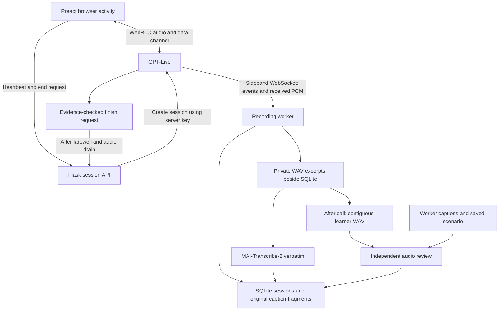

# Speaking activity

Speaking offers **Fluent conversation** and **Step-through** modes under the same
scenario catalogue. Open `/#speaking`. Fluent conversation keeps the live
microphone connection and audio review described below. Step-through pauses each
exchange for a reply choice and optional hint; see
[Step-through conversations](step-through-speaking.md).
Updated 18 September 2026.

The scoring rubric, evidence boundaries and calibration plan are documented in
[Speaking assessment](speaking-assessment.md).
The game catalogue and database hierarchy are documented in
[Speaking scenarios](speaking-scenarios.md).

Speaking is the single activity for new conversations. The former recording-and-send activity has been retired from the
learner interface. Its saved recordings, replies, translations and language notes
remain accessible through **Previous conversations**, alongside saved live calls.
Recorded sessions open for review; they no longer offer new microphone/file turns.
The diagnostic **Speech lab** is under **Developer tools** at `/#speaking/lab`.

Existing links are preserved and normalised without starting providers:

| Earlier link | Destination |
|---|---|
| `#conversation` or `#live-conversation` | `#speaking` |
| `#live-conversation/<id>` | `#speaking/<id>` |
| `#conversation/<id>` | `#speaking/recorded/<id>` |
| `#speech-lab` | `#speaking/lab` |

The navigation consolidation required no database migration. The subsequent
assessment pass adds migration **021**: a `speaking_reviews` table and a nullable
`end_reason` on live sessions. Migration **022** adds the relational scenario
catalogue and session links. Both earlier storage formats and API namespaces remain
intact for saved data, retry/deletion, diagnostic tests and compatibility. The old
conversation creation API remains compatible, but the app no longer links to or
offers its recording-and-send game. Shared transcription and assessment services
are registered independently of the legacy activity's service construction.
The consolidation itself did not change models. The assessment pass adds a
separate audio reviewer; existing live speech, voices, MAI and other activity
models keep their roles.

Historical consolidation verification: 53 focused UI tests and 34 conversation/backend tests
passed, alongside TypeScript and the production build. Browser checks confirmed
the single activity entry, merged history and archived-session replay. All five
conversation tables were compared before and after and remained unchanged; no
provider calls were needed. The first backend run had a recorded-audio backup
assertion fail; both an isolated diagnostic and the complete rerun passed without
backup-code changes. Logs are in ignored `instance/speaking-*-tests.log` and
`instance/speaking-backend-retest.log`; preservation receipts are under
`instance/speaking-consolidation-20260915/`.

## Learner experience

Choose **Speaking** in Activities, then choose a game: **At the café**, **At the
shops**, **Asking directions**, **At the station** or **Meeting people**. Read the
selected situation before **Start talking**. **Another situation** changes the
preview within that game without creating a call or opening the microphone.
Starting saves that exact previewed situation. The initial catalogue contains 16
variants: the existing eight café situations and two for each other game.

The situation, goals and useful reference information stay visible. A menu fits
the café; a shopping list, destination or meeting plan fits the other games. The
character greets the learner in Russian using the opening and role for that
situation. The café worker is one character among shop assistants, local
residents, ticket clerks and social conversation partners. There is one microphone
permission request, a mute control and an end control; individual replies do not
need submitting. Calls last up to five minutes, and can finish earlier with a
natural goodbye. The learner can also end the call at any time.

After a new call, a separate model listens to the saved learner audio and gives
grammar and fluency feedback, task progress, and one suggestion for next time.
Scores describe this attempt on two five-point scales. Insufficient or unclear
speech receives no score; a valid short answer can still fulfil a task goal.
The character does not announce marks or interrupt the conversation to correct every
ending. There are no automatic coin or Elo changes in this pass.

The character stays in its selected role and only understands Russian. English
speech gets a short, natural «Извините, я не понимаю» or «Я говорю только по-русски»,
then the character waits. It does not translate the English, supply a model phrase,
count it as a task decision, or add a second coaching prompt. Help requested in Russian and
ordinary Russian small talk remain natural parts of the conversation. Short
answers and imperfect Russian remain valid attempts.

Both the live voice and its delegated reasoning use the shared scenario
instructions in `services/conversation_policy.py`. The café retains its
`russian-cafe-v3` policy; other roles use the saved scenario's facts and character.
The original
permission to explain in English was removed. Startup/greeting instructions are
in Russian; this follows the official [language prompting guidance](https://developers.openai.com/api/docs/guides/live-prompting#language-and-pronunciation).
The voice is instructed to keep listening through pauses, coughs, music and
background conversations. This is model behaviour, not a deterministic audio
language filter: WebRTC audio still reaches the provider directly. Captions and
background grammar notes do not gate or rewrite the speech already played.
Fresh calls receive the updated instructions; existing saved sessions are retained.

Live captions can be hidden. Raw provider fragments, including repetitions and
whitespace, remain intact internally. The lesson display omits groups containing
English or another non-Russian script; it never translates them into invented
Russian or strips individual words out of a mixed sentence. The same display rule
applies to saved conversation captions and recording transcripts. It also applies
to the recorded-turn activity, while the diagnostic Speech lab remains literal.
This is a conservative display check, not audio language identification: mixed
text containing a Latin-script name is also omitted; Russian endings, accents,
hesitation and numerical answers are not grammar-filtered. Incoming audio still
reaches the provider, whose private hypotheses and the original audio are retained.

Their grouping into conversational rows is revisable, not a definition of completed
utterances. An intervening worker reply separates a quick Russian retry from the
preceding English display group. Reading earlier captions stops automatic
scrolling. Leaving the activity releases microphone tracks and asks the server to
close the remote session. An additional server watchdog closes sessions after
35 seconds without a browser heartbeat, or after five minutes.

Saved sessions offer the original received audio and a separate MAI transcript.
New sessions add one conversation-level audio review rather than another set of
text-only comments for every recording excerpt. Earlier language notes remain
stored. Old calls are graded only when the learner asks for feedback; opening
history never starts a paid model call. Failed feedback can be retried, and
finished sessions can be deleted once their processing finishes. No approval or
PIN flow was added to personal use.

## Architecture



The browser exchanges its SDP offer through Flask; the permanent API key never
enters the browser. Audio then travels directly over WebRTC. JSON captions arrive
on the same connection's data channel. Flask also attaches a server WebSocket
before returning the SDP answer, so recording is ready before media starts.

This implementation does not require an additional application server. A bounded
local thread owns each sideband (two simultaneous calls maximum), two workers
process original transcriptions, and one worker processes full-call reviews.
Browser heartbeats are ordinary HTTP requests every ten
seconds; they do not gate the voice or captions. After a call, the saved review
checks for unfinished transcription and feedback. There is no per-utterance polling in the live audio
path. A hosted version should move persistent connection ownership and analysis
jobs into a supervised service before scaling across multiple web workers.

The application server owns `session.close`; the browser keeps the data channel
open briefly for `session.closed`, then cleans up its peer and microphone. Provider
final usage is saved only when the server actually receives that event. An
interrupted session is not reported as gracefully finalized. A saved call left
active after a server restart offers **Recover saved audio**; this seals partial
WAV excerpts and queues their notes without fabricating missing speech.

The delegated model can call `finish_speaking` with Russian learner evidence.
`task_complete` requires evidence for every goal; `learner_finished` allows an
early goodbye without awarding task success. A thank-you in the middle of an
conversation is not sufficient. After an accepted request, the character says a short
farewell. The sideband waits for completed backend work, farewell text, reflected
output audio and a short drain period before closing. New learner transcript
arriving during that period cancels the pending ending. This protects a natural
exchange, but reflected audio is not a browser playback acknowledgement and a
delayed transcript can still limit interruption detection. The manual end button
and watchdog remain available.

At approximately four minutes thirty seconds, the server prompts the character to
wrap up the existing conversation without introducing a new topic. Five minutes remains
the hard call limit. A transport closing normally is not, by itself, proof that
the learner completed the selected scenario's goals.

## Models and configuration

| Work | Configuration | Default |
|---|---|---|
| Live speech | `LIVE_CONVERSATION_MODEL` | `gpt-live-1` |
| Voices, chosen once per call | `LIVE_CONVERSATION_VOICES` | `marin,cedar` |
| Delegated scenario reasoning and historical text coaching | `CONVERSATION_MODEL` | `gpt-5.6-luna` |
| Background transcription | `CONVERSATION_TRANSCRIPTION_MODEL` | `microsoft/mai-transcribe-2` |
| Full-call audio review | `SPEAKING_ASSESSMENT_MODEL` | `gpt-audio-1.5` |

Existing `OPENAI_API_KEY` and `OPENROUTER_API_KEY` are used through the existing
configuration loader. No secret file was replaced or edited. ElevenLabs continues
to serve the original game; this activity uses native live voices. No silent
provider or model substitution occurs. The installed OpenAI SDK lacks the Live
resource, so the new adapter uses the documented HTTPS/WebSocket protocol through
`requests` and pinned `websockets==15.0.1`.

GPT-Live handles conversational speech and timing. Its Responses delegation is
limited to scenario reasoning and the application-owned finish tool; there is no
external action or payment tool. The audio reviewer receives the original learner
recording, the saved scenario, and only the worker's caption text as fallible
context. It is not given MAI or live learner transcripts to copy or normalize.
Its independent rendering is saved separately from both. Other activity model
choices remain unchanged.

Audio review uses Chat Completions with audio input and text output. GPT Audio
does not provide strict Structured Outputs, so the app requests JSON and validates
the result locally. Unsupported scores, invented source quotes, unknown goals or
corrections to explicitly uncertain phrases cause a retryable failure. See the
[audio guide](https://developers.openai.com/api/docs/guides/audio-chat-completions)
and [model reference](https://developers.openai.com/api/docs/models/gpt-audio-1.5).

## Audio and linguistic evidence

The saved recording is **the audio received through the provider sideband**:
mono PCM16 at 24 kHz, after browser capture, WebRTC encoding and provider decoding.
It is not a second, lossless recording directly from the microphone hardware.
The app neither corrects nor denoises those samples before transcription. Browser
echo cancellation and noise suppression are enabled for a usable speaker/mic call.

Every received sample is retained in contiguous WAV excerpts. Quiet intervals
choose convenient boundaries after at least eight seconds; a hard boundary is
used at forty seconds. Silence is not removed. Very quiet or sub-0.2-second
excerpts remain saved but do not trigger paid analysis. These are recording
excerpts, not asserted grammatical sentence boundaries.

Recording offsets use a sample clock starting at sideband attachment. Provider
caption times use the provider session clock. They are stored separately and
must not be treated as sample-perfect aligned timestamps. A caption does not
prove which words the learner actually heard when speech overlapped.

The original transcript, independent audio rendering, corrections and recording
remain distinct. The new reviewer can inspect acoustic evidence that a text-only
assessor never received, but it is still a fallible model rather than a phonetic
ground-truth verifier. It can mishear an ending or a word. Exact-quote validation
checks internal consistency, not whether the sound was recognized correctly.
There is no pronunciation mark, measured words-per-minute score, CEFR level, Elo
change or coin reward. Two agreeing recognizers would not prove that the original
speech was correct.

## Data and migration

Migration 014 introduced `live_conversation_sessions`, `live_conversation_events`
and `live_conversation_recordings`. Migration 021 adds the independent review
record and end reason. Migration 022 adds `learning_activity_types` →
`speaking_scenarios` → `speaking_scenario_variants`, with `scenario_id` and
`variant_id` foreign keys on live sessions. Runtime selection reads SQLite;
`data/speaking_catalogue.json` seeds the migration only. Recognised café history
receives category/variant links while its original `scenario_json` snapshot
stays unchanged. Unknown legacy content can keep nullable links.

The new relationships do not rebuild vocabulary, word forms, flashcards or
original conversation tables, rewrite earlier transcripts or assign historical
scores. Each review references its live session with deletion cascading from the
session. Run the normal `flask db-upgrade`
against the intended configured database; it backs up an existing database first.

Audio is stored under `live-conversation-audio/` beside that database. Playback
checks the existing study session's ownership and is private/no-store. Personal
mode remains the default; optional household mode uses the existing policy.

Learning-store backups include live WAV files and checksums in
`live_conversation_audio`. Restore that directory beside the restored database,
alongside the existing `conversation-audio/` and asset directories. End live
sessions and let active recording/analysis finish before taking a backup.
Deletion from the running app does not remove earlier backup copies.

## Verification and next work

Current assessment contracts and provider observations are tracked in
[Speaking assessment](speaking-assessment.md#verification-and-calibration).
The historical tests below document the earlier transport and Russian-only
behaviour; they do not validate the new audio grades or natural-ending protocol.

Automated tests cover independent activity storage, duplicate signalling,
unchanged audio across excerpt boundaries, ownership/CSRF, caption preservation,
retrying notes without retranscribing, restart recovery, backup/deletion,
microphone cleanup, denied/failed connections, mute/end, and returning to Start.

Two paid WebRTC tests used synthetic audio files paced as microphone frames:

* A three-reply café exchange received audible output, preserved the order and
  returned the correct tea-plus-bun total of 180 рублей. Three excerpts received
  notes; trailing silence remained saved. Voice: Marin.
* A learner recording started while the greeting was still arriving. The exchange
  continued and closed cleanly. Voice: Cedar. This is overlap coverage, not a
  measured guarantee that output stops within a particular number of milliseconds.
* Both runs retained the incorrect genitive ending in `без сахар` through MAI,
  and the independent notes suggested `сахара`. Correct short replies received no
  correction in the first run. These are fixture results, not a human accuracy
  benchmark.

Local receipts are in `instance/live-webrtc-e2e-20260911/` and
`instance/live-interruption-e2e-20260911/`. The opt-in script is
`scripts/test_live_conversation.py`. It requires optional `aiortc` for the test
peer, not for running the application. Example:

```sh
.venv/bin/python scripts/test_live_conversation.py --run \
  --audio /absolute/path/to/russian-learner-fixture.wav \
  --output instance/live-smoke
```

Continue testing real learner speech on desktop
and mobile, hesitant pauses, repetitions, interruptions, headset/speaker echo and
poor connections. Measure end-of-utterance to audible reply and interruption
response from audio, separately from caption timing. Validate Russian case and
conjugation errors against listened-to recordings before interpreting attempt
scores as calibrated ability or using them for rewards. The audio review and
saved scenario seeds are implemented. The five-game catalogue expands beyond the
café; the earlier paid tests below still establish café behaviour only. Human
calibration, live checks for the additional roles and reliable hosted job recovery
remain further verification and development work.

### Language regression, 14 September 2026

The first pass below used policy v2. The subsequent v3 pass replaces its teacher-like
English coaching with natural non-understanding. The fixture set now also includes
the learner's reported greeting, coffee-and-tea order, and holiday invitation.
Text-model responses to these examples were short Russian non-understanding, with
no translation or extra order question. The nine-step WebRTC run gave each of the
reported English examples «Простите, я говорю только по-русски» and waited; it accepted
«Я хотеть чай без сахар», retained the Russian tea-and-bun order and quoted 180 рублей.
The existing reported conversation was also checked in the browser: English was
absent from its displayed captions and recording transcript. Its historical worker
replies were not rewritten. Display tests cover English streaming
fragments, saved captions, recording transcripts, mixed-script groups, quick
Russian retries and unchanged Russian errors. Current receipts are in
`instance/cafe-realism-20260914/`. The focused suite passes 34 backend and 33 UI tests,
plus the TypeScript check and production build.

The fixture sequence in `flask_vocab_app/data/conversation_language_cases.json`
covers an English order, an explicit language switch, imperfect Russian,
a Russian request to abandon the café role, English help with a Russian phrase,
then a snack and final price. The recorded-turn model passed all seven without
output-language recovery. A real WebRTC test using synthetic speech kept Russian
throughout, returned to the café and quoted **180 рублей** for tea plus a bun;
the initial English coffee request did not enter the accepted order. All seven
speech excerpts received notes; trailing silence was retained separately. The
received assistant audio is saved as `agent.wav` for inspection.

The initial audio run exposed blocking fixture conversion in the test harness,
which dropped portions of short clips. `test_live_conversation.py` now decodes
fixtures before starting its real-time audio clock. Only the subsequent paced run
supports the complete dialogue result. Receipts are under the ignored directory
`instance/conversation-language-20260914/`; the live test used an isolated database,
not the learner's conversation history. Synthetic fixtures are not a guarantee
for all accents, interruptions or background sounds.

Generate text replies and optional speech fixtures without opening a database:

```sh
.venv/bin/python scripts/evaluate_conversation_language.py --run --synthesise \
  --output instance/my-conversation-language-check
```

Feed the generated audio files in manifest order to `test_live_conversation.py`
against an isolated app, adding `--russian-only` to check assistant captions. This
checks output script; scenario continuity and the spoken recording still need
inspection. The automatic backend/UI regression checks and frontend build pass.

Protocol references: [GPT-Live](https://developers.openai.com/api/docs/guides/live),
[WebRTC](https://developers.openai.com/api/docs/guides/voice-webrtc),
[sideband recording](https://developers.openai.com/api/docs/guides/voice-server-controls),
[session and transcript semantics](https://developers.openai.com/api/docs/guides/live-conversations).
