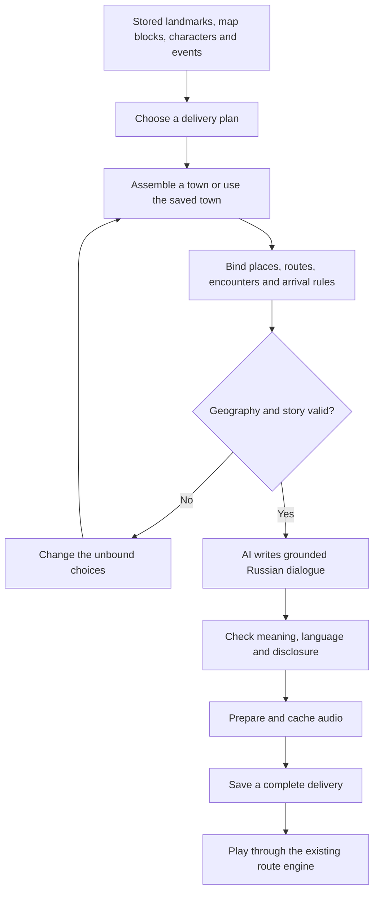

# Procedural directions engine design

Status: first implementation completed locally, 17 September 2026. Reusable map blocks, the four initial event types, grounded dialogue preparation and saved audio are implemented. See [Procedural directions implementation](procedural-directions-implementation.md) for exact behaviour, tests and limits. This design also includes later extensions; those remain proposals where the implementation guide does not list them.

## 1. Design decision

Build the game from a stored library of places, map blocks, characters and events. The engine combines them into a delivery. AI supplies the conversation and character detail, using the locations and events that the engine has verified.

The owner's proposed approach is sound. The important ordering is:

1. Choose what happens and which kinds of places it needs.
2. Assemble the town and assign those roles to actual places.
3. Write the dialogue using the resolved geography.
4. Validate the delivery, prepare its audio and save it.

For example, “the recipient has gone to a café” can be chosen before the map exists. “Turn left after the bakery” must wait until the engine knows where the bakery is and which way Barsik is facing.

This is a grid, a connected road network, a small event system and a content preparation step. It fits the existing Python application. It does not need a new game engine or a separate service.



The saved town remains stable between deliveries. A new district or an explicit new-town choice can create new geography. Refreshing or asking for another assignment must not move familiar buildings.

## 2. What exists and what needs changing

| Existing component | Current limitation | Proposed use |
|---|---|---|
| `services/route_town.py` | Four street plans, with specific landmark positions and relationships. | Replace the layout construction with block assembly. Preserve its map format, graph utilities and useful validation checks. |
| `services/route_dispatch.py` | Composes assignments, but uses named places, a small event sequence and a finite sentence catalogue. | Separate event definitions from composition. Bind events to suitable places instead of fixed place names. |
| `services/route_delivery.py` | Runtime expects a sequence of legs. Creation currently happens inside a database write transaction. | Keep owned sessions, actions, replay and rewards. Move paid preparation outside the transaction. Initially compile composed events into the existing leg sequence. |
| `services/route_arrival.py` | Some arrival behaviour still depends on particular mission fields and geometry. | Accept explicit encounter areas and task requirements, so new events need fewer special cases. |
| `DeliveryMap.tsx` and `DeliveryGame.tsx` | Already render the town and support planning, movement, dialogue and arrival. | Keep them. Add support for generated entrances and encounter metadata where necessary. |
| `services/journey_game_preparation.py` | Its preparation records are designed around vocabulary examples and their media. | Reuse its approach to resumable preparation and asset storage, without forcing deliveries into its picture-per-example workflow. |

The current seed makes a result reproducible. It does not, by itself, make the game varied. Variation must come from different street connections, event combinations, spatial relationships and language tasks.

## 3. The content library

Use versioned JSON files for reusable content in the first implementation. They are easy to review, test and extend. SQLite stores generated deliveries and player progress. An editor and database-backed content catalogue can come later if needed.

### Landmarks

A landmark definition contains:

- A type, such as bakery, library, park or apartment building.
- Its footprint, artwork and supported orientations.
- Possible entrances and how they connect to streets or paths.
- Tags for compatible events: staffed counter, courtyard, public meeting place, collection point.
- Its Russian lemma, grammatical information and checked phrases used in directions.

A definition is not a particular building. The town may contain two cafés, each with a separate ID, position, appearance and entrance. This lets a clue such as “the café opposite the station” matter.

Do not give every destination a unique identifying colour and then ask a question that only requires recognising that colour. Distractors should share one property while differing on the relationship being practised.

### Map blocks

A block is a small layout, not a finished town. Useful examples include a residential block, a market square, a park with several gates, a courtyard and a river crossing.

Each block declares its occupied cells, building plots, road or path connections at its boundary, and internal walkable connections. Boundary connections include road class and width. Two touching blocks connect only where their boundary connections agree. Touching artwork does not create a route.

An illustrative block definition:

```json
{
  "id": "residential-courtyard-01",
  "size": [5, 5],
  "rotations": [0, 90, 180, 270],
  "connections": [
    {"cell": [0, 2], "side": "west", "kind": "street"},
    {"cell": [4, 2], "side": "east", "kind": "street"}
  ],
  "plots": [{"cell": [2, 1], "landmark_tags": ["courtyard-building"]}],
  "features": ["through-street", "rear-access"]
}
```

This example omits internal cells and paths for readability. Production definitions must contain them. A rotation transforms cells, entrances, connections and artwork together. Blocks whose artwork cannot rotate must declare fewer orientations.

Road appearance comes from the assembled graph. Draw continuous surfaces and junctions, retaining the current renderer's approach. Do not draw a rounded rectangle around each road tile.

### Characters

Characters have a name, Russian name forms, role, voice and a few personality traits. Their job determines what they can know. A neighbour may know where a recipient went; a road worker may know an alternative crossing.

Assign these roles when composing the mission. Every delivery should not begin with Nina sending Barsik to Sasha. Keep recurring characters for familiarity, but vary who initiates the task and who provides information.

### Events

An event describes an interaction, not a complete story. It declares requirements, what changes, what the player learns and how the interaction finishes.

| Event | Required situation | Effect and learning opportunity |
|---|---|---|
| Collect an item | A collection point and someone who can hand it over. | Adds the item; introduces the next destination. |
| Clarify an address | At least two places fit the initial description. A character knows the missing detail. | A Russian question reveals the distinguishing relationship. |
| Find a different entrance | One building has separate accessible entrances. | Practises front, rear, around and through the courtyard. |
| Recipient has moved | A plausible original address, an informed character and a reachable new location. | Changes the destination for a stated reason. |
| Find another route | A blocked connection and a usable alternative. | Practises crossing, going around and following a sequence. |
| Collect two items | Two sources and a final recipient. | Practises sequencing. Order is assessed only when the dialogue specifies it. |
| Take a bus | A usable service, boarding stop and reachable final destination. | Practises stop order, before/after, boarding and getting off. |
| Guide a visitor | A visible visitor position, heading and destination. | Asks the learner to construct directions. |

Start with a small compatible subset. The first release should not randomly combine every event with every other event.

For example, a relocation event needs someone who can explain the change. It cannot leave the player at an empty building with no way to discover the next destination. A closed crossing must have another usable route.

## 4. Planning the delivery

Choose a language focus, a short event sequence and the required place roles. Use weighted choices with recent-history exclusions. Avoid an elaborate general-purpose story planner at this stage.

An initial plan could contain:

```text
Language focus: locating places relative to landmarks
Collect a parcel from a staffed shop
Visit a recipient at a courtyard building
Learn that the recipient has gone to another public place
Deliver the parcel there
```

The plan has no coordinates yet. It needs a shop, a courtyard building, a public place and characters who can connect those events.

For a new town, the assembler reserves those requirements before filling the remaining plots. For an existing town, the planner uses the available features. It chooses another compatible event if the town lacks a courtyard; it does not move buildings to make the story work.

An LLM can later propose the event sequence as a list of approved event IDs and roles. The engine still checks it. The first implementation can select this sequence in Python and use the model for dialogue, which keeps the initial build smaller.

Exclude recent event sequences and spatial task patterns as well as exact mission fingerprints. Changing Anna to Vera should not count as a substantially different exercise. Track variation in:

- Event order and the number of meaningful decisions.
- Routes, destination relationships and entrance types.
- The language being interpreted or produced.
- Characters, motivations and conversational wording.

A starting pacing rule is two to four encounters with one main complication. A twist must explain a change or introduce a useful decision. Extra walking alone is not extra learning.

## 5. Assembling the town

Use a coarse block grid over the existing fine movement grid. This preserves tile coordinates while allowing neighbourhoods to have different shapes.

The initial algorithm can be straightforward:

1. Reserve the required terrain and large features, such as a river and crossing sites.
2. Build a connected street skeleton between districts. Add some extra connections to create alternative routes.
3. Choose blocks whose boundary connections fit that skeleton.
4. Place required landmarks in compatible plots, with entrances facing accessible streets or paths.
5. Fill remaining plots with useful distractors, ordinary buildings and public space.
6. Expand the blocks into the existing tile and movement graph format.
7. Check connectivity, entrances, overlap, event requirements and route length.

When a placement fails, try another block or orientation. Use a bounded search with recorded rejection reasons. There is no need to start with a complex constraint-solving framework.

Several properties are essential:

- Buildings sit within neighbourhood blocks, with usable frontage.
- Not every street continues across the entire map.
- A road cannot meet the side of a building or terminate accidentally at a block boundary.
- Footpaths and roads have distinct connections. A bus cannot take a courtyard shortcut.
- River crossings connect actual banks. Closing one must leave the required mission possible.
- Repeated buildings are distinguishable by valid clues, rather than hidden IDs.

Make the assembler accept different map dimensions instead of hard-coding a larger canvas. First prove good layouts at roughly the current scale. More space should support more useful choices, not make Barsik walk farther between isolated houses.

## 6. Binding facts and writing dialogue

Once the town exists, bind each role to a specific landmark, entrance or character. Compute the facts the dialogue needs: relative positions, route decisions, visible landmarks and arrival conditions.

A resolved encounter might contain:

```text
Speaker: shop assistant
Player receives: parcel_1
Recipient: Anna
Destination: courtyard_house_3, entrance courtyard_gate_3
Public clues: yellow building opposite bakery_2; entrance from courtyard
Required action: reach the courtyard entrance with parcel_1
Route policy: any reachable route to that entrance
Later event: Anna has gone elsewhere — not disclosed in this encounter
```

Give the dialogue writer only the facts this character should disclose. Future plot details do not need to be in every prompt. This reduces both accidental spoilers and inconsistent character knowledge.

The model request should contain:

- The encounter's purpose and known context.
- The speaker's role, manner and available knowledge.
- Verified facts, allowed entity IDs and any required direction sequence.
- The learner's level, language focus and a small allowance for useful new words.
- A structured response format for dialogue turns, optional question replies and English help.

Its job is to make a conversation sound natural. For example, a shopkeeper can explain that Anna ordered a book and thank Barsik for taking it. The model must not invent an additional turn, move Anna to another building or disclose a later complication.

### Directions need their own contract

Represent the route meaning separately from the spoken text. Examples include `turn_left_at(junction_7)`, `pass(park_2)`, `cross(bridge_1)` and `arrive(courtyard_gate_3)`.

Also distinguish two task types:

- **Find a place:** the description identifies a destination. Any accessible route is acceptable.
- **Follow a route:** the conversation explicitly requires particular turns, crossings or intermediate stops. Check those requirements, without demanding one exact stored path.

“The building opposite the bakery” must be true on the map. “The second street on your left” needs a defined starting position, heading and junction-counting rule. A pedestrian driveway should not silently count as a street.

Use short sequences at first. Include compound instructions where the level supports them: pass a landmark, take a turn, then identify the entrance. This provides more substance than repeatedly asking for a single left or right turn.

### Validate what the model actually wrote

Valid JSON and an attached list of fact IDs do not prove that the Russian sentence is accurate. A model can list the right facts while saying the wrong thing.

For the first release, use checked Russian realizations for the clauses that determine the correct route. Give them several natural variants and combine them from the resolved facts. The model chooses suitable variants and writes the surrounding conversation. It cannot change the required meaning.

Allow fuller AI paraphrasing only with an independent meaning check against the encounter contract. Reject invented landmarks, reversed directions, missing destinations and premature disclosures. This check reduces risk; it is not a proof of language correctness. On a failed check, retain the facts and replace or regenerate the affected wording. Never move the map to accommodate an accidental sentence.

### Russian language and vocabulary

Preserve the existing lemma and word-form relationship. Save the actual encountered form with its sentence and contextual translation. Do not introduce a single permanent English meaning for each lemma.

Keep checked forms and phrases for landmarks and common route constructions. For example, `у библиотеки`, `к библиотеке` and `между библиотекой и аптекой` cannot be produced by substituting nominative dictionary words into an English template.

Use familiar words where possible, with a small number of new words supported by the context. Lessons can supply target vocabulary when it fits the task. Do not make generation fail because the personal vocabulary list lacks a bakery or a bridge.

## 7. Example generated delivery

This is an illustrative result, not another fixed mission to implement verbatim.

The planner chooses collection, courtyard arrival and recipient relocation. The assembler places a yellow courtyard building opposite a bakery. It also places a second yellow building elsewhere. A café sits near the market.

1. At the shop, Barsik collects a book for Anna. The assistant says: “Отнеси эту книгу Анне. Она живёт в жёлтом доме напротив пекарни. Вход со двора.”
2. The learner distinguishes the two yellow buildings and finds the courtyard entrance. A neighbour explains: “Анна ушла в кафе рядом с рынком. Она ждёт тебя там.”
3. Barsik reaches the café and hands over the book. Anna thanks him. The delivery ends.

The engine verifies that the first description identifies exactly one building, its courtyard is reachable and the second description identifies exactly one café. It also checks that Barsik collected the book before handing it over.

The next delivery might involve a park gate and an address clarification, with a different opening character. It need not reuse the shop, Anna, the courtyard or the relocation event.

The player sees a neutral delivery title. They discover the change at the courtyard. No English menu heading announces that Anna has moved.

## 8. Player flow and fair assessment

Keep the game centred on the map, the current conversation and the route controls below it. Expose level and reading/listening options before play. Keep generation seeds, event names and constraints out of the player interface.

Characters, questions and the next objective appear when discovered. The server must also filter future dialogue and objectives from the client response; hiding them with CSS is insufficient.

Define an encounter's acceptable arrival area explicitly. “Meet Sergei by the bridge” should accept the connected approach where Sergei is visible. “Use the courtyard entrance” should distinguish the courtyard entrance from the front door. Neither should depend on guessing an invisible tile.

Preserve partial progress:

- Pausing on the route is navigation, not an incorrect answer.
- Reaching the correct building can give entrance guidance when the entrance is not the learning target.
- Choosing a different building or ignoring an explicitly required entrance is a meaningful error.
- Completing a required crossing stays recorded while the learner finishes the remaining route.

Store separate observations for destination choice, route instructions, entrance choice and independent versus supported understanding. Do not turn every walking click into a grade. Keep the existing coin policy. Introducing a new generator alone is not sufficient evidence to enable Elo updates; assessment needs calibration first.

## 9. Preparation, audio and persistence

Prepare the complete short mission before the player begins. That includes later encounters and optional question replies, which remain hidden until needed. The conversation can feel responsive without a model call at every stop.

New dialogue needs new audio. The current exhaustive sentence-recording script cannot cover unrestricted generated text. Reuse existing media providers and asset storage, but cache by exact text, voice, language and provider settings. Keep character voices stable within a mission.

Reuse landmark artwork across towns. Do not generate a set of pictures for every delivery.

Preparation should be resumable:

```text
planned → world_validated → dialogue_validated → audio_ready → ready
```

A failure records its stage and preserves completed work. Retrying an audio request does not regenerate the story. A request ID prevents duplicate starts. A lease prevents two workers preparing the same stage simultaneously. Reserve provider budget before paid work, and make the stage state durable before releasing the lease.

A crash after a provider finishes but before saving leaves an uncertain outcome. Keep that reservation open. Reconcile it or use provider idempotency where supported. Otherwise, a bounded retry can incur another charge and needs a separate budget reservation. An expired lease is not evidence that the first request cost nothing.

Do not hold a SQLite write transaction open during text or audio generation. Use short transactions to claim work and save results. Build on the existing preparation pattern; local request-driven preparation and polling are sufficient initially. WebSockets are unnecessary for this activity.

A complete saved pack contains:

- World and mission seeds, content versions and generator versions.
- The resolved map, event sequence and encounter requirements.
- Accepted dialogue, translations, vocabulary references and asset IDs.
- Model and prompt versions for diagnosis, without credentials.

The snapshot is authoritative. A seed cannot recreate an identical model response. Reopening a delivery loads its saved text and map rather than asking the model again.

Keep the existing session and route-action tables. Add a small preparation record for stage state and errors instead of changing the vocabulary database. Versioned content definitions can remain files.

Reuse existing ownership and provider access controls. Public demo play should initially select from prebuilt complete packs. The existing `services/ai_trial_budget.py` ledger defaults to disabled and is not wired to public generation routes. Enabling generation later requires connecting the complete workflow to that ledger, with verified identity and bounded provider costs. The approved limits are US$1 daily and US$20 monthly, including retries and audio. Cache lookup must respect ownership when a pack contains personal lesson material.

If preparation cannot finish, offer a clearly identified prepared delivery or a retry. Do not silently present an old canned mission as a newly generated one. Listening mode starts only when its required audio is available.

## 10. Implementation sequence

Each step should produce something visible and testable.

| Step | Work | Completion evidence |
|---|---|---|
| 1. Extract the content definitions | Introduce schemas for landmarks, blocks, events and encounter facts. Adapt existing content into them. | One existing delivery runs from the new definitions with unchanged saving and movement. |
| 2. Build the map assembler | Create a small block library, compatible connections, placement and validation. | A contact sheet of generated towns shows different street networks and interior landmarks. Every displayed route is walkable. |
| 3. Compose events | Start with collection, address clarification, entrance choice and relocation. Bind roles to the assembled or saved town. | Several deliveries differ in their task structure, not only names and destinations. Required information is always obtainable. |
| 4. Add grounded dialogue | Integrate the current configured text provider, encounter contracts, language checks and resumable audio preparation. | Characters explain coherent motivations and give accurate directions. Retry and reload preserve the mission. |
| 5. Extend the events | Add closures, buses, multiple collections and guiding a visitor one at a time. | Each event composes with an explicitly tested set of other events. |

Keep `route_delivery` as the runtime boundary. Introduce focused modules for content loading, map assembly, event planning and dialogue preparation as those steps are implemented. Avoid creating a large framework before the first composed delivery works.

Initially compile events into the existing linear legs, with optional questions within an encounter. A branching story graph can come later. Existing saved sessions continue using their original packs; the new generator applies only to new deliveries.

Unordered collections also need a set of outstanding objectives, rather than a single current leg. Defer them until that state exists. An initial two-collection task must state the order in the dialogue if the runtime requires that order.

## 11. Acceptance criteria

The first release should meet these proposed checks:

- A reproducible test across at least 200 seeds checks road connections, plot overlap, entrance access, mission solvability and clue uniqueness. Record rejection rates as well as successes.
- For deliberately incomplete clues, test that the offered clarification resolves them before assessment. Reject questions whose replies still identify several places.
- Compare street topology and event structure separately from names, coordinates and artwork. A renamed or rotated town is not evidence of a new layout.
- Review a contact sheet of at least 20 towns. Reject empty central areas, disconnected-looking streets and buildings whose visible entrance disagrees with the graph.
- Test ambiguous bridge approaches, courtyard entrances, intermediate stops and alternate valid routes through the HTTP action flow.
- Test invalid model responses: wrong turn, fabricated landmark, contradictory translation, changed recipient and leaked future event. None may change the accepted answer or silently enter play.
- Test cancellation, retry, expired leases and duplicate requests. Verify that paid stages are bounded and saved assets are reused.
- Complete several missions in both reading and listening modes. Review the Russian for natural phrasing, correct cases and enough information to act.

The release test is a learner completing a delivery from the supplied Russian without having to guess what the programmer intended. Seed counts and unit tests support that test; they do not replace it.

## 12. Scope

The first useful version combines a modest block library, four event types, grounded dialogue and reliable audio. It can produce varied, coherent deliveries without building an unrestricted world simulator.

Free-form spoken NPC interaction, timed opening hours, moving traffic and open-ended story generation are later options. They should follow a successful map-and-dialogue implementation rather than delay it.
