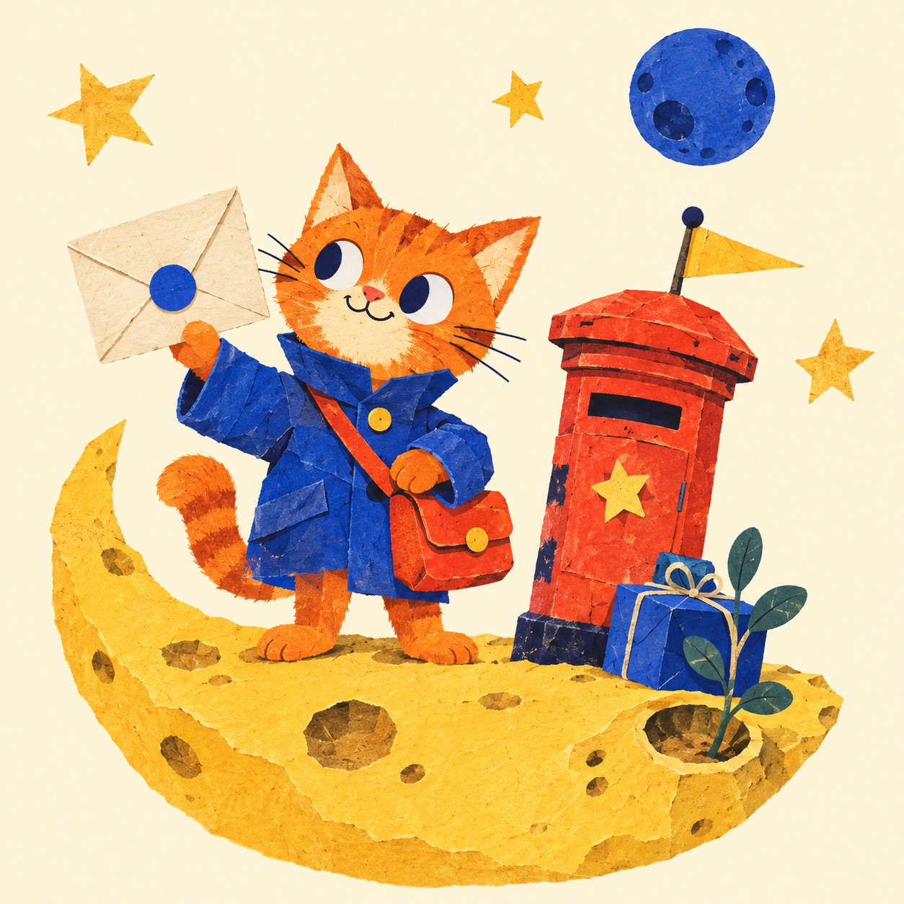

# Approved Word Post reference

The owner approved this concept on **8 September 2026**: “this is the perfect design for the application.” This directory preserves the exact visual reference independently of the conversation's temporary preview server.

**Clarification, 9 September:** the owner retains the visual design, picture and theme but rejects the implemented copy, narrative and flow. The preserved artefact is historical visual evidence, not approval of postal navigation or the Moon Picnic learning sequence. The [experience review](../experience-review.md) governs subsequent product work. Original artwork and concept files remain unchanged.

| File | Role |
|---|---|
| [approved-concept.html](approved-concept.html) | Exact HTML fragment used for the approved interactive concept; includes its demonstration artwork and local-only example state |
| [misha-moon-courier-original.png](misha-moon-courier-original.png) | Original generated illustration, preserved without modification |
| [misha-moon-courier.jpg](misha-moon-courier.jpg) | Optimized JPEG used by the concept |
| [manifest.json](manifest.json) | SHA-256 checksums and byte sizes for the preserved files |

The fragment was designed for the conversation's visualization host. It uses optional host icon/design helpers and externally loaded fonts; opening it directly as a production document is not the supported application setup. The original preview demonstrated a letter, word choice, sentence assembly, a Word pocket, a Passport and grown-up concept controls. State is held in memory and resets on reload. It contains no working AI, Drive, Anki, account system or audio.

The production implementation should preserve the visual world and interaction intent while replacing demonstration state with the contracts in [technical architecture](../technical-architecture.md). In particular, the prototype's single accepted sentence order is not a general rule for Russian grammar, and its “For grown-ups” button is not an access-control mechanism.

## Illustration provenance

Generated with the built-in image-generation tool in this task on 8 September 2026. No external artist reference or existing mascot was provided. The JPEG is a format/compression derivative of the preserved PNG. The copy/checksum operation was verified when this reference directory was created.

Generation brief:

> One original premium children's editorial illustration for Word Post, aimed at ages 7–11. An endearing ginger-orange cat courier with triangular ears, an oversized cobalt postal jacket and a tomato-red satchel stands on a butter-yellow crescent moon island, holding a cream envelope sealed with a cobalt circle. Beside the cat is a wonky red pillar postbox, a pale-yellow pennant, a blue parcel and a leafy plant in a moon crater. A smaller blue moon and a few irregular paper stars float in generous cream space. Handmade cut-paper collage, screen-printed picture-book character, subtle ink grain and restrained paper shadows. Palette: warm cream, cobalt, tomato, marigold, dark ink and ginger. Strong silhouette, mischievous kind expression, complete subjects inside margins. No letters, logos, interface elements, watermark, glossy 3D or gradients.

This is a faithful condensed record of the illustration instructions, not a claim of deterministic regeneration. Preserve the actual artwork as the identity reference; do not regenerate it on every lesson request.

Fonts named by the concept are Unbounded and Golos Text. The original planning checkpoint did not bundle fonts; the subsequent [UI package](../../../flask_vocab_app/ui/README.md) now packages them locally with their licences and a compressed WebP derivative of this artwork. This directory remains the immutable design reference. Curated source art is kept in Git; personal uploads and runtime-generated learning media remain outside Git.
