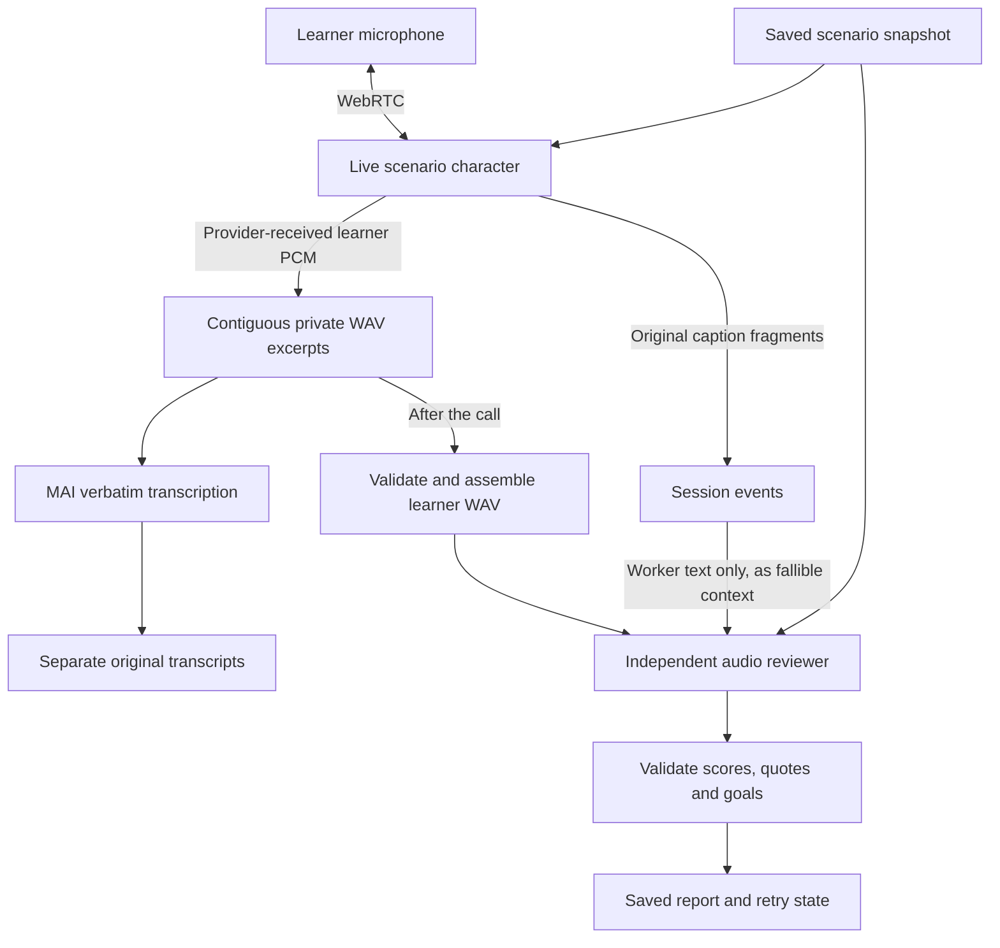

# Speaking: feedback, varied situations and natural endings

Updated 15 September 2026. This is the implementation contract for the first
audio-based assessment pass. The activity and transport overview is in
[Speaking](live-conversation.md). The multi-game catalogue and migration 022 are
described in [Speaking scenarios](speaking-scenarios.md).

## The learning experience

Speaking has two distinct jobs: sustain a believable Russian conversation, then
help the learner understand how it went. The learner first chooses a game—café,
shops, directions, station or meeting people—then previews a situation within it.
The selected character responds to the meaning of imperfect Russian without
stopping at every wrong ending. When the call
finishes, a separate reviewer listens to the saved learner audio and provides:

1. A brief, specific account of what worked.
2. Grammar and fluency marks for this attempt, each from 1 to 5 when supported.
3. Progress against that situation's communication goals.
4. At most two useful corrections and one achievable next step.

The learner can inspect what the reviewer heard and play the original recordings.
The report is part of the saved conversation, not a mandatory interstitial after
every utterance. Personal use retains the existing access model; this work adds
no grown-up approval stage or PIN requirement.

Task success and grammatical accuracy are different. A learner who says
`Я хочу чай без сахар` can successfully order unsweetened tea while needing help
with `без сахара`. An English order does not count as completing a Russian task.
A correct short reply such as `Чай, пожалуйста` can complete a goal but is too
little evidence for a global speaking mark.

## Data flow and responsibilities

| Responsibility | Implementation |
|---|---|
| Read the database catalogue and choose a variant | `repositories/speaking_repository.py` |
| Save the previewed situation as the session snapshot | `services/live_conversation.py` |
| Capture audio, own the call and queue review | `services/live_conversation.py` |
| Carry voice and delegated tool traffic | `services/live_voice_provider.py` |
| Validate an ending and wait for farewell audio | `services/speaking_lifecycle.py` |
| Run a durable whole-call review job | `services/speaking_review.py` |
| Audio prompt, rubric and result validation | `services/speaking_assessment.py` |
| Display task, call controls, feedback and recordings | `ui/src/LiveConversation.tsx` |

The live call remains independent of grading latency. The browser talks directly
to GPT-Live over WebRTC. A server sideband retains the audio received by the
provider before separate transcription. Once capture finishes, the review worker
assembles those excerpts in sample order into a temporary WAV. It checks every
offset, sample count and audio format; it refuses a missing or overlapping
segment rather than filling gaps with invented silence. The temporary file is
removed after success or failure. Original recordings are unchanged.

MAI continues producing a separate verbatim transcript for comparison and replay.
New seeded sessions do not also ask the old text assessor for comments on every
excerpt. Historical comments remain stored, and the old diagnostic workflow
remains available. An existing call does not acquire a paid review just because
someone opened it.

### Models and configuration

| Role | Setting | Default |
|---|---|---|
| Conversational voice | `LIVE_CONVERSATION_MODEL` | `gpt-live-1` |
| Voice choices, randomly selected once per call | `LIVE_CONVERSATION_VOICES` | `marin,cedar` |
| Scenario reasoning and finish tool | `CONVERSATION_MODEL` | `gpt-5.6-luna` |
| Original background transcription | `CONVERSATION_TRANSCRIPTION_MODEL` | `microsoft/mai-transcribe-2` |
| Independent audio assessment | `SPEAKING_ASSESSMENT_MODEL` | `gpt-audio-1.5` |

The new assessment setting is additive. It does not replace the live model, MAI,
random voice selection, or models used by stories, lessons and flashcards. Audio
review uses the existing OpenAI configuration; MAI uses the existing OpenRouter
configuration. Keys remain on the server. No silent provider fallback is used.

The reviewer uses Chat Completions with WAV input and text output. GPT Audio does
not support strict Structured Outputs, so the application requests JSON and
validates its shape and evidence locally. A malformed result is a failed review,
not an excuse to display a guessed score. The request has a 120-second SDK timeout
and automatic SDK retries are disabled. See the official
[audio input guide](https://developers.openai.com/api/docs/guides/audio-chat-completions)
and [GPT-Audio-1.5 reference](https://developers.openai.com/api/docs/models/gpt-audio-1.5).

## What counts as evidence

The reviewer receives the learner audio, the stored scenario and captions from
the **worker only**. It is deliberately not given a learner transcript from MAI or
the live provider. That avoids priming it with an already corrected Russian
ending. It first renders the speech independently and keeps corrections separate.
English remains English in that internal rendering; it is not translated into a
Russian answer the learner never spoke.

The report stores:

- `basis: audio_review`, model and `rubric_version: speaking-audio-v1`.
- An independent literal `transcript`, separate from the existing transcripts.
- `speech_status` and exact `uncertain_phrases` when recognition is ambiguous.
- Grammar and fluency objects containing a score or null, a reason and source
  phrases supporting any score.
- Goal IDs with `completed`, `not_yet` or `uncertain`, and learner evidence.
- A summary, one next step, at most two corrections and specific uncertainty.

Each quoted phrase and correction original must occur in that independent
transcript. Completed goals require Russian learner evidence and known goal IDs.
Explicitly uncertain phrases cannot support a mark or a correction. Invalid
numeric ranges, missing evidence, unknown or repeated goals, and excessive
corrections are rejected. A score below the minimum sample requirement is withheld.

These checks establish internal consistency, not acoustic truth. The audio model
can still mishear a word, normalize an ending, or be overconfident. Its transcript
is another interpretation of the recording. The UI must never relabel it as a
verified transcript or overwrite MAI's output with it. Two models agreeing is not
proof of correctness.

The retained audio is mono PCM16 at 24 kHz after browser processing, WebRTC
encoding and provider decoding. Browser echo cancellation and noise suppression
remain enabled. It is not a lossless hardware-microphone recording. Caption times
and the recorded sample clock are separate; they do not provide exact utterance
alignment or reliable evidence of when the learner heard a worker response.

## The five-point rubric

Scores describe the Russian used in this attempt. They are not a CEFR placement,
exam result, diagnosis, or calibrated measure of long-term ability. There is no
combined percentage, Elo update or coin award.

| Mark | Grammar | Fluency |
|---|---|---|
| 5 | Forms used are consistently appropriate. | Phrases flow comfortably with natural planning and repair. |
| 4 | Mostly accurate with isolated slips. | Mostly connected speech with occasional searching. |
| 3 | Meaning generally clear with recurring form errors. | Repeated searching within phrases, but messages are completed. |
| 2 | Form errors often obscure meaning. | Frequent disruptive restarts or searching within phrases. |
| 1 | Little usable control of the forms attempted. | Speech remains fragmented. |
| No score | Not enough clear evidence for this dimension. | Not enough audible delivery to judge this dimension. |

At least eight Russian words across the attempt are required for either global
score. This is a conservative implementation minimum, not a research-derived
proficiency boundary. The model should still abstain with a longer but
uninterpretable or inadequate sample. It can withhold one dimension independently
of the other. `no_russian`, `insufficient` and `unclear` speech statuses withhold
both marks. Fluent English earns no Russian fluency credit.

The grammar prompt considers case government, agreement, conjugation and aspect
in context. It accepts short answers, ellipsis, conversational alternatives,
successful self-repair and the polite request `Я хотел чай`. It does not demand
advanced grammar for a high mark or treat transcript punctuation as a spoken
mistake. A valid `Я хочу... нет, я хотел чай без сахара` should not be penalized
for changing tense during the repair.

Fluency concerns audible delivery **within learner phrases**. It must not be
calculated from words divided by total call duration. Waiting for the worker,
muting, network gaps, background noise and an unfamiliar accent are not fluency
errors. A successful self-repair can demonstrate skill. When the reason for a
pause is unclear, the model is instructed not to penalize it. This first pass does
not produce measured pause statistics, words per minute or pronunciation marks.

Task progress uses the saved scenario's meaning-based completion criteria, not a
single required phrase or grammatical answer key. Errors can coexist with
successful communication. The worker giving the answer, a quoted example, an
English request, or a normally closed connection does not establish success.

## Scenario seeds

Seeds identify complete situations, not random first lines. Speaking now contains
five selectable games and 16 curated variants: eight café situations and two each
for shops, directions, station and meeting people. The full list is in the
[scenario catalogue](speaking-scenarios.md#current-catalogue).

The session snapshots its seed/version, English and Russian title, description,
opening, character, menu or reference panel, aligned goal IDs, completion criteria,
character brief and closing
instruction. The interface, voice agent and reviewer all use that same snapshot.
Changing the catalogue later does not rewrite the task for a saved conversation.

Runtime selection reads enabled variants from SQLite within the learner's chosen
scenario. It prefers unplayed variants in that scenario's recent history, then
the least recently played one. Playing a different game does not reset the first
game's history. Historical calls without a recognised variant are ignored by the chooser.
Retrying the same start submission returns the same session and situation rather
than rerolling. Voice choice remains a separate random selection per call.

Constraints should be human and solvable: one sold-out item, a simple budget, a
destination or a friend's availability. The character should accept reasonable
alternatives and let people finish early. A social scenario has social goals;
it does not need an order, a price or a purchase to count as successful. Future
lesson- or vocabulary-linked tasks can reuse this design without introducing
arbitrary obstacles or repeating a single scripted exchange.

## Ending a conversation

The character should close a finished exchange naturally. It should not keep
offering new products forever, close immediately after a price question, or
interpret hesitation as an instruction to stop.

The delegated model requests the application-owned `finish_speaking` tool. It
supplies a reason and learner quotes:

- `task_complete`: evidence for every goal, the scenario's closing instruction
  followed, and the learner's indication that they are finished. The café asks
  whether anything else is needed; another role closes in a way that fits its situation.
- `learner_finished`: the learner clearly chooses to leave early in Russian;
  this does not imply all goals were completed.

The server checks the request's shape, goal indexes, presence of Russian learner
quotes in the live transcript and duplicate calls. Semantic interpretation of
the goals and farewell remains a model judgment. These live transcript checks
control the interaction; they are not the independent audio grade.

For an accepted request, the worker says a short farewell ending `До свидания!`
and is instructed not to introduce another question. The lifecycle manager waits
for completed backend continuation, farewell captions, audible reflected output
and a two-second drain interval. It then asks the provider to close, keeps the
connection available for `session.closed`, and records the ending reason apart
from transport usage. A new learner transcript during the pending farewell
cancels that ending. An unconfirmed farewell times out after 30 seconds without
forcing a success claim.

The drain interval is an estimate. GPT-Live reflection is not confirmation that a
particular browser played every sample; device latency, blocked playback and
late input transcripts require further testing. A spoken goodbye without the
accepted tool sequence does not by itself close the session.

The manual end control, 35-second heartbeat watchdog and five-minute limit remain.
At around 270 seconds the server asks the character to wrap up the current conversation.
`user_ended`, `connection_lost`, `time_limit`, `task_complete` and
`learner_finished` must remain distinct. A gracefully finalized transport can
still represent an incomplete task, and an interrupted session can still contain
useful speech to review.

## Storage, retries and migration

Migration 021 adds `speaking_reviews`, keyed by the existing live session, plus
the nullable session `end_reason`. It does not assign historical grades, change
lemmas or word forms, replace saved scenarios, rewrite transcripts or touch
recorded-turn history. Normal database upgrade procedures create a backup first;
apply the migration to the intended configured database.

Migration 022 adds the one-to-many hierarchy `learning_activity_types` →
`speaking_scenarios` → `speaking_scenario_variants` → `live_conversation_sessions`.
The session also references its scenario directly through `scenario_id`; both
new foreign keys are nullable for legacy content. Recognised café sessions are
linked without changing their original `scenario_json`, recordings or reports.
SQLite owns the live catalogue. `data/speaking_catalogue.json` is used to seed
the migration, not reread as an authoritative catalogue for each call. The
session snapshot remains the context for later feedback even if a catalogue
entry is edited or disabled.

New seeded calls automatically request one review after capture closes. Earlier
calls require an explicit **Get speaking feedback** action. A ready report is
reused across repeated finish requests, page loads and retries. Failed reviews
keep the original audio and offer an explicit retry; reading a page never starts
another paid request.

The review queue uses one worker with a 240-second lease. Its states are
`queued`, `analysing`, `ready` and `failed`. Healthy queued work waits behind the
current job. After a server restart, expired unfinished work can be retried
explicitly. This is a local single-process job system, not yet a distributed
worker architecture. A hosted deployment needs supervised ownership and recovery
before running multiple application workers.

Review assembly accepts the existing 24 kHz mono PCM WAV format and up to 320
seconds, allowing the five-minute conversation plus close-out audio. It retains
listening pauses rather than trimming them. No audio, entirely silent recordings,
a missing segment or invalid format cannot produce a mark. These failures should
remain visible and retryable where the saved source can be recovered.

Deletion waits for active capture and processing, then cascades the review with
its session and removes the session's original files. SQLite backups contain the
review rows; the existing learning-store backup also copies live WAV files with
checksums. Restore the matching database and audio directory together. As with
other stored material, deleting a live record does not delete older backups.

## Verification and calibration

Implementation tests exercise the provider request shape, preserved source bytes,
exclusion of learner ASR text, correction/evidence validation, abstention, stable
goal IDs and safe failures. Lifecycle tests exercise evidence checks, duplicate
events, farewells and interruptions. Review tests cover continuous audio,
idempotency, queues, recovery, ownership and deletion. Contract tests are not
benchmarks of how accurately a model hears human Russian.

During the 15 September implementation pass, the following paid synthetic-audio
observations were reported:

| Fixture | Observed result | What it establishes |
|---|---|---|
| `я хочу чай без сахар` | The independent rendering retained the wrong ending; the correction suggested `без сахара`. Both marks were null for the short sample. | This fixture exercised the real audio endpoint and the insufficient-sample path. |
| Longer combined example | The reviewer identified case corrections and returned grammar 3 / fluency 4, but rendered `Она` as `А на`. | The model can produce useful feedback and still make recognition mistakes. These marks are synthetic-fixture output, not calibrated learner results. |
| Correct control with self-repair | An initial request failed safely. A fresh diagnostic request preserved the repair, returned grammar 5 / fluency 4 and suggested no corrections. The initial failure's provider/schema cause was not captured. | A successful repair and polite `я хотел` were accepted in the real audio path; reliability still needs broader measurement. |
| Live learner leaves early | The worker said goodbye and the server closed with `learner_finished`, without the test requesting closure; the final review was ready. | WebRTC, the finish tool, farewell drain, original recording, transcription and final review work together. Leaving early did not complete the café goals. |
| Live café task completed | Ordering without sugar, asking the price, and declining more items ended with `task_complete`; all three review goals were completed. | Natural completion works beyond the explicit-goodbye case. The first report drifted into Russian in English mode; explicit system language instructions and local validation were added, and a new review returned English successfully. |

Receipts are in ignored `instance/speaking-assessment-20260915/`: audio-review
JSON, `natural-end/metrics.json`, `task-completion/metrics.json`, the English
language recheck, test logs and `migration.json`. Both live tests used synthetic
files in a separate QA database, never the learner's microphone or practice history.
The 48 new Speaking checks and existing conversation checks were exercised;
the activity/migration regression suite was followed by targeted reruns after
fixing older-schema test fixtures. The final UI run passed 33 tests; TypeScript
and the production build passed. Browser checks covered the task preview,
changing situations without a call, compact results and original recordings.

The preview database was backed up and migrated to schema 21. All five existing
conversation tables were compared using their original columns and were unchanged;
no historical grades were created. The existing configuration, environment files
and canonical vocabulary database passed unchanged-hash checks.

Human calibration is the next requirement before using marks for progression:

1. Collect consented recordings from actual learners across levels and devices,
   with tutor-reviewed literal transcripts and acceptable contextual readings.
2. Pair correct and incorrect Russian cases, agreement and conjugations; include
   unstressed or ambiguous endings, polite requests, ellipsis and self-repair.
3. Include Russian help requests, mixed speech, English-only attempts, brief
   answers, accents, background sound and a silent/no-speech control.
4. Compare MAI and the independent audio rendering without treating either as
   truth. Track error preservation, false correction and appropriate abstention
   separately; record disagreements instead of flattening them into one transcript.
5. Have tutors rate grammar and fluency independently. Compare model stability on
   repeated attempts and check whether corrections remain motivating and useful.
6. Measure natural turn timing and farewell playback on desktop/mobile, including
   interrupted goodbyes, lost connections and browser autoplay restrictions.

Only after those results should the application consider changing thresholds,
adding progress trends, deriving targeted practice, or attaching coins and Elo.
Any future reward should distinguish participation, task communication and
language accuracy so a recognition mistake does not silently penalize a learner.
