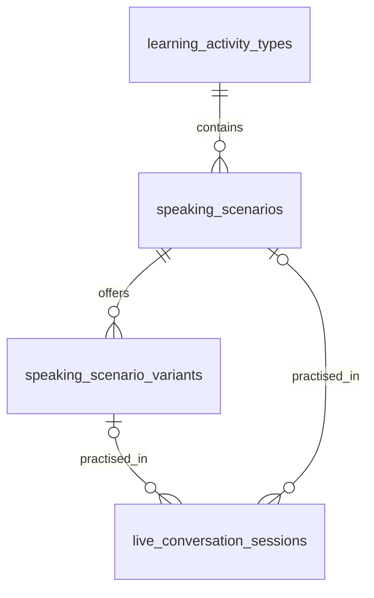

# Speaking scenarios

Updated 15 September 2026. Speaking is an activity containing several conversation
games. The café is one game within it; ordering for two is one version of that
game. This distinction lets the learner choose what to practise before the app
chooses a fresh situation.

## Learner flow

1. Open **Speaking** and choose a scenario: café, shops, directions, station or
   meeting people.
2. Read the short situation, its three goals and any useful reference information.
   **Another situation** offers a different version within the selected scenario.
3. Start talking in Fluent conversation mode, or select **Step-through** in this scenario's setup screen for guided replies. The two text choices keep the same situation and level.
   The character, opening, facts and goals come from that exact
   preview; changing a preview never opens the microphone or starts a paid call.
4. Finish naturally or use the end control. The saved conversation keeps its
   original situation, audio and separate grammar/fluency review.

Fluent conversations share the live connection, Russian-only role-play and audio
review. Step-through uses the same scenarios with paused exchanges and optional
hints; its answer choices do not produce fluency scores. Both modes save history
and end naturally. Each scenario has its own character and purpose:
asking directions must not turn into a café order, and meeting a neighbour must
not become a purchase. Short or imperfect Russian can communicate a goal
successfully. Task completion and grammatical accuracy remain separate.

## Current catalogue

The initial database catalogue has **five scenarios and 16 variants**. English
and Russian titles, descriptions and goals are stored together. The eight café
variants retain their existing content.

| Scenario | Variant seed | Situation | Conversation focus |
|---|---|---|---|
| At the café | `cafe-takeaway-v1` | Something to take away | Order a drink and snack, ask for takeaway and check the total. |
| At the café | `cafe-for-two-v1` | A table for two | Order two drinks and something to share. |
| At the café | `cafe-warm-drink-v1` | Time to warm up | Order a hot drink without sugar and ask the price. |
| At the café | `cafe-budget-v1` | A little lunch | Choose food and drink within 250 roubles. |
| At the café | `cafe-recommendation-v1` | What would you recommend? | Ask for advice, choose and check the total. |
| At the café | `cafe-sold-out-v1` | A change of plan | Choose an alternative when buns have sold out. |
| At the café | `cafe-payment-v1` | Coffee before the train | Order takeaway coffee and ask about card payment. |
| At the café | `cafe-later-order-v1` | One more thing | Add a snack and confirm the updated total. |
| At the shops | `shop-groceries-v1` | A few things for dinner | Request a kilo of apples and half a kilo of cheese. |
| At the shops | `shop-tshirt-v1` | Finding a T-shirt | Describe colour and size, ask to try it on and ask the price. |
| Asking directions | `directions-library-v1` | Finding the library | Ask the way and check a turning or landmark. |
| Asking directions | `directions-station-v1` | Enough time to walk? | Ask the route, walking time and where to turn. |
| At the station | `station-one-way-v1` | A day in Lesnoy | Choose a one-way train arriving before noon. |
| At the station | `station-return-v1` | There and back | Arrange a Saturday return journey for two people. |
| Meeting people | `meet-neighbour-v1` | A new neighbour | Introduce yourself to Anya and exchange interests. |
| Meeting people | `meet-weekend-v1` | A plan for the weekend | Agree on an activity, time and place with Dima. |

Each variant has aligned goal IDs and meaning-based completion criteria. A task
does not require one prescribed Russian sentence. Prices and travel timetables
are fictional role-play facts. Reference panels show what the learner needs to
know, such as a shopping list or destination; a route or departure time that the
learner is meant to ask about stays in the character's brief.

## Database relationship

Migration **022** adds this hierarchy:

| Table | Responsibility |
|---|---|
| `learning_activity_types` | The parent activity, initially `speaking`. Other activities are not migrated in this pass. |
| `speaking_scenarios` | Selectable games, with activity foreign key, bilingual presentation, role, ordering and enabled state. |
| `speaking_scenario_variants` | Versions of each game, with a scenario foreign key, validated JSON content and enabled state. |
| `live_conversation_sessions` | The learner's actual attempts, with nullable `scenario_id` and `variant_id` foreign keys plus the existing `scenario_json` snapshot. |

The hierarchy is relational where identity and membership matter. The variant's
JSON payload holds its coherent teaching content: opening, roles, reference
information, goals, completion criteria and closing instructions. This avoids a
different database table for every game's menu or social situation while keeping
scenario selection and session reporting queryable.

`data/speaking_catalogue.json` is the **migration seed**, not the runtime catalogue.
The migration imports it into SQLite; `repositories/speaking_repository.py` reads
enabled scenarios and variants from that database. Editing the seed file alone
does not update a household's existing catalogue. Future content revisions need
an explicit migration or a dedicated content-management operation.

Starting a session copies the selected variant into `scenario_json`. That saved
snapshot remains the authority for its interface, live role and assessment.
Changing or disabling a catalogue variant later must not rewrite an earlier
conversation. A `scenario_seed` belonging to another scenario is rejected rather
than silently changing the learner's choice.

Variant selection considers previous attempts within the selected scenario.
Unplayed variants are preferred; once all have been played, the least recently
played one is reused. Switching to another game does not reset the café's recent
history. Repeating an idempotent start request returns the same saved session,
not another roll of the scenario or voice.

### Migrating existing practice

Use the normal database upgrade command against the intended configured database;
the existing upgrade procedure creates a backup first. Migration 022 adds
catalogue rows and session relationship columns. Earlier café sessions can be
linked to their known category and, where their seed is recognised, their variant.
The foreign keys stay nullable for legacy or unrecognised content. Existing
`scenario_json`, original audio, transcripts, grades and review history are not
rewritten to match the new catalogue.

This pass does not add a scenario editor, learner-authored roles, difficulty
unlocking, coins or vocabulary-driven generation. The checks below cover this migration; the earlier café-only provider tests
are not evidence that every new role has been tested through a live microphone connection.

## Verification on 15 September 2026

- 12 catalogue tests passed: category membership, exact selected variant,
  disabled/invalid selections, repeat avoidance, idempotency, immutable history
  and schema 21→22 migration. Speaking/backend suites passed 69 checks; 141
  migration and activity regression checks also passed.
- 56 focused UI checks passed, including catalogue-only entry, selected category
  and seed, role/reference rendering, stale-response handling and saved feedback.
  TypeScript and the production build passed. The browser preview was checked
  for the catalogue, both shop variants and a saved directions review.
- The preview database was backed up and upgraded to schema 22. Existing columns
  in all six conversation/history tables matched their pre-migration snapshots;
  foreign-key integrity passed. The canonical vocabulary database and secret
  configuration files were not changed.
- A paid WebRTC test used synthetic Russian audio to ask for the library and
  confirm the turn and walking time. The local-resident character stayed in
  Russian, used the correct route facts, ended after the learner's goodbye and
  produced an independent audio review. No manual end request was needed.
- That first review overcredited a compound goal: goodbye was counted as both
  thanks and goodbye. The rubric now explicitly requires evidence for every
  required action. Reassessing the same recording correctly left that goal
  `not_yet`. All 35 focused assessment/prompt/catalogue checks passed afterwards.
- Supplementary MAI transcription failed during that call. A separate probe of
  OpenRouter's public endpoint also failed with `NameResolutionError`, indicating
  a DNS/connectivity problem rather than evidence of invalid credentials. The
  recording, live captions and independent audio assessment still completed.

Reproducible transport test: `scripts/test_live_conversation.py` now accepts
`--scenario` and `--seed`. Local receipts are under
`instance/speaking-catalogue-20260915/` (ignored by Git). Synthetic voices verify
transport and scenario behaviour; they do not calibrate human fluency scores or
establish that every new scenario has passed a live audio test.

## Further scenarios — not implemented

| Idea | Useful conversation | Learning opportunity |
|---|---|---|
| At the library | Ask for a book, describe its subject and find out when to return it. | Description, preferences and dates. |
| At a hotel | Find a booking, ask about breakfast and explain a small room problem. | Polite requests, time and descriptions. |
| At the post office | Send Barsik's letter, explain where it is going and choose a service. | Destination, address conventions and comparisons. |
| Planning a trip | Compare two destinations with a friend and agree on a plan. | Reasons, preferences, future plans and compromise. |
| Discussing a story | Talk about a saved story's characters, motives and ending. | Retelling, opinions and supporting an interpretation. |
| After a tutor lesson | Explain an idea from the lesson and respond to a follow-up question. | Reusing lesson vocabulary and grammar in a new exchange. |

Story- and lesson-linked scenarios should store their source revision and the
selected material with the session. Their goals need to assess communication
about that material, not reward repeating a supplied answer. The shared feedback
rubric remains subject to the human calibration plan in
[Speaking assessment](speaking-assessment.md#verification-and-calibration).
