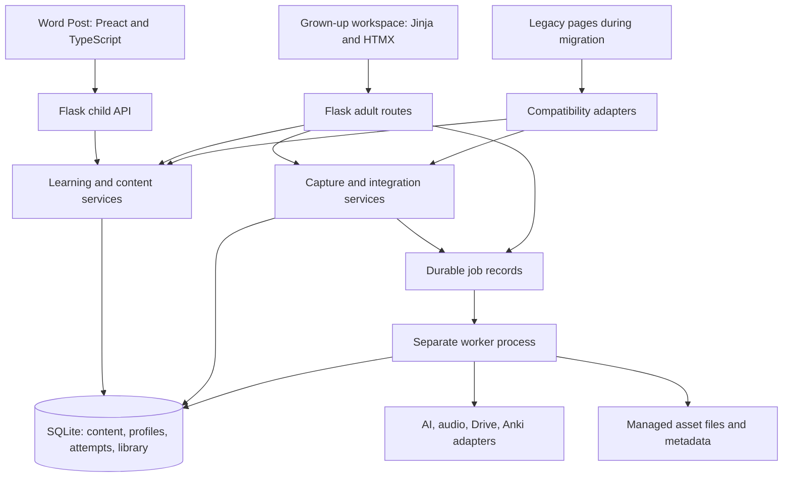

# Word Post technical architecture and data contracts

Status: proposed technical design, 8 September 2026. The owner confirmed local-household deployment first, optional grown-up Anki and adult-approved authored/AI-drafted content; see the [decision record](README.md). Names below describe responsibilities and suggested contracts; they are not existing endpoints or applied SQL.

Implementation note: `/post/`, its built assets and the gated `/post/catalogue` exist. [Stage 1](stage-1.md) now adds household access, independent profiles, immutable content packs, local assets and persistent choice-activity attempts through migration 004. The tables/routes below remain the broader target model; the Stage 1 guide records the exact implemented names and scope. The [native MVP](native-flashcards-mvp.md) adds schema-9 review/card extensions. Connected child games and provider jobs remain later boundaries.

Scope update: native flashcards/FSRS are now the first learning slice. [Native requirements](native-flashcards.md) extend this model; [progression](progression.md) defines common rewards and later difficulty selection; [storage](storage-and-hosting.md) defines local-first/Fly.io preparation. The [product backlog](product-backlog.md) owns current priority.

9 September flashcard integration: [Anki-to-native migration](anki-to-native-migration.md#5-integrate-with-the-existing-foundation) reconciles this target with the implemented schema. Native card versions reference approved pack items rather than duplicating editable payloads. Review occurrences extend the shared sessions/attempts with an explicit session migration; v2 content adds form identity, retrieval mode and media roles. Native scheduling starts independently of Anki by owner decision. The core v2/card/session extensions are implemented in migration 009; preparation jobs and native review rewards remain proposed. Consult the MVP guide for exact implemented names rather than the broader target tables below.

9 September narrative refinement: [Barsik's journey](barsik-journey.md) proposes a chapter layer above the shared learning service. Future immutable journey/chapter definitions reference approved activity versions; learner enrolments and step completions reference accepted events. Chapter advancement must be transactional, retry-safe and scoped to the learner, with explicit withdrawal/version and adult-placement policies. This is an additive SQLite extension after the required activity adapters, not a new service, a second reward system or a browser-owned level counter. The restored welcome adds no journey tables or endpoints.

**9 September correction:** the default native flashcard flow is individual and automatic, with optional edit/delete. Household roles and publication gates below apply only when that mode is explicitly enabled. Migration 010 adds durable generation batches; a local personal profile reuses scheduling/history without a PIN. See the [current MVP guide](native-flashcards-mvp.md).

## 1. Application shape



Keep one repository, one Python application and one deployed origin. Vite is an asset compiler and optional development server. The production Flask release serves the built assets. The app worker is a separate process using the same domain/integration code, not another backend product.

Suggested organisation within the existing app:

```text
flask_vocab_app/
  app.py                       # composition and registration
  blueprints/                  # child API, adult UI, compatibility routes
  services/                    # incrementally separated application services
  repositories/                # SQL and transaction-aware persistence
  content/                     # reviewed, versioned starter adventure packs
  contracts/                   # request/response and content schemas
  jobs/                        # durable job execution and provider adapters
  migrations/                  # existing explicit migration mechanism
  templates/
    legacy/                    # move only when affected routes migrate
    grownups/
    word_post.html             # child mount and asset manifest tags
  ui/
    package.json + lockfile
    src/
      word-post/               # app shell, routing and adventure controller
      grownups/                # small rich controls where needed
      components/              # shared interactive primitives
      styles/                  # tokens, foundations, product components
      locales/                 # canonical UI messages
      assets/                  # curated artwork, icons, local fonts
    tests/                     # components and browser workflows
  static/dist/                 # generated, ignored build output
  tests/                       # backend/domain/migration/provider tests
```

Do not move every old file to satisfy this diagram. Introduce target directories as their first migrated feature needs them. Keep development and release commands in one documented entry point; build assets in CI/release packaging, not on the child's first request.

## 2. Frontend responsibility

**Word Post:** Preact owns the child page, activity step state, answer editing, focus transitions, audio playback and brief motion. TypeScript describes activity variants and API responses. Start with Preact state/reducers; add a separate state library only if actual complexity justifies it.

**Grown-ups:** Jinja renders ordinary pages and forms; HTMX updates explicit fragments for filters, import previews, job status and approval actions. A rich editor may be a Preact island with its own root and cleanup. No HTMX swap inside that root. Replace `extract_main_content` string parsing with explicit full-page and partial templates as these routes move.

**Shared:** tokens, typography, icons, illustration assets, copy catalogue, accessibility behaviour and visual tests. A component's interaction logic has one owner. For simple controls rendered in both systems, share CSS/semantic rules and fixtures; do not maintain two competing adventure controllers.

**Assets:** pin dependencies with a lockfile; use Vite's manifest for JS/CSS/chunk references; self-host production fonts and illustrations. Upgrade HTMX separately from layout changes, with legacy navigation tests. A CDN version bump is not a migration plan. [Vite integration](https://vite.dev/guide/backend-integration), [HTMX documentation and migration guidance](https://htmx.org/docs/).

**State:** temporary answer edits can live in the component; content, completed steps, feedback and awards are server-owned. Use session IDs and revision numbers to rehydrate after refresh. Show “Saved” only after acknowledgement. If a save fails, retain the answer on screen, offer retry, and do not claim the answer was saved.

For free-text replies, add a debounced draft-save operation with ordered revisions and save-on-navigation handling. Distinguish a saved draft from a submitted/assessed attempt. Do not promise recovery of an unsent in-memory edit; full offline draft storage is a later scope decision.

## 3. Identity and authorisation

The current `users` table is a legacy progress record, not an account system. Do not extend its ELO row into an implicit child identity by relabelling it.

For the proposed local-household release:

- Create a household context and learner profiles with opaque IDs, a display name/avatar, support preferences and active/archived status. Avoid collecting birth dates when an age band/reading-support preference is sufficient.
- Map legacy user `1` to an explicitly labelled legacy profile. Keep its existing data and totals. New children start with no invented learning evidence.
- The adult chooses the learner; the server checks the session's permitted profile on every write/read. Never trust a body field `learner_id` by itself. Pin each learning session to its profile. A profile switch in a second browser tab must not reattribute the first tab's pending answer; reject mismatched context and offer to resume with the correct profile.
- Apply a shared access policy to **all** routes, including legacy endpoints, generated files, uploads, job results and JSON reads. Adult tools must not become accessible just by typing an old URL.
- A local grown-up PIN can reduce accidental entry, with hashed storage, throttling and session expiry. It is not a substitute for an authenticated account boundary on a hosted service.

For hosted families, resolve household membership, adult accounts, recovery, consent/retention expectations and tenant isolation before pilot. Use server-side ownership checks, secure sessions, HTTPS, CSRF protection and protected asset access. Keep child profiles separate from adult credentials. Schools additionally need classroom membership, teacher privileges, assignments and account lifecycle decisions. These are scope changes, not a skin on the local profile picker.

Cookie authentication requires CSRF protection on state-changing forms and JSON actions; SameSite cookies are part of the defence, not the entire policy. New write APIs use POST/PATCH/DELETE; retire generation via GET through a compatibility plan. [OWASP CSRF prevention](https://cheatsheetseries.owasp.org/cheatsheets/Cross-Site_Request_Forgery_Prevention_Cheat_Sheet.html).

## 4. Content, activity and learning evidence

Split four things that the current services often combine: **the learning material**, **its presentation**, **an attempt to use it**, and **the resulting learning evidence**.

| Proposed entity | Key responsibility and constraints |
|---|---|
| `learning_profiles` | Stable profile ID; household context; support preferences; optional unique mapping to a legacy user |
| `adventures` | Stable identity/slug and story-world metadata; changing illustrations does not change identity |
| `adventure_versions` | Immutable published content, schema version, approval actor/time, audience and language; draft → validated → approved/published → retired |
| `activity_definitions` | Version-owned ordered steps and typed payloads: word choice, sentence builder, reading, listening, short reply; stable step IDs |
| `learning_sessions` | Profile, activity/review kind, pinned content/issued card versions, current step, status, revision and timestamps; shared lifecycle for adventures and native reviews |
| `activity_attempts` | Session/step, submission ID, answer, hint use, evaluation policy version, feedback, outcome and time; uniqueness of session + submission ID |
| `learner_word_evidence` | Profile + lexical identity + attempt reference + skill/evidence type; rebuildable summary of seen/practised/recall observations |
| `legacy_record_links` | Old table/ID → new record/owner mapping with migration run; explicit imported-history provenance |
| `assets` | Stable ID, content hash, local/storage key, media type, language/voice and source version, approval and visibility |
| `jobs` / integration operations | Durable work state, deduplication key, input/output references, attempts, lease, timestamps and redacted error |
| Native cards / learner memory / review events | Versioned review items, per-learner FSRS state and scheduling extensions linked to canonical attempts; detailed in [native requirements](native-flashcards.md) |
| Shared reward ledger / skill evidence | Atomic, bounded participation credits and later per-skill challenge selection; distinct from FSRS and legacy totals |

Use relational columns and foreign keys for identity, ownership, status and uniqueness. A schema-validated JSON payload is reasonable for each typed activity; avoid turning the entire application into unvalidated JSON blobs. Final SQL is designed in small additive migrations as each phase needs it, not one speculative schema expansion.

### Lexical identity and existing vocabulary

Keep existing `words.id`, `forms.id`, `UNIQUE(lemma,pos)` and Anki links. A household library is a set of usable lexical records; Word pocket is a learner-specific projection of evidence. Importing 1,233 library words must not fill a child's pocket with 1,233 “learned” words.

Keep source spelling, lemma, part of speech, inflected form and sense/context distinct. The same written word can have different grammatical analyses. For the first slice, link an approved definition/example to the existing word ID; add richer sense modelling only when content needs it. Do not replace IDs with a lowercased text key.

NFC normalisation and tolerant punctuation/case handling can be appropriate in grading; whether to ignore stress marks or accept `е` for `ё` depends on the learning objective. Preserve the original response. Do not globally collapse these distinctions or label the current difficulty bands as CEFR.

### Honest progress

“Seen”, “used with help”, “used independently” and “recalled later” are different observations. A hint-assisted correct answer can complete an adventure; it is not evidence of mastery. Completion history records practice, not proficiency. Preserve legacy coins/ELO in the adult history without converting them into CEFR or child mastery.

Repeat practice produces a new session/attempt. Retrying the same HTTP submission returns the same recorded outcome. A repeat adventure can produce new learning evidence without duplicating a reward for the same submission.

### Learning progression without depending on Anki

Word Post must provide its own opportunities to revisit vocabulary because Anki is optional. Start with an explicit, inspectable planning policy: offer to resume an unfinished review/activity, offer a short due-review session, and suggest appropriate approved adventures that reuse introduced words. The pilot pack should intentionally repeat target words across reading, recognition and sentence use. Record the policy version and why an activity was selected so the adult can understand it.

Native spaced repetition is now part of the first learning slice. Use FSRS behind a versioned scheduler boundary and show due-review counts only from persisted state. Keep recognition, supported production and independent recall distinct; only qualified card reviews update their memory state. Adventure revisitation can use those records alongside reviewed curriculum choices. Elo-style cross-game adaptation remains a later, separately evaluated capability; see [progression](progression.md).

## 5. Example API and transaction contract

Proposed same-origin routes:

| Route | Responsibility |
|---|---|
| `GET /api/v1/post` | Approved adventures and permitted resumable session for the active profile |
| `POST /api/v1/learning-sessions` | Start/resume an authorised, published adventure version with a request idempotency key |
| `GET /api/v1/learning-sessions/{id}` | Return authorised resumable state and current revision |
| `POST /api/v1/learning-sessions/{id}/attempts` | Validate step/answer, record attempt, advance state and return acknowledged result |
| `GET /api/v1/word-pocket` | Read the active learner's word evidence and reward history |
| `POST /api/v1/grownups/jobs` | Start an authorised drafting/enrichment/integration operation |
| `GET /api/v1/grownups/jobs/{id}` | Redacted status/output references for its owner |

Example submission, with CSRF protection supplied separately:

```json
{
  "submission_id": "opaque-client-generated-request-id",
  "expected_revision": 3,
  "activity_id": "moon-picnic.choose-word",
  "answer": {"choice_id": "apple"}
}
```

The server loads the pinned version and the expected activity from the session. It does not accept a client-supplied score, reward, answer key or arbitrary task text as the assessment authority. Hint requests and their acknowledgement should also be recorded when hint use affects evidence; avoid trusting a client Boolean for that policy.

Use separate child and adult content serializers. The child response contains only the approved presentation, permitted choices/support and its own saved state; assessment policies, provider configuration, other learners' data and unpublished drafts remain server/adult data. Validate requests at runtime as well as in TypeScript; a compiled client type is not a server validation boundary.

For deterministic activity grading, in one short transaction:

1. Authorise profile/session; return the stored result if this submission ID already exists with the same payload hash. Reject reuse with a different payload.
2. Check session revision, publication/retirement policy and expected step. A stale new submission receives a `409` and current state; do not silently overwrite a second device's progress.
3. Evaluate against the versioned answer policy, append the attempt and advance the session.
4. Append evidence and, on completion, insert the uniquely keyed award. Commit atomically and return the new revision and saved state.

Check existing idempotent results before treating their old revision as a conflict. Concurrent duplicates must converge through database uniqueness and a retry/read path, not only disabled buttons. Authorization is still checked before returning a stored result.

For long AI assessment, store a pending attempt and enqueue work, then return a pending status. The worker persists a validated result; the UI only advances according to the server transition. No provider call may hold the write transaction open. Start the child slice with deterministic reviewed activities to avoid making this infrastructure a prerequisite for every interaction.

Sentence assembly must model acceptable Russian responses. The prototype's single sequence demonstrates interaction, not a linguistic validity rule. Provide explicit accepted variants or explicitly ask for the model sentence; do not mark every different Russian word order as incorrect grammar.

## 6. Content publishing and asset management

Under the confirmed publication policy, generation creates an adult-visible draft. Validate structural schema, vocabulary references, answer keys/variants, audience/reading demands and required assets. Adult approval publishes an immutable version. Editing a published adventure creates a new version; active sessions remain pinned to the old version unless it is withdrawn, in which case present a graceful replacement and preserve completed evidence.

Use a reviewed starter pack before building a sophisticated authoring UI. It should include learning objectives, Russian text, English support, target words, accepted answers, hints, speaker/audio metadata and illustration references. Approve audio pronunciation and stress with the text. Default provider failure to a prepared adventure, not a blank child page.

Separate curated app artwork in source control from private uploads and runtime-generated media outside source control. Production assets have stable IDs and local/storage references; do not persist expiring remote image URLs as the only copy. Use a content hash and source/voice/config version for audio reuse, atomic file replacement and metadata validation before marking an asset ready.

Provider output and uploaded material are untrusted data. Render structured text with escaping; sanitise any deliberately supported markup through an allowlist. Do not interpolate generated feedback into HTML. Validate uploads by content/type/size, generate storage names, and keep private file routes subject to authorisation. Remove raw responses, child writing and credentials from routine debug logs.

## 7. Jobs and providers

Flask async views still occupy a request worker; background tasks spawned inside a normal async view are not a durable queue. [Flask async/background guidance](https://flask.palletsprojects.com/en/stable/async-await/).

For one household, start with one separate worker process and a small persistent SQLite job queue behind a `JobQueue` interface. Before committing to a home-grown executor, time-box a comparison with a maintained local queue implementation; require the same crash/retry acceptance tests. Hosted multi-worker deployment should reassess a managed broker/queue, rather than stretching local assumptions.

Required behaviour:

- States: queued, running, succeeded, failed, cancelled; partial multi-stage progress is recorded explicitly.
- Claim with a short transaction and a lease/heartbeat; reclaim expired work after a crash. Never hold the database lock while calling a provider.
- Bounded attempts, backoff, deadlines, cancellation checks and redacted errors. Cancellation cannot undo a provider side effect already completed.
- Job inputs reference immutable content/snapshot IDs. Deduplicate equivalent work by an explicit operation key; intentional regeneration gets a new version/key.
- Store progress by completed stage, such as text ready/audio pending. Do not invent a percentage when the provider exposes no measurable progress.
- Treat delivery as at-least-once. Idempotency in local writes does not guarantee exactly-once provider billing or external side effects.
- After an ambiguous Anki/Drive write result, reconcile using external IDs/operation metadata before retrying. Do not blindly recreate cards or overwrite a capture file.

Keep provider adapters injectable and cover outages with doubles. Version prompts and policies where they affect published content or scoring. Child identifiers and personal writing should not be sent to a provider when approved lexical/content text is sufficient for the operation.

## 8. Drive capture and sync

Preserve the [existing contract](../synchronization.md) until explicitly changed. Design the next version around **capture receipts, lexical records and learner evidence**, not two interchangeable databases.

- Every app capture is saved durably before enrichment; Drive import remains available for mobile capture. Recommended future direct-app capture can work without Drive and optionally export through a job. This is a proposed change to today's Drive-first app capture path, not current behaviour.
- Store raw text/source, local capture UUID, source snapshot ID/hash, interpretation and library linkage. A Drive text line has no inherent stable record ID; do not pretend its line number survives edits. Preserve ambiguous edits/duplicates for review.
- Preview records the exact input snapshot and intended operation. Apply checks it again. A changed snapshot invalidates destructive preview approval and yields a fresh comparison.
- Version metadata helps detect changes, but checking it before a write does not itself close the race. Verify conditional-write behaviour for the **actual Drive v3 media-upload path** using a disposable file before promising conflict-free rewrites. Drive documents a monotonically increasing file version, not an automatic transaction with the local database. [Drive file resource](https://developers.google.com/workspace/drive/api/reference/rest/v3/files).
- If the conditional-write spike cannot demonstrate safe behaviour, recommend read-only import from the capture file plus an optional separate app-managed export file. Ask the owner before changing the established reverse-export policy. Do not ship new unattended whole-file rewrites on a best-effort read/compare assumption.
- Keep SQLite imports if enrichment/export fails; persist retryable work per word/operation. Absence from Drive never deletes words, forms or learner history. Explicit adult library archival/deletion is a separate operation with reference checks.
- Route add/edit/delete/append/sanitise/export through the same adapter. Record outside writers and unsupported scripts in the operational guide; an in-process lock does not coordinate another phone or program.
- Migrate local pickled OAuth credentials through an explicit trusted-local conversion or reauthorisation, then use standard credential serialisation and secure storage. Evaluate per-file `drive.file` access with an explicit file-selection flow; changing the scope string alone is not a complete migration. [Drive scopes](https://developers.google.com/workspace/drive/api/guides/api-specific-auth).

Adult labels should distinguish “Captured”, “In library”, “Details pending”, “Available in adventures” and “Exported to Anki”. These are separate facts. An imported word is not automatically taught; an exported card is not proof of recall.

## 9. Deployment and operating limits

SQLite is a sound initial local store when writes are short and concurrency is modest. It supports one writer at a time; multiple application/worker processes need bounded write behaviour and measured lock contention. [SQLite appropriate uses](https://www.sqlite.org/whentouse.html).

Keep the file on the application host, use the existing shared connection policy, and make WAL configuration deliberate at application setup rather than setting it in unrelated feature calls. Back up through SQLite's backup API and include a media manifest. Never host the live SQLite database on a synchronised Drive folder as a substitute for application sync.

The production package should contain built UI assets, reviewed starter content and Python dependencies; run a supported WSGI server with environment configuration and a worker supervisor. The current Flask development server is for inspection/development. A phone cannot reach the Mac's `127.0.0.1` address: LAN access, HTTPS and deployment are explicit follow-up work, not a benefit automatically delivered by responsive CSS.

For a public multi-household service, decide account/tenant/storage/backup design first and strongly consider PostgreSQL before accumulating tenant-specific SQL. Revisit this based on deployment topology and measured write concurrency, not a word-count threshold. Keep database access behind repositories so this is a deliberate migration. Do not add an ORM solely to cosmetically rename existing SQL during the UI transition.

Prepared content and local assets permit use without external AI/Drive/Anki. That does **not** mean full offline browser operation or cross-device offline sync. Defer service-worker caching of private responses and offline writes until there is a versioning, ownership, cache-clearing and reconciliation design.
